# CesiumJS - WebGPU Fork

> :construction: **STATUS — BETA, WORK IN PROGRESS.** This is an unofficial fork
> of CesiumJS that adds a complete WebGPU rendering backend alongside the
> existing WebGL2 one. It is a massive overhaul — not only the new backend, but
> a deliberate pass over the tech debt and architecture the backend split
> exposed.
>
> **It is not production-supported and it is not ready to be dropped into a
> shipping application.** APIs, defaults and visual output may change without
> notice; several subsystems are shipped-but-uncertified, and the
> [feature table](#bar_chart-feature-status) below says so per feature rather
> than averaging it away. Issues, reproductions and corrections are welcome — an
> honest defect report is worth more here than a star.

[](https://github.com/CesiumGS/cesium/actions/workflows/dev.yml)
[](https://www.npmjs.com/package/cesium)
[](https://cesium.com/learn/)


CesiumJS is a JavaScript library for creating 3D globes and 2D maps in a web browser without a plugin. It uses WebGL for hardware-accelerated graphics, and is cross-platform, cross-browser, and tuned for dynamic-data visualization.

Built on open formats, CesiumJS is designed for robust interoperability and scaling for massive datasets.

---

[**Examples**](https://sandcastle.cesium.com/) :earth_asia: [**Docs**](https://cesium.com/learn/cesiumjs-learn/) :earth_americas: [**Website**](https://cesium.com/cesiumjs) :earth_africa: [**Forum**](https://community.cesium.com/) :earth_asia: [**User Stories**](https://cesium.com/user-stories/)

---

## :sparkles: About this fork

This fork gives CesiumJS a **second, complete rendering backend**. Everything
above the renderer — the globe, 3D Tiles, glTF models, entities, datasources,
picking, the widgets — is unchanged public API; underneath it, a scene can now
be drawn by WebGPU instead of WebGL2, chosen per `Viewer` at construction time.

**How it is put together.** Measured against the tree this README ships in:

- **A WebGPU renderer.** 264 modules (~205,000 lines, mostly TypeScript) under
  `packages/engine/Source/Renderer/WebGPU/`, plus **219 standalone WGSL shaders
  and 104 shared WGSL chunks** under `packages/engine/Source/Shaders/WebGPU/`.
- **Backend agnosticism as an architecture, not a flag.** `GraphicsContext` is
  an abstract base that both the WebGL `Context` and `WebGPUContext` extend, so
  scene code never branches on the backend. Backend-specific work lives behind
  **54 feature-renderer slots** (`FeatureRendererKey`) reached through
  `context.getFeatureRenderer(key)`. Multiple contexts — including one of each
  backend, side by side — can run in the same page.
- **Build variants.** `buildCesiumDual` (both backends), `buildCesiumWebGPUOnly`
  and `buildCesiumWebGLOnly` tree-shake the unused half away, so a WebGPU-only
  or WebGL-only consumer does not pay for the other backend.
- **WASM bridges** for the hot CPU paths (culling, sorting, heightmap and
  quantized-mesh decode, RTE and matrix math, point clouds), each with a JS
  fallback and feature-detected activation.
- **~200 fork-added features** on top of the ~290 inherited from upstream, all
  catalogued — with their `SHIPPED` / `SCAFFOLDED` / `EXPERIMENTAL` tags and
  their known gaps — in
  [`migration_doc/FEATURE_INVENTORY.md`](migration_doc/FEATURE_INVENTORY.md).

**Relationship to upstream.** The fork tracks
[CesiumGS/cesium](https://github.com/CesiumGS/cesium) releases and is currently
synced to **v1.144**. Preserving WebGL behaviour is a hard rule: upstream files
may be refactored where it improves the architecture, but existing APIs and
rendering results must keep working, and the WebGL2 path stays a first-class
target rather than a legacy one.

---

## :bar_chart: Feature status

**How to read the numbers.** Each row carries a completion figure with its
basis stated in the same row — no figure is offered without one. Two kinds of
basis appear:

- **A parity percentage** (a single number such as `92 %`) is quoted from the
  per-subsystem weighted column of
  [`WEBGPU_PARITY_REPORT_2026-07-01.md`](migration_doc/WEBGPU_PARITY_REPORT_2026-07-01.md).
  That report is **five-plus weeks old as of this writing**; it scored a
  310-feature surface at **86.3 % weighted / 80.3 % strict** overall, with 31
  features on WebGPU that WebGL does not have at all. Work has landed since,
  so treat those figures as a dated floor, not a live measurement.
- **A completion band** (a range such as `70–80 %`) is a fork-only feature that
  the parity report does not score, because WebGL has no counterpart. The band
  is derived from the `SHIPPED` / `SCAFFOLDED` / `EXPERIMENTAL` tags in
  [`FEATURE_INVENTORY.md`](migration_doc/FEATURE_INVENTORY.md) §B and the named
  open gaps in §C, both cited in the row.

Screenshots are WebGPU captures produced by
`node Tools/readme-screenshots/capture-readme-screenshots.mjs`; the scene behind
each one is recorded in
[`Tools/readme-screenshots/scenes.json`](Tools/readme-screenshots/scenes.json).

<!-- FEATURE-TABLE:BEGIN -->

### Renderer core & architecture

| Feature                                | Completion | Notes & details                                                                                                                                                                                                                                                                                                                                                               | Screenshot                                                                               |
| -------------------------------------- | ---------- | ----------------------------------------------------------------------------------------------------------------------------------------------------------------------------------------------------------------------------------------------------------------------------------------------------------------------------------------------------------------------------- | ---------------------------------------------------------------------------------------- |
| WebGPU rendering backend               | 90–95 %    | The full `WebGPUContext` / `WebGPUSceneRenderer` stack: 264 modules, 54 feature-renderer slots, RTE 64-bit precision enforced by runtime assertions. Basis: every default-scene path renders on WebGPU, and the residual is the §C WIP tail — `WebGPUContext.ts` decomposition still in progress, MRT order-independent transparency contained OFF by default (FAR-003).      | 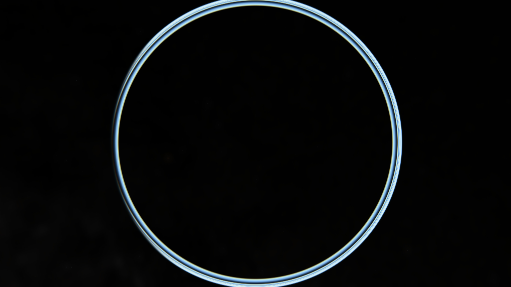 |
| WGSL shader pipeline & resource caches | 95–100 %   | 219 WGSL shaders plus 104 shared chunks behind an `//>>ifdef` preprocessor, a 32-bit `ShaderDefine` bitmask, per-device shader-module dedupe and LRU render/compute pipeline caches. Basis: all `SHIPPED` in §B.2, and the pipeline key folds shader-module identity structurally (landed Batch 825, Edge-verified Batch 828 over 3,729 pipeline calls with zero collisions). | 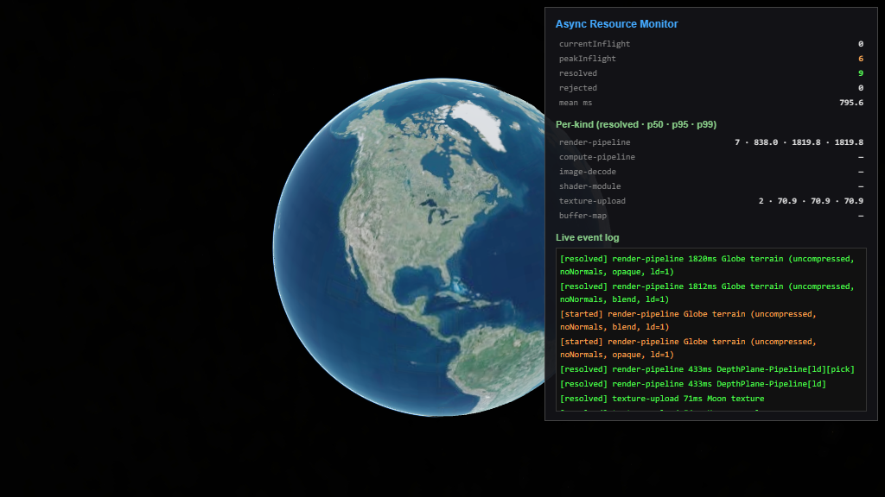   |

### Globe & imagery

| Feature                                     | Completion | Notes & details                                                                                                                                                                                                                                                                                                                                                       | Screenshot                                                                                   |
| ------------------------------------------- | ---------- | --------------------------------------------------------------------------------------------------------------------------------------------------------------------------------------------------------------------------------------------------------------------------------------------------------------------------------------------------------------------- | -------------------------------------------------------------------------------------------- |
| Quadtree terrain & imagery                  | 92 %       | Full quadtree terrain renderer with per-tile bind-group caching and a dynamic-offset uniform ring. Basis: weighted parity for Globe & Imagery in the parity report §3 (25 full, 3 exceeding WebGL, 3 partial, 1 by-design missing, of 32).                                                                                                                            | 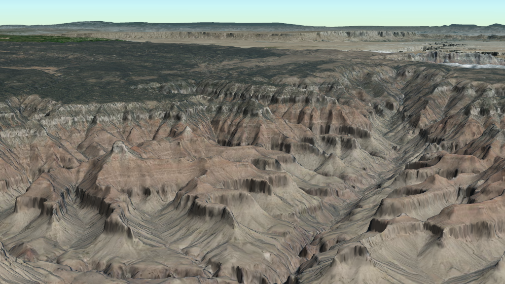         |
| Multi-layer imagery & reprojection          | 95–100 %   | 16 imagery slots per tile with a reduced-slot fallback for constrained devices, GPU web-Mercator reprojection at upload, and per-device dedupe of imagery texture realizations. Basis: `SHIPPED` in §B.2/§B.3; the cross-backend contract is pinned in `IMAGERY_PROJECTION.md`.                                                                                       | 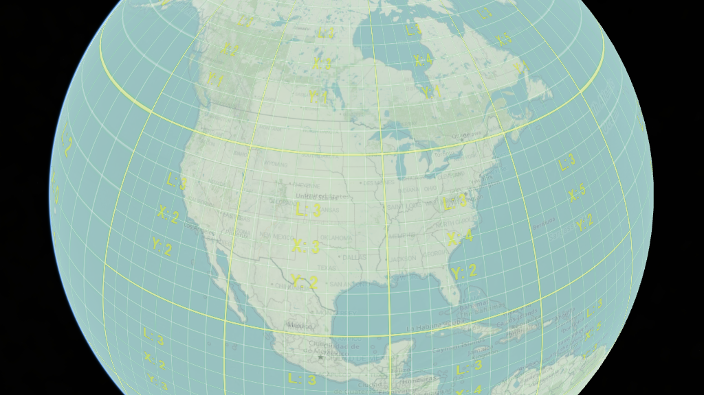 |
| Globe lighting, night lights & translucency | 85–90 %    | Day/night terminator lighting, night lights, underground colour with distance falloff, and the three-pass translucent-globe technique. Basis: `SHIPPED` in §B.8; the open item is §C.1 `C-R1-GLOBE-RENDERSTATE`, where the globe still builds pipeline variants from hardcoded state instead of the upstream render state.                                            | 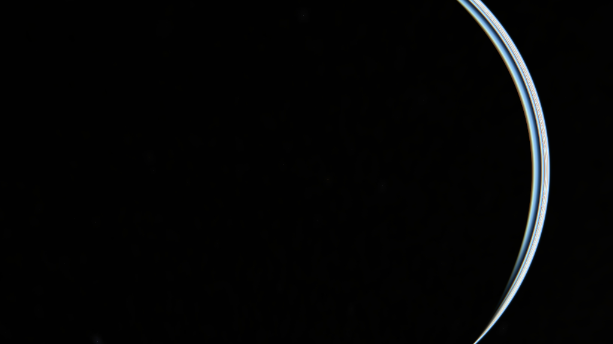           |
| Vector-tile draping                         | 50–60 %    | Clamped vector geometry draped over terrain through storage-buffer bakes. Basis: the WebGPU claim path handles **polylines only** — polygon tables are ignored, so polygon draping is WebGL-only until the storage-buffer layout learns them (`DEFERRED_WORK.md` C11-213); the upstream v1.144 WGSL twin landed 2026-08-06 with browser acceptance still owed (§C.1). | 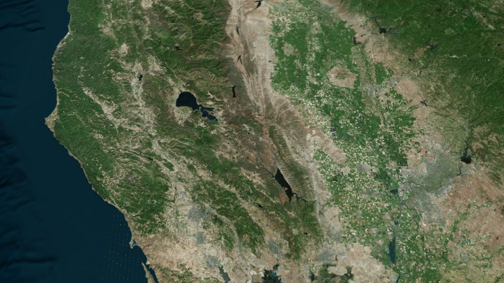               |

### 3D Tiles & Gaussian splats

| Feature                          | Completion | Notes & details                                                                                                                                                                                                                                                                                                                                                      | Screenshot                                                                           |
| -------------------------------- | ---------- | -------------------------------------------------------------------------------------------------------------------------------------------------------------------------------------------------------------------------------------------------------------------------------------------------------------------------------------------------------------------- | ------------------------------------------------------------------------------------ |
| 3D Tiles core formats            | 81 %       | B3DM, I3DM, PNTS, CMPT and glTF content, batch-table styling, per-feature picking and classification. Basis: weighted parity for 3D Tiles in the parity report §3 (33 full, 1 exceeding, 10 partial, 2 stub, 2 missing, of 48) — the core render paths are full and the long tail is metadata and voxel residuals.                                                   | 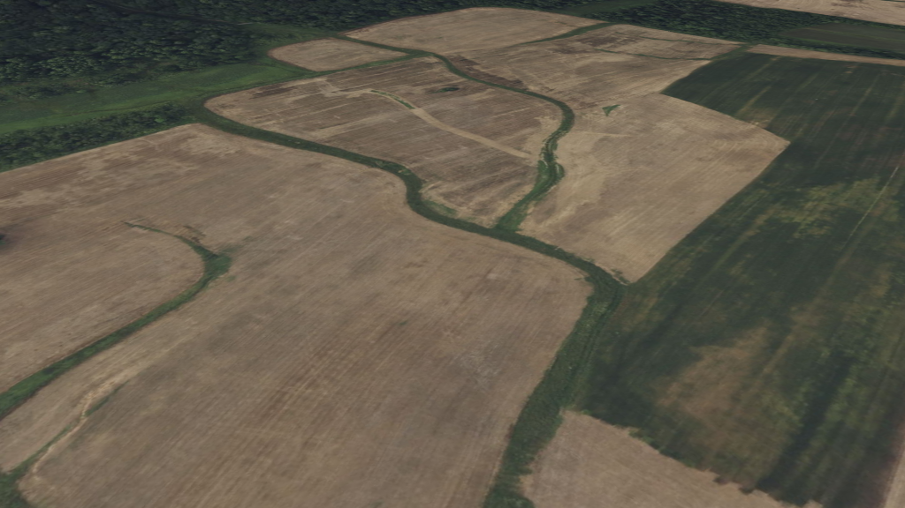                 |
| Point clouds & eye-dome lighting | 90–95 %    | PNTS rendering with attenuation, eye-dome lighting, and a compute LOD pipeline using a single-dispatch decoupled-look-back prefix scan. Basis: all three renderers `SHIPPED` in §B.3; the GPU bitonic sort stays `EXPERIMENTAL` behind `useGPUSort`, default false.                                                                                                  | 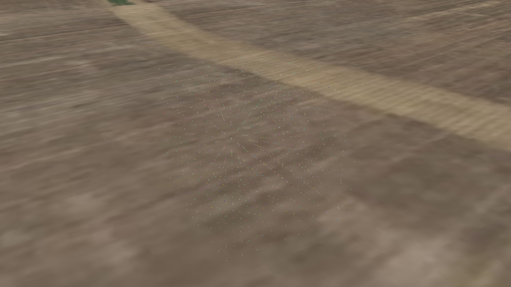 |
| Voxels                           | 70–80 %    | Voxel primitive ray-marching with per-cell picking that decodes byte-identically to WebGL. Basis: the 2026-07-31 §B.3 status correction records a real root-tile-through-depth traversal, superseding the older placeholder note; §D voxel residuals remain open.                                                                                                    | 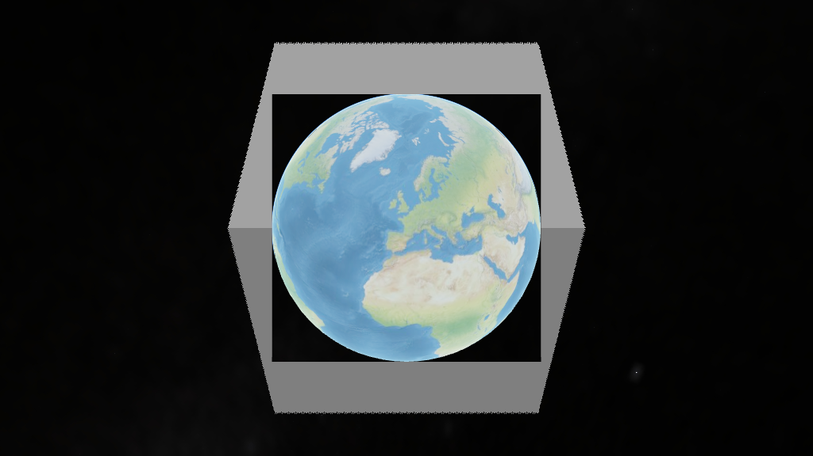                   |
| Gaussian splats (3DGS)           | 55–65 %    | 3D Gaussian splat tiles with back-to-front ordering consumed through a sorted-index storage buffer. Basis: the renderer is `SHIPPED` in §B.3, but the Campaign-15 GSPLAT track (`C15-G1`–`C15-G8`) is authored and open, and splat-against-globe classification depth is reachable for the first time yet still **unverified** (§C.4 `NEW-GS-CLASSIFICATION-DEPTH`). | 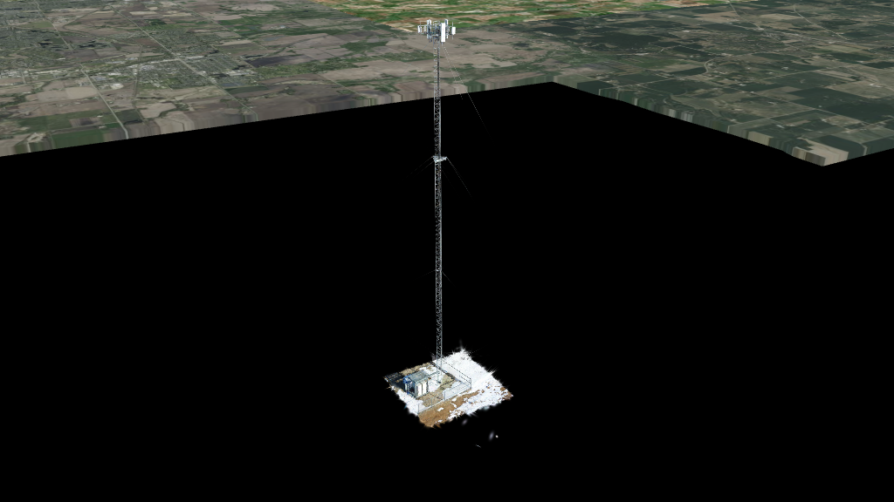 |

### glTF models, PBR & IBL

| Feature                                         | Completion | Notes & details                                                                                                                                                                                                                                                                                                                                 | Screenshot                                                                           |
| ----------------------------------------------- | ---------- | ----------------------------------------------------------------------------------------------------------------------------------------------------------------------------------------------------------------------------------------------------------------------------------------------------------------------------------------------- | ------------------------------------------------------------------------------------ |
| glTF model pipeline & PBR                       | 82 %       | Full glTF loader and PBR pipeline: skinning, morph targets, `EXT_mesh_gpu_instancing`, feature IDs, trilinear material-texture mip sampling, model edges and per-node previous transforms for motion vectors. Basis: weighted parity for glTF Models + KHR in the parity report §3 (43 full, 1 exceeding, 7 partial, 3 stub, 4 missing, of 58). | 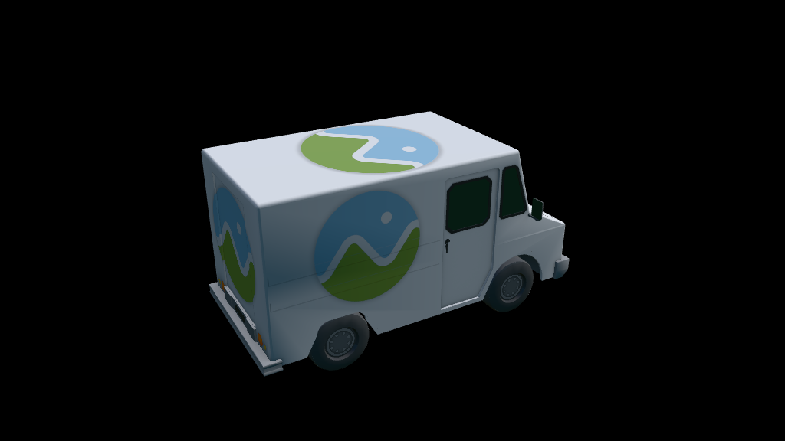                         |
| KHR material extensions                         | 85–90 %    | `KHR_texture_transform` plus clearcoat, specular, anisotropy, iridescence, sheen, volume and transmission, with iridescence on the Belcour 2017 analytic thin-film integral rather than a LUT approximation. Basis: `SHIPPED` in §B.8; `KHR_materials_variants` and the IOR / clearcoat-IOR coupling remain unwired (§C.3).                     | 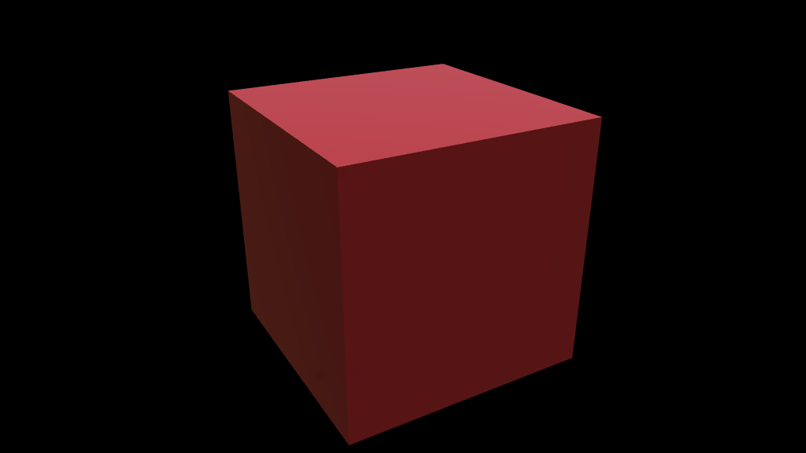   |
| Image-based lighting & dynamic environment maps | 85–90 %    | Split-sum IBL with a compute-generated BRDF LUT, prefiltered radiance mip chain, and per-position dynamic environment probes whose diffuse term comes from an atmosphere-derived spherical-harmonic producer. Basis: `SHIPPED` in §B.3; replacement-device recovery for the environment manager is explicitly still open.                       | 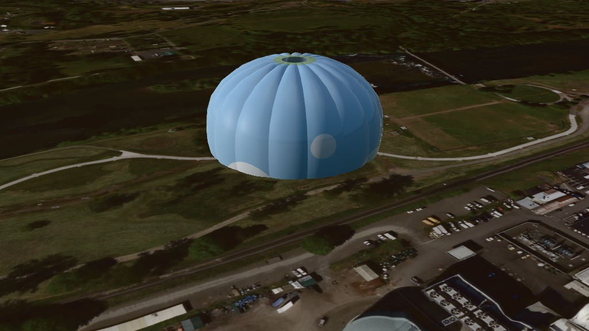 |

### Clouds & weather

| Feature                    | Completion | Notes & details                                                                                                                                                                                                                                                                                                                                                                         | Screenshot                                                                                 |
| -------------------------- | ---------- | --------------------------------------------------------------------------------------------------------------------------------------------------------------------------------------------------------------------------------------------------------------------------------------------------------------------------------------------------------------------------------------- | ------------------------------------------------------------------------------------------ |
| Volumetric clouds          | 70–80 %    | Schneider-style raymarched cloud volume: dual-lobe Henyey-Greenstein phase, Beer-Powder lighting, Perlin-Worley density, per-genus morphology and a sun-view beer shadow map cast into the fog grid. Basis: implementation is `SHIPPED` in §B.3 with a 172-float `CloudUniforms`, but Campaign 13 is the live authority and its temporal-reconstruction and march rows are OPEN (§C.7). | 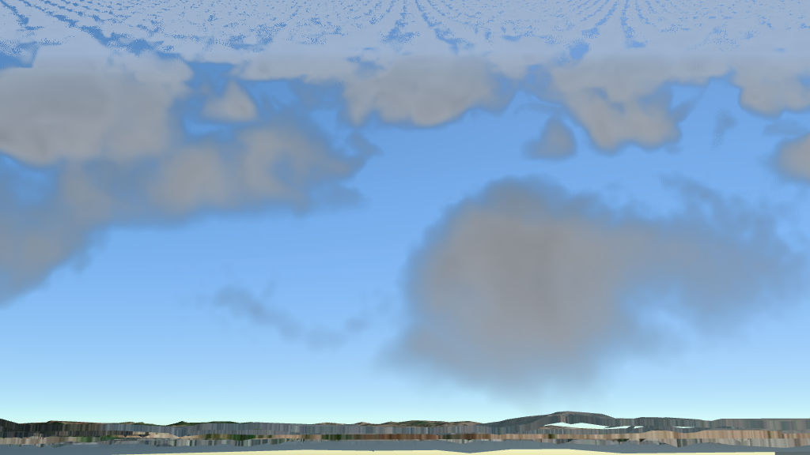               |
| Weather-driven cloud dials | 75–85 %    | `CloudRenderMode` / `CloudVolumetrics` / `AtmosphericConditions` drive coverage, density, layer heights, silver lining, phase and wind from presets keyed to METAR oktas and WMO cloud genera. Basis: the API and presets are `SHIPPED` in §B.3; the C13 genus and morphology rows continue.                                                                                            | 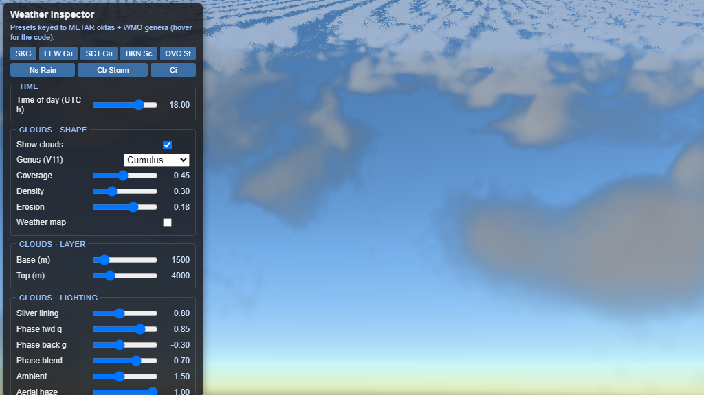 |
| Live weather ingest        | 55–65 %    | `Scene/Weather/` carries EDR, WCS-Coverages, METAR and synthetic sources through a shared CoverageJSON parser into the renderer's weather texture. Basis: the path is `SHIPPED` end to end, but the 2026-08-06 endpoint spot-check refuted one source outright and corrected five more, and the regional-tail and seam rows stay open.                                                  | 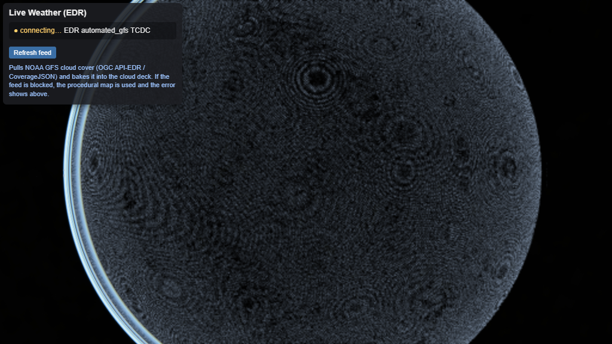                 |
| Weather particles          | 65–75 %    | GPU-compute rain, snow, hail and fog simulation rendered as instanced camera-relative quads. Basis: the `WebGPUWeatherRenderer` orchestrator is `SHIPPED` in §B.3, but both of its WGSL kernels are tagged `SCAFFOLDED` in §B.4 — the orchestration is further along than the simulation.                                                                                               | 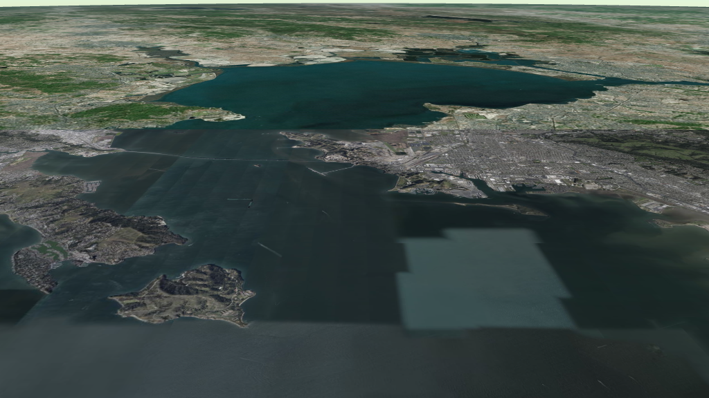               |

### Atmosphere, sky & celestial

| Feature                                 | Completion | Notes & details                                                                                                                                                                                                                                                                                                                                                                                             | Screenshot                                                                           |
| --------------------------------------- | ---------- | ----------------------------------------------------------------------------------------------------------------------------------------------------------------------------------------------------------------------------------------------------------------------------------------------------------------------------------------------------------------------------------------------------------- | ------------------------------------------------------------------------------------ |
| Sky atmosphere & aerial perspective     | 90–95 %    | Precomputed transmittance, multiple-scattering and irradiance LUTs (Bruneton and Hillaire) with a per-pixel ray-march fallback for orbital cameras, plus a whole-scene aerial-perspective post-pass. Basis: `SHIPPED` in §B.4 Tracks V-A1/V-A2; the per-primitive LUT consumer reaches only 12 of about 44 shaders (§C.7 `FEAT-GAP-09`).                                                                    | 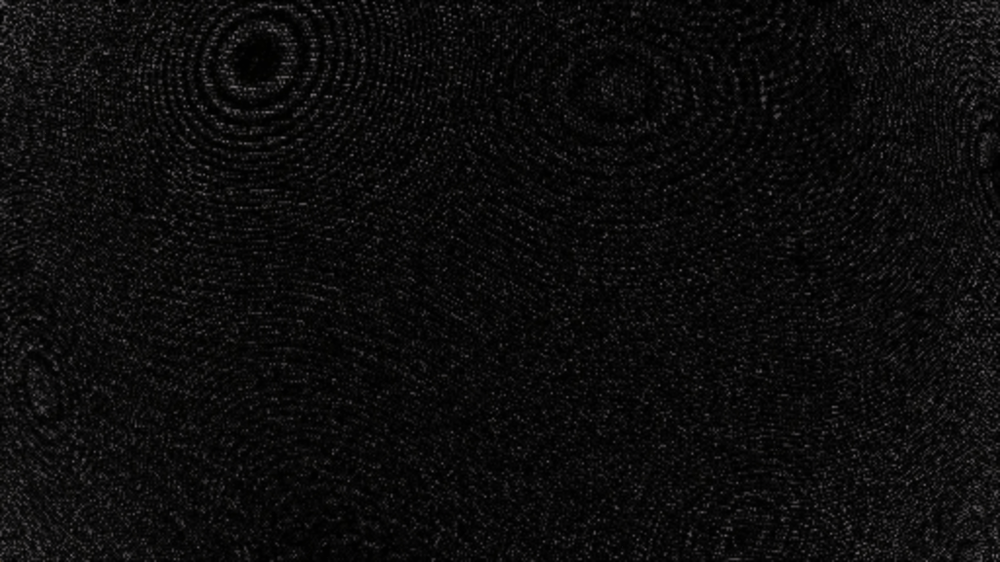               |
| Dual-light atmosphere                   | 85–95 %    | Two LUT pairs sampled per frame so the sky scatters moonlight as well as sunlight, with the lunar contribution scaled by phase. Basis: Phase 1.3c `SHIPPED` in §B.4.                                                                                                                                                                                                                                        | 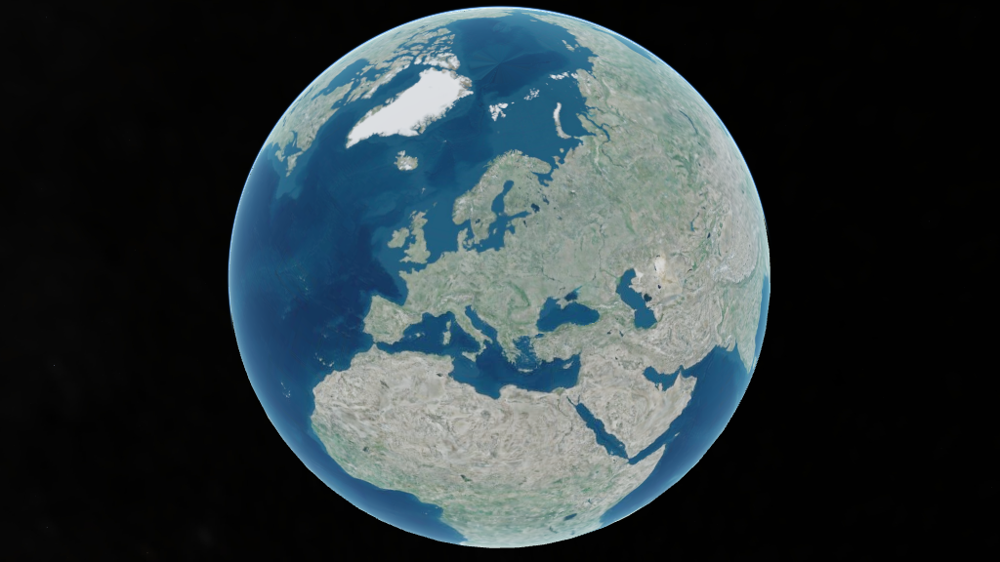 |
| Sun: limb darkening, glare & bloom      | 80–90 %    | A physical solar disc: Claret limb darkening, a CIE-135 veiling-glare falloff behind the halo, true HDR radiance and a retuned bright pass. Basis: C12-15/16/17 shipped pending their Edge gate; C12-19 HDR radiance and the C12-34 WebGPU sun-bloom mirror are implemented with acceptance still owed (§B.4).                                                                                              | 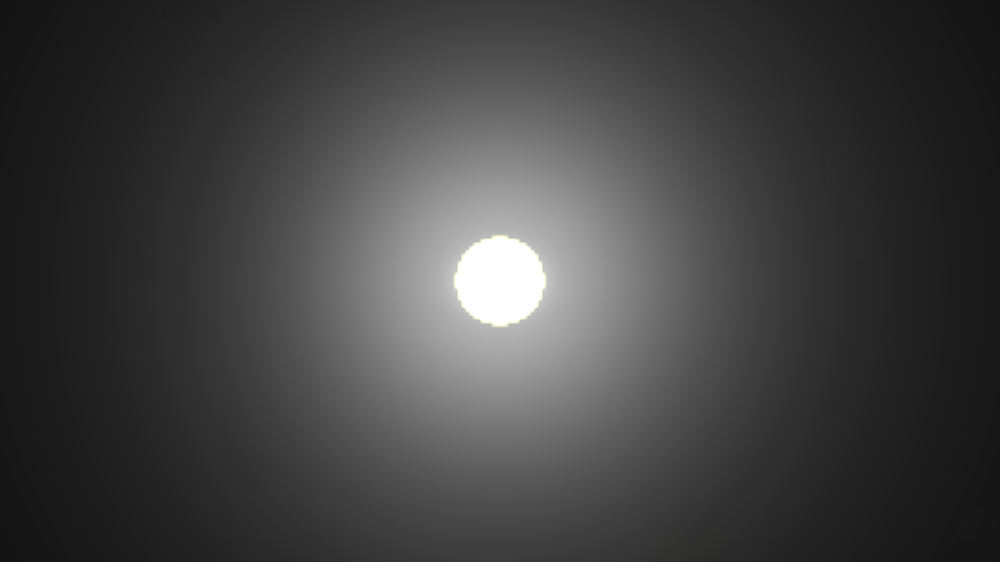                 |
| Moon: albedo, relief & phase            | 80–90 %    | NASA LROC colour albedo, a LOLA-derived tangent-space normal map for terminator relief, Lommel-Seeliger regolith reflectance, the Hapke opposition surge, phase-dependent earthshine and a finite-solar-disc soft terminator. Basis: C12-20/23/30 shipped with targeted Edge gates passing; C12-21/22/24/25/33 are shipped or landed with acceptance still owed (§B.4).                                     | 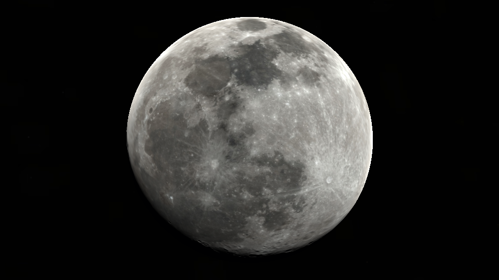               |
| Stars: star map & bright-star catalogue | 80–90 %    | A Tycho-derived star cube map with an optional diffuse Milky Way variant, plus a Yale Bright Star Catalogue point field with Moffat point-spread profiles and magnitude-to-colour-temperature conversion, modulated by an atmospheric sky-brightness estimate. Basis: `SHIPPED` in §B.4 with the star-map seam landed Batch 833; the samplable star cube map (C12-14) is `SCAFFOLDED` with no consumer yet. | 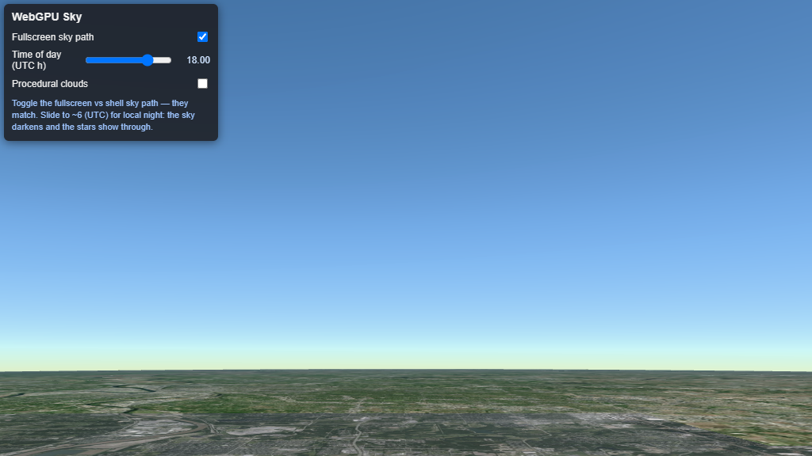             |
| Eclipses & occultation                  | 75–85 %    | Continuous sun fade through penumbra and umbra, per-fragment lunar shadow on globe terrain, totality sky, scene dimming, and eclipse-driven cloud lighting and IBL refresh. Basis: C12-29 S1/S5/S6 are integrated and landed with targeted gates passing; final S5 certification against NASA SVS references, provider transitions and dense timing is explicitly open.                                     | 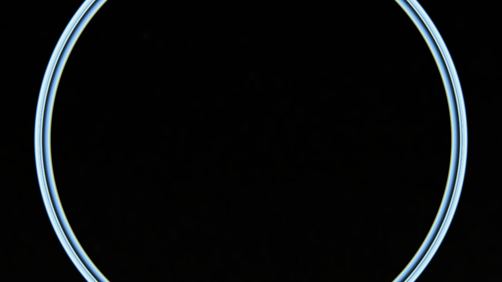         |

### Ocean & water

| Feature                                 | Completion | Notes & details                                                                                                                                                                                                                                                                                                                                                                             | Screenshot                                                                         |
| --------------------------------------- | ---------- | ------------------------------------------------------------------------------------------------------------------------------------------------------------------------------------------------------------------------------------------------------------------------------------------------------------------------------------------------------------------------------------------- | ---------------------------------------------------------------------------------- |
| Enhanced ocean, waves & tidal datum     | 60–70 %    | Opt-in `globe.enableEnhancedOcean`: a Tessendorf spectrum synthesised by inverse FFT on compute, physical-wavelength wave styling, a harmonic tide model with node factors, and an EGM2008 geoid undulation grid for the vertical datum. Basis: the stack is landed, but Campaign 14 (Dynamic Ocean & Wind) is ratified and **not launched** — it unblocks only once Campaign 12 completes. | 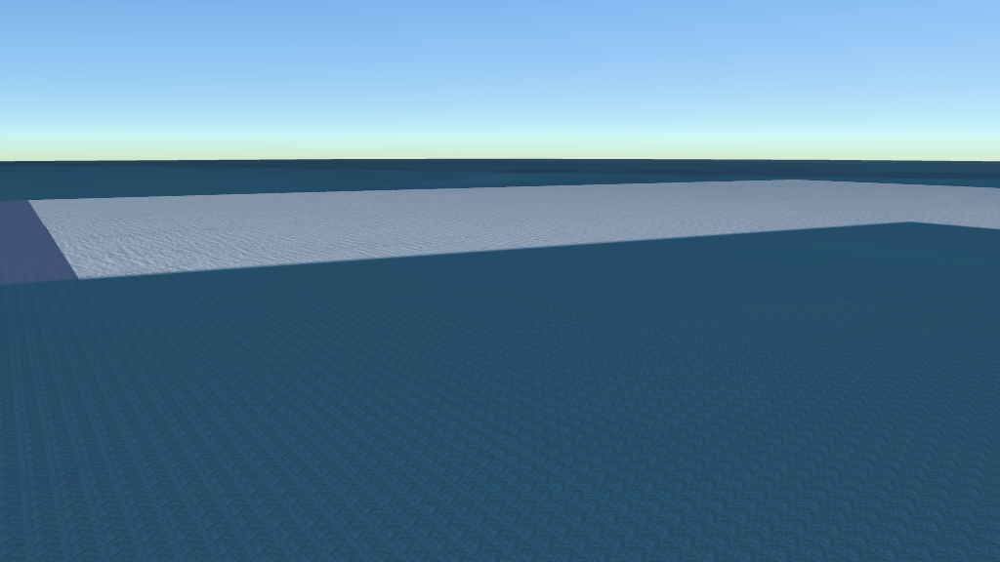 |
| Inland water mask & classification seam | 50–60 %    | A renderer-agnostic `WaterClassificationProvider` seam plus a bundled Natural Earth 1:10m lake mask, so inland water shades as water without a terrain water mask. Basis: this is Phase 1 only — WATER §1 Phase 1+ (Gerstner waves, bathymetry, per-water-type taxonomy) is design-only (§C.9).                                                                                             | 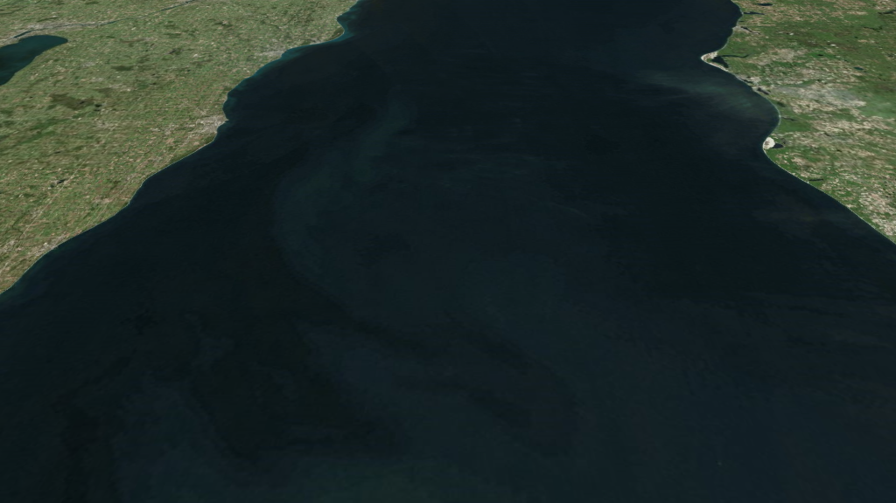         |

### Shadows & lighting

| Feature                                   | Completion | Notes & details                                                                                                                                                                                                                                                                                                                                                                       | Screenshot                                                                       |
| ----------------------------------------- | ---------- | ------------------------------------------------------------------------------------------------------------------------------------------------------------------------------------------------------------------------------------------------------------------------------------------------------------------------------------------------------------------------------------- | -------------------------------------------------------------------------------- |
| Cascaded shadow maps                      | 55–65 %    | RTE-precise per-cascade view projections, slope-scaled depth bias, a 3x3 PCF soft-shadow kernel and a dedicated cast pass covering all seven cast variants. Basis: Slices 1 and 2a are shipped; Slice 3 (altitude-adaptive splits, moon dual-light cascades, variance soft shadows) and Slice 4 (per-tile cascade culling, freezable snapshot mode, WebGL parity) are pending (§C.6). | 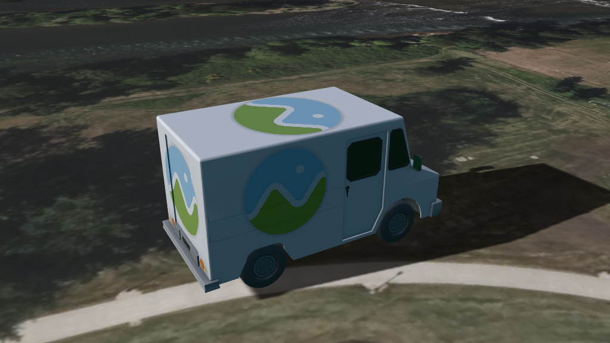                 |
| Point & spot light shadows                | 85–95 %    | Cube depth sampling with a 5-tap PCF soft kernel, received by models, primitives and globe terrain in a matched order. Basis: `SHIPPED` in §B.8; the quantized-terrain vertex layouts are still absent from the shadow cast variant table (§C.6 `SHADOW-LAYOUT-QUANTIZED`).                                                                                                           | 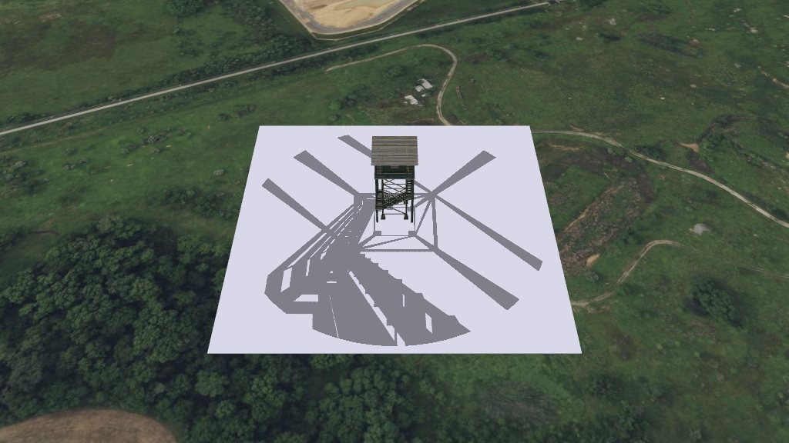 |
| Forward+ clustered lighting & area lights | 80–90 %    | A 16x9x24 cluster grid built and populated by compute passes so `KHR_lights_punctual` point and spot lights shade per pixel far beyond the old one-sun limit, with linearly-transformed-cosine rectangle and disk area lights alongside. Basis: clustered lighting is `SHIPPED` in §B.3; LTC area lights are WebGPU-only and opt-in, default off.                                     | 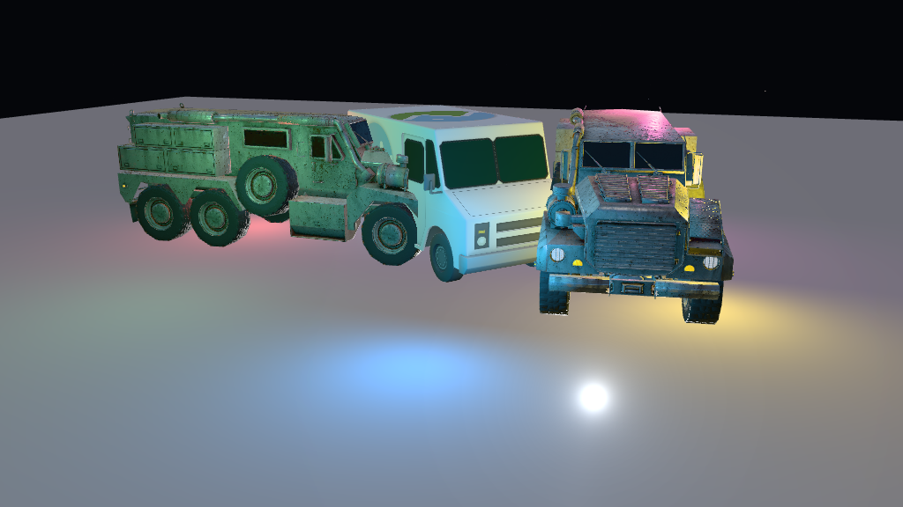   |

### Post-processing

| Feature                                       | Completion | Notes & details                                                                                                                                                                                                                                                                                                                                                                                | Screenshot                                                                         |
| --------------------------------------------- | ---------- | ---------------------------------------------------------------------------------------------------------------------------------------------------------------------------------------------------------------------------------------------------------------------------------------------------------------------------------------------------------------------------------------------- | ---------------------------------------------------------------------------------- |
| Temporal anti-aliasing                        | 75–85 %    | History accumulation with RTE depth-reprojection motion vectors, interleaved-gradient-noise sub-pixel jitter and a history-validity gate. Basis: Slices 1 and 2 are `SHIPPED`; Slice 2b per-model MRT motion vectors for skinned, morphed and instanced primitives, Slice 3 YCoCg variance clipping, and the Slice 4 WebGL parity path are all pending (§C.7).                                 | 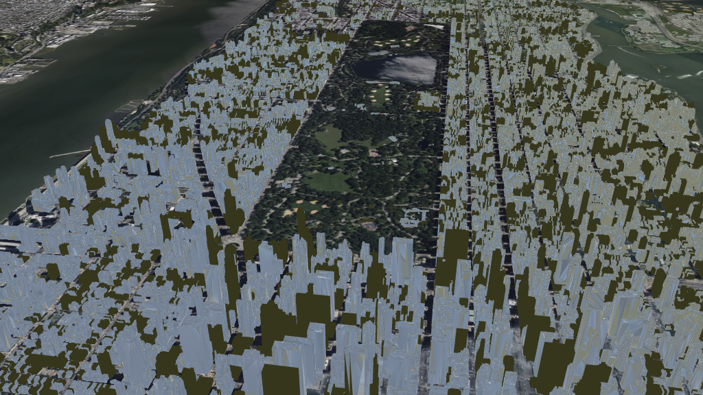                             |
| Screen-space reflections                      | 90–95 %    | McGuire-Mara screen-space ray tracing with tunable march distance, thickness, stride and strength. Basis: `SHIPPED` in §B.5, and one of the 31 features the parity report counts as exceeding WebGL — there is no WebGL counterpart to fall behind.                                                                                                                                            | 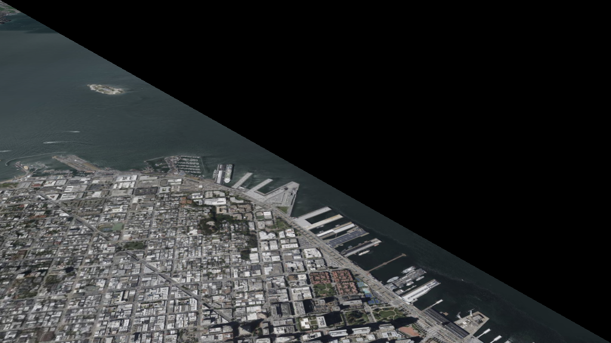                             |
| Bloom, depth of field, FXAA & tonemapping     | 95–100 %   | The full compositing chain: multi-pass bloom, depth of field, FXAA, five tone-mapping operators including a `shader-f16` variant, auto-exposure from a luminance histogram, and colour grading. Basis: every live WebGL post stage scores full parity; the parity report's weaker post-process figure was the orphaned built-in stub cluster, closed 2026-07-02 by `WIRE-PP-LIBRARY-BUILTINS`. |  |
| God rays, ambient occlusion & screen-space GI | 75–85 %    | Radial god rays from the sun direction, GTAO/SSAO ground-truth occlusion, visibility-bitmask screen-space global illumination, velocity-buffer motion blur and contact shadows. Basis: god rays and ambient occlusion are `SHIPPED` in §B.5; SSGI, motion blur and contact shadows are WebGPU-only additions that are opt-in and default off, so they are shipped but unexercised by default.  |    |
| Volumetric fog                                | 85–90 %    | A froxel grid with Henyey-Greenstein sun and moon in-scattering, sun-shadow-map god rays, three-octave varying density and cloud shadows attenuating the shafts. Basis: Phases 5a-5d are `SHIPPED` and default off by an explicit lock so users opt in; Phase 5f temporal-reprojection polish is deferred (§C.7).                                                                              |        |

### Points, vectors & collections

| Feature                                | Completion | Notes & details                                                                                                                                                                                                                                                                                                                                                                | Screenshot                                                                                   |
| -------------------------------------- | ---------- | ------------------------------------------------------------------------------------------------------------------------------------------------------------------------------------------------------------------------------------------------------------------------------------------------------------------------------------------------------------------------------ | -------------------------------------------------------------------------------------------- |
| Bulk entity, point & label collections | 95–100 %   | Billboard, label, point and polyline collections on WebGPU with resident instance buffers, plus two fork additions: a backend-agnostic `BulkPointVisualizer` fast path from entities to flat buffers, and GPU bin-and-count acceleration for `EntityCluster`. Basis: Entity/DataSource plus performance is the strongest subsystem in the parity report §3 at 99.0 % weighted. | 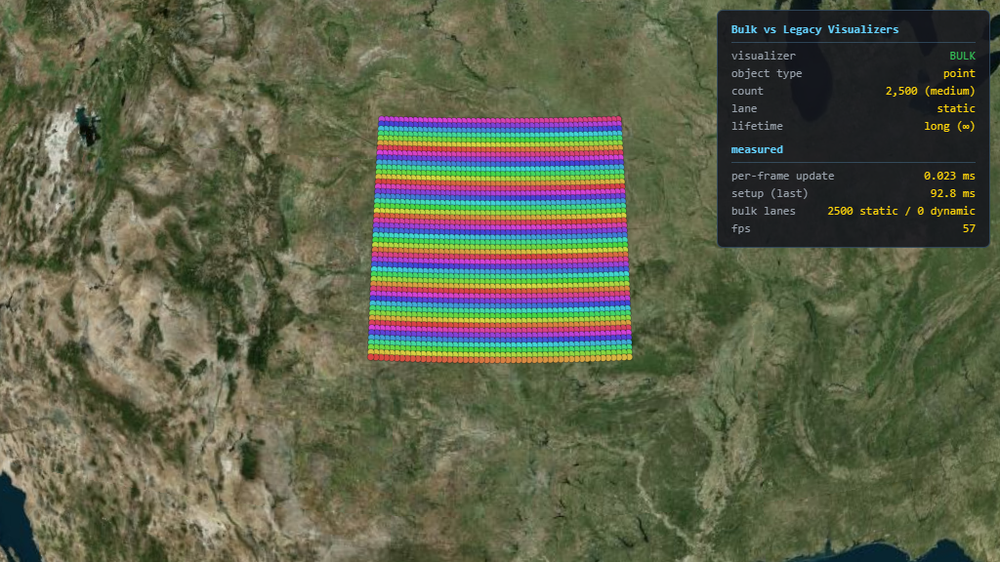 |
| Model edges & feature-ID edges         | 85–95 %    | Per-fragment edge intensity emitted into an MRT edge target with a 16-bit feature-id channel split across RGBA8, driving a three-mode `EdgeDisplayMode` (surfaces only, edges only, both). Basis: `SHIPPED` Batch 316; §C.3 keeps only residual items.                                                                                                                         | 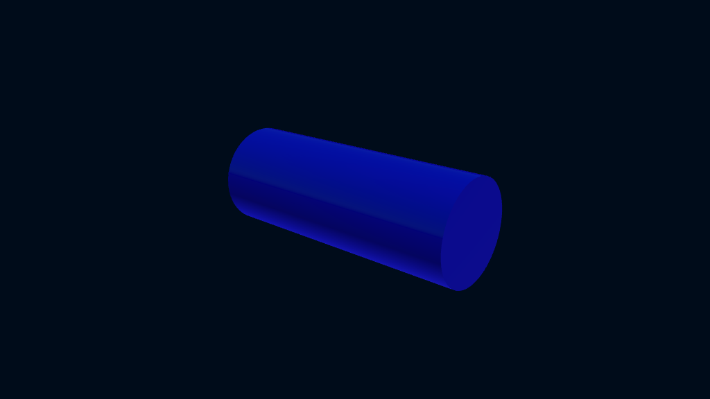     |

### Compute & performance

| Feature                                      | Completion | Notes & details                                                                                                                                                                                                                                                                                                                                                                    | Screenshot                                                                                 |
| -------------------------------------------- | ---------- | ---------------------------------------------------------------------------------------------------------------------------------------------------------------------------------------------------------------------------------------------------------------------------------------------------------------------------------------------------------------------------------- | ------------------------------------------------------------------------------------------ |
| GPU compute-instance system                  | 85–95 %    | A feature-agnostic GPU-resident compute-instance system — user kernels advance thousands of instances entirely on the GPU, with RTE-correct positions, used here for orbital and keyframe catalogues. Basis: `SHIPPED` in §B.3 as a fork-only capability with no WebGL counterpart.                                                                                                | 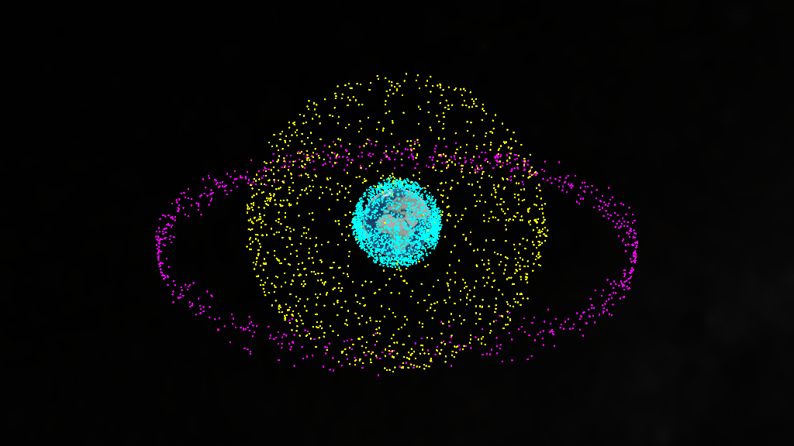 |
| High-density culling, sorting & WASM bridges | 60–70 %    | Render bundles, Hi-Z occlusion pyramids, GPU frustum culling, packed 64-bit sort keys and seven WASM bridges for the hot CPU paths. Basis: render bundles and the WASM bridges are `SHIPPED`, but `FrustumCull.wgsl`, `GPUSortKeys.wgsl` and their dispatchers are `SCAFFOLDED` and the Hi-Z command drop is gated off — JS/WASM culling is what actually runs today (§B.4, §B.8). | 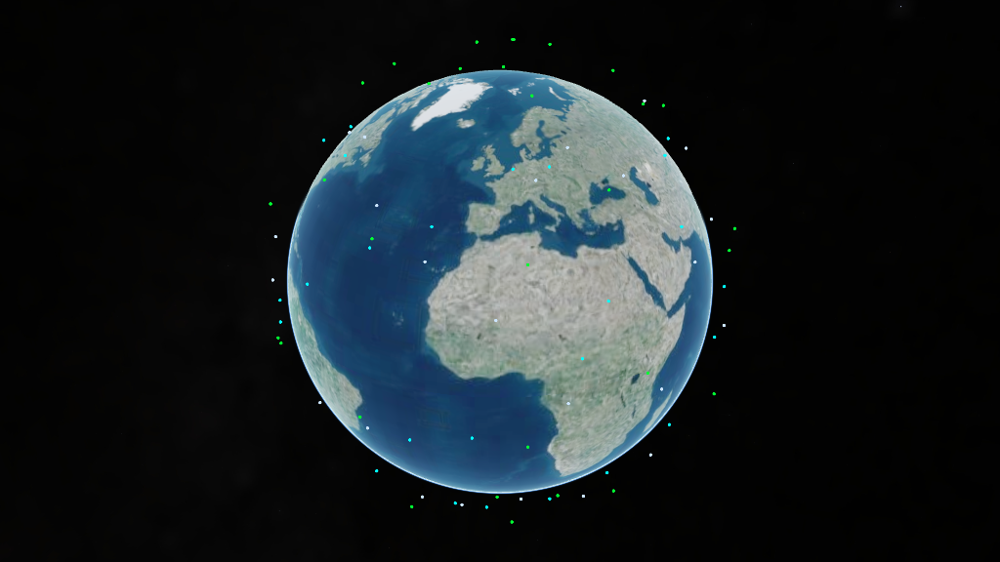         |

### Build variants & tooling

| Feature                                                   | Completion | Notes & details                                                                                                                                                                                                                                                                                                                                                                      | Screenshot                                                                             |
| --------------------------------------------------------- | ---------- | ------------------------------------------------------------------------------------------------------------------------------------------------------------------------------------------------------------------------------------------------------------------------------------------------------------------------------------------------------------------------------------ | -------------------------------------------------------------------------------------- |
| WebGL preservation, split-screen harness & build variants | 95–100 %   | Both backends can be instantiated in one page and compared pixel for pixel, and three build variants ship: dual, WebGPU-only and WebGL-only. Basis: `SHIPPED` in §B.7, with a CI `variants` job building all three and running a WebGL-only runtime smoke test on every push.                                                                                                        | 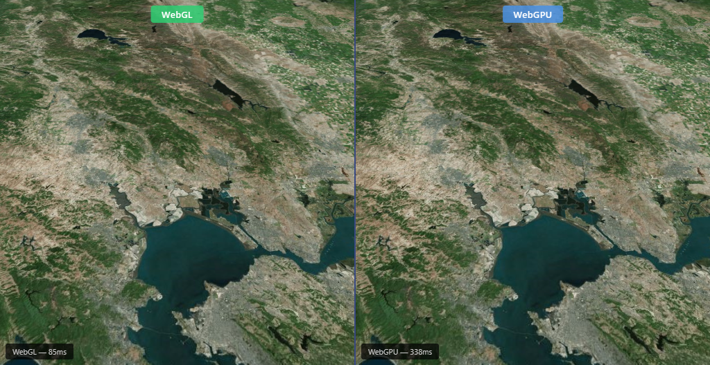     |
| Debug overlays & the probe fleet                          | 95–100 %   | A `CesiumDebug` console surface (wireframe, depth, frustum split colouring, command counts, pipeline and cache statistics, per-pass CPU and GPU timing) plus a large Playwright regression fleet. Basis: `SHIPPED` in §B.9; the fleet carries over 500 probes held to an authoring-time machine-safety contract enforced by `Tools/visual-regression/probe-fleet-contract.spec.mjs`. | 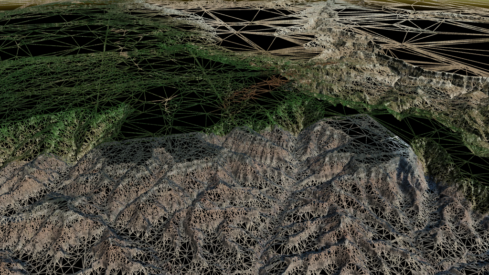 |

<!-- FEATURE-TABLE:END -->

**Where the detail lives.** This table is a summary; the load-bearing documents
are [`migration_doc/README.md`](migration_doc/README.md) (index of every
migration document, live versus archived),
[`FEATURE_INVENTORY.md`](migration_doc/FEATURE_INVENTORY.md) (the full
four-bucket catalogue), [`DEFERRED_WORK.md`](migration_doc/DEFERRED_WORK.md)
(every known gap, with its owner) and
[`DEBUGGING_GUIDE.md`](migration_doc/DEBUGGING_GUIDE.md) (tools and procedures).

---

## :rocket: Get started

Visit the [Downloads page](https://cesium.com/downloads/) to download a pre-built copy of CesiumJS.

### npm & yarn

If you’re building your application using a module bundler such as Webpack, Parcel, or Rollup, you can install CesiumJS via the [`cesium` npm package](https://www.npmjs.com/package/cesium):

```sh
npm install cesium --save
```

Then, import CesiumJS in your app code. Import individual modules to benefit from tree shaking optimizations through most build tools:

```js
import { Viewer } from "cesium";
import "cesium/Build/Cesium/Widgets/widgets.css";

const viewer = new Viewer("cesiumContainer");
```

In addition to the `cesium` package, CesiumJS is also [distributed as scoped npm packages for better dependency management](https://cesium.com/blog/2022/12/07/modular-structure-in-cesiumjs/):

- [`@cesium/engine`](./packages/engine/README.md) - CesiumJS's core, rendering, and data APIs
- [`@cesium/widgets`](./packages/widgets/README.md) - A widgets library for use with CesiumJS

### What next?

See our [Quickstart Guide](https://cesium.com/learn/cesiumjs-learn/cesiumjs-quickstart/) for more information on getting a CesiumJS app up and running.

Instructions for serving local data are in the CesiumJS
[Offline Guide](./Documentation/OfflineGuide/README.md).

Interested in contributing? See [CONTRIBUTING.md](CONTRIBUTING.md). :heart:

### Development

`npm start` serves the repository at <http://localhost:8080/>. The CesiumViewer
application there starts on WebGPU, falling back to WebGL when the browser does
not support it, and otherwise matches upstream CesiumViewer.

`npm run start-dev-ui` serves the same content and additionally prints the
CesiumViewer URL that enables this fork's development chrome — the
WebGL/WebGPU/Split renderer switcher and the FPS toggle. That chrome is built
only for a page loaded with `?devUi=true` (`?devUi=1` also works); every other
URL, including `?renderer=webgl` and `?renderer=webgpu`, leaves it out
entirely.

## :green_book: License

[Apache 2.0](http://www.apache.org/licenses/LICENSE-2.0.html). CesiumJS is free for both commercial and non-commercial use.

## :earth_americas: Where does the Global 3D Content come from?

The Cesium platform follows an [open-core business model](https://cesium.com/why-cesium/open-ecosystem/cesium-business-model/) with open source runtime engines such as CesiumJS and optional commercial subscription to Cesium ion.

CesiumJS can stream [3D content such as terrain, imagery, and 3D Tiles from the commercial Cesium ion platform](https://cesium.com/platform/cesium-ion/content/) alongside open standards from other offline or online services. We provide Cesium ion as the quickest option for all users to get up and running, but you are free to use any combination of content sources with CesiumJS that you please.

Bring your own data for tiling, hosting, and streaming from Cesium ion. [Using Cesium ion](https://cesium.com/ion/signup/) helps support CesiumJS development.

## :white_check_mark: Features

- Stream in 3D Tiles and other standard formats from Cesium ion or another source
- Visualize and analyze on a high-precision WGS84 globe
- Share with users on desktop or mobile

See more in the [CesiumJS Features Checklist](https://github.com/CesiumGS/cesium/wiki/CesiumJS-Features-Checklist).

## :books: References & Credits

> **Automation note:** this fork is developed by an autonomous AI agent
> pipeline; commit timestamps reflect automated landings, not personal
> working sessions — see [AUTOMATION.md](AUTOMATION.md).
>
> **Licensing note:** all fork-specific work (the WebGPU backend, WGSL
> shaders, and tooling) is available under the same Apache-2.0 terms as
> upstream CesiumJS — see the [Fork-Specific Work](LICENSE.md#fork-specific-work)
> section of the license. Credit to the fork author is appreciated but not
> required.

The rendering work in this fork stands on published research, on datasets
published by public agencies, and on a handful of open-source projects whose
approach it follows. Everything named below is credited in the source file that
uses it as well; this section collects them in one place so the debts are
visible without reading the tree.

**This is credit, not licensing.** Where code, data or an asset was actually
copied or adapted, the terms travel with it in [`LICENSE.md`](LICENSE.md) — in
its `# Third-Party Code` and `# Bundled Engine Assets` sections, mirrored into
[`packages/engine/LICENSE.md`](packages/engine/LICENSE.md) for anything that
ships inside `@cesium/engine`. A name here is not a grant. The reasoning behind
each of those entries, including the questions that are still open, is recorded
in
[`migration_doc/LICENSE_DETERMINATIONS_2026-08-10.md`](migration_doc/LICENSE_DETERMINATIONS_2026-08-10.md),
and `node Tools/c16/verify-packaged-notices.mjs` checks that every notice it
requires actually reaches the published artifacts.

### Rendering techniques

| Work                                                                                                                                                                                                                         | Used for                                                                             |
| ---------------------------------------------------------------------------------------------------------------------------------------------------------------------------------------------------------------------------- | ------------------------------------------------------------------------------------ |
| Bruneton & Neyret, _Precomputed Atmospheric Scattering_ (2008) — [paper](https://hal.inria.fr/inria-00288758)                                                                                                                | Transmittance and inscatter lookup tables for the sky and the ground pass            |
| Hillaire, _A Scalable and Production Ready Sky and Atmosphere Rendering Technique_ (2020) — [paper](https://sebh.github.io/publications/egsr2020.pdf)                                                                        | Multiple scattering, sky-view parameterisation, aerial-perspective froxels           |
| Nishita et al., _Display of the Earth Taking into Account Atmospheric Scattering_ (SIGGRAPH 1993)                                                                                                                            | The single-scattering integral both backends' sky shaders evaluate                   |
| O'Neil, _Accurate Atmospheric Scattering_, GPU Gems 2 (2005) — [site](http://sponeil.net/)                                                                                                                                   | The analytic scattering fallback inherited from upstream                             |
| Karis, _Real Shading in Unreal Engine 4_ (SIGGRAPH 2013)                                                                                                                                                                     | Split-sum image-based lighting, the environment BRDF table, the Smith geometry remap |
| Karis, _High Quality Temporal Supersampling_ (SIGGRAPH 2014)                                                                                                                                                                 | Temporal anti-aliasing resolve and neighbourhood clamping                            |
| Walter et al., _Microfacet Models for Refraction through Rough Surfaces_ (EGSR 2007)                                                                                                                                         | The GGX / Trowbridge-Reitz distribution used throughout the PBR path                 |
| Schlick, _An Inexpensive BRDF Model for Physically-based Rendering_ (1994)                                                                                                                                                   | The Fresnel approximation                                                            |
| Belcour & Barla, _A Practical Extension to Microfacet Theory for the Modeling of Varying Iridescence_ (2017)                                                                                                                 | Thin-film iridescence for `KHR_materials_iridescence`                                |
| Khronos Group — [glTF specification](https://github.com/KhronosGroup/glTF), [Sample Renderer](https://github.com/KhronosGroup/glTF-Sample-Renderer), [ToneMapping](https://github.com/KhronosGroup/ToneMapping)              | The glTF material model, its reference formulations, and the PBR Neutral operator    |
| Wronski, _Volumetric Fog_ (SIGGRAPH 2014)                                                                                                                                                                                    | The froxel volume and the inject / scatter / integrate decomposition                 |
| Hillaire, _Physically Based and Unified Volumetric Rendering in Frostbite_ (SIGGRAPH 2015)                                                                                                                                   | Energy-conserving volumetric integration                                             |
| Henyey & Greenstein, _Diffuse Radiation in the Galaxy_ (1941)                                                                                                                                                                | The scattering phase function                                                        |
| Schneider & Vos, _The Real-Time Volumetric Cloudscapes of Horizon Zero Dawn_ (SIGGRAPH 2015) and Schneider, GPU Pro 7 (2016)                                                                                                 | Perlin-Worley cloud noise and the erosion ladder                                     |
| Worley, _A Cellular Texture Basis Function_ (SIGGRAPH 1996)                                                                                                                                                                  | The cellular noise the cloud bake is built from                                      |
| McGuire & Mara, _Efficient GPU Screen-Space Ray Tracing_, JCGT (2014) — [paper](https://jcgt.org/published/0003/04/04/)                                                                                                      | Screen-space reflections                                                             |
| Therrien, Levesque & Gilet, _Screen Space Indirect Lighting with Visibility Bitmask_ (2023) — [arXiv](https://arxiv.org/abs/2301.11376)                                                                                      | Screen-space global illumination                                                     |
| Jimenez et al., _Practical Realtime Strategies for Accurate Indirect Occlusion_ (2016)                                                                                                                                       | Ground-truth ambient occlusion                                                       |
| Jimenez et al., _Next Generation Post Processing in Call of Duty: Advanced Warfare_ (SIGGRAPH 2014)                                                                                                                          | Interleaved-gradient noise                                                           |
| Hill & Collin, _Practical, Dynamic Visibility for Games_, GPU Pro 2 (2011)                                                                                                                                                   | Hierarchical-Z occlusion culling                                                     |
| Heitz, Dupuy, Hill & Neubelt, _Real-Time Polygonal-Light Shading with Linearly Transformed Cosines_ (SIGGRAPH 2016) — [project](https://eheitzresearch.wordpress.com/415-2/), [code](https://github.com/selfshadow/ltc_code) | Analytic area lights                                                                 |
| Kerbl, Kopanas, Leimkühler & Drettakis, _3D Gaussian Splatting for Real-Time Radiance Field Rendering_ (2023) — [project](https://repo-sam.inria.fr/fungraph/3d-gaussian-splatting/)                                         | The Gaussian-splat renderer                                                          |
| Lottes, _FXAA 3.11_ (NVIDIA)                                                                                                                                                                                                 | Fast approximate anti-aliasing                                                       |
| Reinhard et al. (2002), Hable, _Filmic Tonemapping Operators_ (2010), Narkowicz, _ACES Filmic Tone Mapping Curve_ (2016)                                                                                                     | The tone-mapping operators                                                           |
| Tessendorf, _Simulating Ocean Water_ (SIGGRAPH course notes, 1999-2004)                                                                                                                                                      | The ocean spectrum and its inverse-FFT synthesis                                     |
| Sloan, _Stupid Spherical Harmonics (SH) Tricks_ (GDC 2008)                                                                                                                                                                   | Spherical-harmonic projection of the radiance environment                            |
| Ramamoorthi & Hanrahan, _An Efficient Representation for Irradiance Environment Maps_ (2001)                                                                                                                                 | The nine-coefficient irradiance result                                               |
| Cigolle et al., _A Survey of Efficient Representations for Independent Unit Vectors_, JCGT (2014)                                                                                                                            | Octahedral normal encoding                                                           |
| Gjøl & Svendsen, _The Rendering of Inside_ (GDC 2016)                                                                                                                                                                        | Screen-space contact shadows                                                         |
| Mitchell, _Volumetric Light Scattering as a Post-Process_, GPU Gems 3                                                                                                                                                        | Screen-space light shafts                                                            |
| CIE 135/1:1999, _Disability Glare_                                                                                                                                                                                           | The veiling-glare falloff behind the solar halo                                      |

### Algorithms & data structures

| Work                                                                                                                                                                                                  | Used for                                                   |
| ----------------------------------------------------------------------------------------------------------------------------------------------------------------------------------------------------- | ---------------------------------------------------------- |
| Batcher, _Sorting Networks and their Applications_ (1968)                                                                                                                                             | The bitonic sort networks used for splats and point clouds |
| Merrill & Garland, _Single-pass Parallel Prefix Scan with Decoupled Look-back_ (2016) — [paper](https://research.nvidia.com/publication/2016-03_single-pass-parallel-prefix-scan-decoupled-look-back) | Single-dispatch prefix sums                                |
| van der Zijp, _Fast Half Float Conversions_ (2008)                                                                                                                                                    | Table-driven half-float encoding on the CPU                |
| Dammertz, _Hammersley Points on the Hemisphere_                                                                                                                                                       | Quasi-random sampling for the BRDF table                   |
| Pogson (1856); Ballesteros, _New insights into black bodies_ (2012)                                                                                                                                   | Star magnitudes and B−V to colour temperature              |
| Moffat, _A Theoretical Investigation of Focal Stellar Images_ (1969)                                                                                                                                  | The stellar point-spread profile                           |
| Claret (2000); _Allen's Astrophysical Quantities_ (2000)                                                                                                                                              | Solar limb darkening                                       |
| Meeus, _Astronomical Algorithms_ (1998)                                                                                                                                                               | Eclipse cone geometry                                      |
| Hapke (1986); Buratti, Hillier & Wang (1996)                                                                                                                                                          | The lunar opposition surge                                 |
| Patat et al. (2006); Crumey (2014)                                                                                                                                                                    | Twilight sky brightness and naked-eye limiting magnitude   |
| Doodson (1921); Cartwright & Tayler (1971); Schureman, _Manual of Harmonic Analysis and Prediction of Tides_ (1940); Simon et al. (1994); IERS Conventions (2010)                                     | Tidal constituents, node factors and the equilibrium tide  |
| Pavlis et al., _The development and evaluation of EGM2008_ (2012)                                                                                                                                     | The geoid undulation model                                 |
| lolengine, _RGB to HSV in GLSL_ (2013) — [post](http://lolengine.net/blog/2013/07/27/rgb-to-hsv-in-glsl)                                                                                              | Branch-free colour-space conversion                        |

### Open-source projects whose approach this fork follows

| Project                                                                                                                                                        | Used for                                                                       |
| -------------------------------------------------------------------------------------------------------------------------------------------------------------- | ------------------------------------------------------------------------------ |
| [gfx-rs/naga](https://github.com/gfx-rs/wgpu/tree/trunk/naga)                                                                                                  | Vendored WebAssembly shader translator for runtime GLSL to WGSL                |
| [KhronosGroup/glTF-Sample-Renderer](https://github.com/KhronosGroup/glTF-Sample-Renderer) and [glTF-WebGL-PBR](https://github.com/KhronosGroup/glTF-WebGL-PBR) | The reference glTF material implementations                                    |
| [mrdoob/three.js](https://github.com/mrdoob/three.js)                                                                                                          | Reference implementations for screen-space global illumination and iridescence |
| [cdrinmatane/SSRT3](https://github.com/cdrinmatane/SSRT3)                                                                                                      | The visibility-bitmask global-illumination formulation                         |
| [gasgiant/FFT-Ocean](https://github.com/gasgiant/FFT-Ocean)                                                                                                    | The compute decomposition of the spectral ocean                                |
| [BarthPaleologue/WebTide](https://github.com/BarthPaleologue/WebTide)                                                                                          | The WGSL form of the twiddle precompute and butterfly stages                   |
| [Popov72/OceanDemo](https://github.com/Popov72/OceanDemo)                                                                                                      | Spectrum packing and displacement reassembly                                   |
| [mapbox/webgl-wind](https://github.com/mapbox/webgl-wind)                                                                                                      | The ping-pong particle integrator behind the wind layer                        |
| [RaymanNg/3D-Wind-Field](https://github.com/RaymanNg/3D-Wind-Field)                                                                                            | Advecting that integrator in geographic coordinates on a globe                 |
| [Orillusion/orillusion](https://github.com/Orillusion/orillusion)                                                                                              | The depth-gated light-shaft variant                                            |
| [linebender/vello](https://github.com/linebender/vello)                                                                                                        | The WebGPU rendering of decoupled look-back                                    |
| [selfshadow/ltc_code](https://github.com/selfshadow/ltc_code)                                                                                                  | The fitted area-light lookup tables                                            |
| [Takram three-geospatial](https://github.com/takram-design-engineering/three-geospatial)                                                                       | Geospatial atmosphere reference for cross-checking                             |
| Tommy Ettinger's Mulberry32 — [gist](https://gist.github.com/tommyettinger/46a874533244883189143505d203312c)                                                   | The deterministic generator seeding the wind-particle field                    |

### Datasets & assets

| Source                                                                                                                                        | Used for                                                                     |
| --------------------------------------------------------------------------------------------------------------------------------------------- | ---------------------------------------------------------------------------- |
| [NASA/GSFC Scientific Visualization Studio — The Tycho Catalog Skymap](https://svs.gsfc.nasa.gov/3572/)                                       | The star-map cube faces, and the diffuse Milky Way variant derived from them |
| [NASA/GSFC SVS — CGI Moon Kit](https://svs.gsfc.nasa.gov/4720/)                                                                               | The lunar albedo map and the normal map derived from LOLA elevation          |
| NASA LRO LROC team, Arizona State University — [WAC mosaic](http://wms.lroc.asu.edu/lroc/view_rdr/WAC_HAPKE_NORMALIZED)                       | The mosaic underlying that albedo map                                        |
| ESA — Hipparcos and Tycho-2 catalogues                                                                                                        | The catalogues the star map was rendered from                                |
| [Yale Bright Star Catalogue, 5th revised edition](https://heasarc.gsfc.nasa.gov/W3Browse/star-catalog/bsc5p.html), served by NASA HEASARC     | The bright-star catalogue the point starfield draws                          |
| U.S. National Geospatial-Intelligence Agency — EGM2008                                                                                        | The bundled geoid undulation grid                                            |
| [Natural Earth](https://www.naturalearthdata.com/) — 1:10m Lakes, via [natural-earth-vector](https://github.com/nvkelso/natural-earth-vector) | The inland-lake water mask                                                   |
| NOAA — Global Forecast System                                                                                                                 | Sample wind velocity fields for the flow-field layer                         |

_Assembled from the attribution census run over every fork-changed file, and
kept in step with `LICENSE.md` by `Tools/c16/verify-packaged-notices.mjs`. If a
work is used here and missing from this section, that is a defect worth
reporting._
