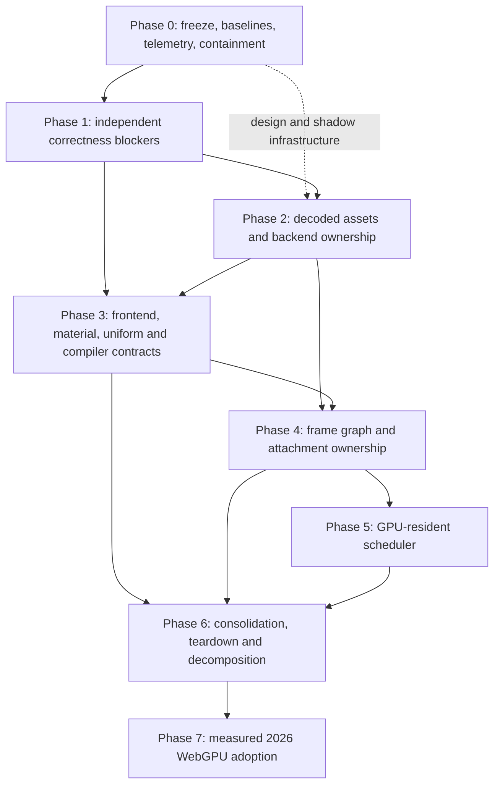

# Fork Architecture Remediation Plan

Date: 2026-07-13; planning checkpoint updated 2026-07-15

Status: **ACTIVE — SECOND BOUNDED HOT-PATH TRANCHE PRESENT; CAMPAIGN 8 LAUNCHED 2026-07-15; RELEASE GATES REMAIN OPEN**

Launch anchor: `a54cc06b2aad89a00e8ecb0887b953a36f061954` (2026-07-11). The worktree audit and planning documents created after that commit are part of the Phase 0 evidence package; they are not a new rendering baseline.

Source audit: [Fork vs Upstream WebGPU/WebGL Architecture Audit](FORK_VS_UPSTREAM_WEBGPU_ARCHITECTURE_AUDIT_2026-07-13.md)

Latest measured tranche: [Fork Performance Audit and Fix Results](FORK_PERFORMANCE_AUDIT_AND_FIX_RESULTS_2026-07-14.md). This records the exact moving-camera before/final evidence and the bounded preparation slices now present; it does not close the wider remediation campaign.

Planning authority: this document is the execution plan for the findings in that audit. It does not erase or renumber existing roadmap IDs. While this remediation campaign is active, its P0/P1 correctness and ownership work takes priority over unlanded net-new Campaign-7 tail features. Existing shipped features remain supported.

Machine-readable traceability: [Fork Architecture Remediation Ledger](FORK_ARCHITECTURE_REMEDIATION_LEDGER_2026-07-13.json).

Active next queue: [Campaign 8 — Correctness Closure and Renderer-Native Architecture](QUEUE_2026-07-15_CAMPAIGN8.md).
The maintainer explicitly launched it on 2026-07-15. Its correctness-first core, production
FAR-200/FAR-209 ownership sequence, gated frame-graph/picking tail, and final render-pacing work still
advance only through the queue's acceptance gates.

Branch policy: trunk-only. At plan creation, the only local/origin branch is `main` / `origin/main`. Any implementation worktree or rollback branch must be short-lived, disclosed before use, and removed after its batch lands and verifies.

## 1. Decision and campaign objective

The architecture investigation is complete enough to stop broad discovery and begin controlled implementation. The problems have concrete code paths, failure mechanisms, dependencies, and observable acceptance conditions. Runtime cost attribution is not complete: repairing telemetry and executing the Phase 0 hot-path characterization are prerequisites to final optimization ordering or any claim that the render path is fully unblocked. Remaining discoveries should be handled inside the relevant work package rather than reopening the entire audit.

The campaign objective is:

> Preserve the complete public CesiumJS/WebGL2 feature surface while making WebGPU own its native resources and frame schedule directly, with at most one primary GPU realization per immutable payload version, backend domain, and exact descriptor; no unsafe cross-context state; no normal-frame GPU readback scheduler; and no default-on optimization without measured benefit.

The campaign is successful only when all of the following are true:

1. WebGL2 behavior and public APIs remain compatible.
2. A fully native-owned WebGPU family/mode/pass/variant creates no compatibility GPU resource before its native resource; partial coverage retains the compatibility owner.
3. Simultaneous WebGL/WebGPU views share fetch/decode products but never cross-use GPU handles.
4. Multiple WebGPU contexts first prove independent NATIVE_CONTEXT ownership, then share safe immutable realizations in NATIVE_DEVICE; compiler objects share only with complete canonical fingerprints.
5. One frame graph owns normal-frame pass order, attachments, encoder lifetime, and submission.
6. Dense WebGPU culling/HiZ/sort/indirect execution removes CPU scheduling work and normal-frame readback instead of duplicating it.
7. Every change is protected by exact API, visual, allocation, lifetime, multi-context, and performance gates.
8. Performance work never removes, default-disables, visually degrades, or bypasses a feature merely to improve a metric. Broken or unsafe behavior is preserved as an explicit capability where safe, its defect is queued, and any safety containment is reported as correctness work rather than a performance win.

This is a consolidation campaign, not a feature campaign. Unlanded planar reflection/refraction, cloud impostor LOD, FSR2, and other large net-new tails stay paused until the Phase 2 ownership exit gate unless the maintainer explicitly reprioritizes them.

### 1.1 Current-functionality anchor

The pre-fix behavior anchor is [Current Rendering Functionality Baseline](CURRENT_RENDERING_FUNCTIONALITY_BASELINE_2026-07-13.md). It combines the public/API inventory with provenance-checked visual and semantic evidence. The ignored `Tools/visual-regression/output` directory is characterization evidence, not automatically a golden baseline: a PNG is promoted only when its producer probe, renderer, flags, commit, semantic oracle, and current-HEAD reproducibility are known.

The anchor includes the Campaign-7 functionality present at `a54cc06`: lake water classification, textured GroundPrimitive classification, silhouette arrays, TPDF dither, sun/star extinction, cloud STBN/far-ray LOD, Gaussian-splat depth composition, LTC area lights, motion blur, flow-field particles, atmosphere parameter resolution, logarithmic-depth post effects, SSGI, cascaded cloud shadows, and FFT ocean. Opt-in features must preserve both their enabled result and their default-off/off-restored result. A known-broken, reverted, experimental, or unproven image is retained as non-blocking reference evidence and must not be normalized into an accepted golden image.

### 1.2 Campaign live execution record

This record describes the current uncommitted implementation worktree; it does not move the launch anchor or promote a new rendering baseline.

| Package | State on 2026-07-15 | Evidence now present | Still required |
| --- | --- | --- | --- |
| FAR-000 | Active, documentation foundation complete | accepted plan, audit, machine-readable finding ledger, roadmap pointer, feature-inventory reconciliation note | finish per-feature scenario/provenance reconciliation as later package fixtures are added |
| FAR-001 | Active, telemetry-integrity Slice A implemented | capability-correct timestamp creation; pre-pass begin/post-pass resolve/post-submit async readback; duplicate-label aggregation; reset epoch; attempt/sample/overflow/skip/failure counters; core scene-pass timestamps; truthful full-`Scene.render` CPU sample; debug enable/disable contract; fake-device and browser tests | instrument every material render/compute pass, add an explicit unprofiled remainder, then add allocation/upload/lifetime/stage/GC counters |
| FAR-002 | Active, characterization inventory complete | 2,934-image/596-probe inventory, seven formal scenes, manually inspected recent feature witnesses, current-functionality baseline document | provenance manifest, curated tracked historical images, Campaign-7 semantic fixtures, off/restored fixtures |
| FAR-003 | Active, unsafe paths contained | unsafe culling/HiZ/sort/OIT defaults fail closed with requested-versus-active diagnostics and focused gates | final cross-backend/full-suite verification; later frame-graph work remains separate |
| FAR-004 | Active, exact moving-flight tranche measured | versioned Node/Edge workloads plus clean AB/BA WebGL/WebGPU runs and a separate instrumented attribution lane over the complete nine-altitude route; exact pre/final bundle hashes and hardware/browser identity recorded | statistically blocking clean committed campaign, uncapped/maximum-throughput lane, broader workload/mode/frustum coverage, and full counter schema |
| FAR-005 | Active, policy/harness foundation implemented | current/current parity, GPU-error gate, manifest-policy tests, and explicit historical-baseline certification state | populate and approve tracked per-backend historical baselines, UI masks, structured provenance/artifacts, and physical-runner cells |
| FAR-006 | Active, first moving hot-path tranche attributed | exact moving run measured WebGPU CPU p95 8.80→7.30 ms and GPU p95 10.02→7.30 ms; instrumented calls/frame measured bind groups 11.76→4.94, passes 23.34→14.49, and writes 79.02→10.06 | full cold/loading/settled/moving/mutation attribution for every HP-01 through HP-08 workload; wider adapter matrix and unprofiled remainder remain open |
| FAR-100 | Active, production compatibility-native allocation removed | metadata-only production WebGPU stub buffers; renderer-capability retention for PNTS and indexed classification decoded payloads; lifecycle/growth/failure tests; strict physical-adapter probe reports zero compatibility live GPU buffers/bytes | legacy CPU/WebGL-shaped shells remain; migrate non-buffer compatibility resource families separately |
| FAR-101 | Active, per-consumer material state implemented | stable public material values, consumer-specific upload/version tracking, bounded pruning, Material/polyline focused suites | final broad WebGL/WebGPU visual and full-suite verification |
| FAR-102/FAR-103 | Active, transactional selection/readiness implemented | centralized renderer policy, async Scene/Widget/Viewer factories, explicit feature readiness, exact-owner rollback, mandatory Scene/DataSourceDisplay cleanup, shared EntityCollection refcounts; 384-case affected Edge matrix passes | complete long-running multi-context/device-loss soak beyond the focused recovery matrix |
| FAR-104 | Active, context-owned conventions/capabilities implemented | immutable clip-space convention and graphics capabilities; explicit KTX2 targets; frustum, shadow, KTX2, and context-factory suites | final full-suite/multi-context soak; legacy unused compatibility modules may be removed only in cleanup |
| FAR-105 | Active, ordering hot loop and bounded producer corrected | canonical ordering normalization occurs once before arithmetic-only comparison; an explicitly `never` consumer no longer pays GPU-sort producer upload/dispatch/map work; a forced 6,400-command run produced a complete exact CPU-comparator permutation | normal-frame readback removal, identity hardening, safe automatic selection, authoritative Phase-5 scheduling, and final full-suite/adapter validation |
| FAR-106 | Active, bounded shader correction implemented | absolute-ECEF LUT fog input plus poles/antimeridian/camera-teleport numeric oracle | consolidated build and visual regression campaign |
| FAR-107/FAR-409 | Planned architecture; two dependency-safe legacy-executor corrections active | the architecture audit traces object, position, arbitrary-ray, metadata, voxel, feature-ID, depth, cache, and readback ownership. The current executor now uses one far-to-near pick pass per frustum (ID load, slice-local depth/stencil clear), and 1×1/3×3 readback allocates exact-extent staging with request-owned async buffers. Focused 1 + 10 case Edge suites and a real 3-frustum WebGPU/2-frustum WebGL near/far/TAA probe pass. | approve the public query/sync contract; implement graph-owned query mini-frames, stable query/depth identity, serial-owned pooled readback, and contiguous feature-ID ranges; pass the complete query/mode/frustum/concurrency matrix. These bounded corrections do not establish one query/submission authority. |
| FAR-108 | Active, effects cache ownership contained | logical-context volatile state, device-shared immutable placeholders, retain/release, bounded pruning, recovery-aware teardown | moving-camera residency campaign and final multi-context/device-loss/browser verification |
| FAR-200 | Active, shadow infrastructure only | typed domains/payloads/descriptors/policy/tokens/leases/shadow cache/submission-serial APIs and Node self-test | no production allocation/retirement authority adopted; 52 direct `queue.submit` sites remain to route through one physical-queue authority |
| FAR-204 preparation slices | Active, bounded hot-path caches implemented | immutable model geometry descriptor/conversion memoization, bounded metadata layout/descriptor caches, O(1) validation of the common no-structural-metadata negative cache, and exact-identity reuse of the merged model instance bind group | loader-owned geometry/metadata revision tokens, mutation-sensitive positive-path validation, group-1 material/texture bind-group stability, and the actual Model ownership vertical remain deferred |
| FAR-303 preparation slice | Active, terrain camera-uniform writes coalesced | CPU-staged device-local ring pages flush at most one contiguous `writeBuffer` per dirty page before finish/submit while preserving offsets/layout/payload; typed-array, alignment, multipage, repeated-flush, and unwritten-tail tests pass | complete frame/view/material/object hierarchy, persistent material/object tables, static/dynamic terrain split, and zero ordinary-frame pick uploads |
| FAR-309 preparation slice | Active, one model settled-frame allocation removed | group-2 skin/morph/instance bind groups cache by the exact seven current/previous buffer identities plus layout/device; all-placeholder primitives reuse the pipeline cache's shared group. Six focused cases pass; a static+instanced+morph WebGPU/TAA probe records zero group-2 creates and stable identities over 40 settled frames. | group-1 material/texture/IBL caching, draw-command allocation, collection dirty gating, shader-diagnostic and performance-tracker demand gates, GC attribution, and settled/mutation workload timing remain open |
| FAR-307 preparation slice | Active, polyline grouping/lifetime churn bounded | grouping storage is reused; same-type camera/pipeline/frame work is hoisted without merging exact material identities; retired material/segment resources receive a 60-frame grace; mixed solid/dash/glow parity probe passes | persistent geometry/material table, dirty-range updates, zero-allocation placeholders, complete velocity/material variants, and lifetime campaign |
| FAR-405 preparation slice | Active, empty depth boundaries reduced | post-tile and post-opaque depth work is skipped only when no relevant writer ran; moving evidence shows render passes/frame 23.34→14.49. The 0.073% worst nine-waypoint visual result is pre-final-depth-source characterization, not exact-current certification. | rerun the exact-current moving visual lane, then implement graph-owned pass merging/load-store/transient policy and prove the complete attachment/frustum/mode matrix |
| FAR-408 preparation slice | Active, depth binding churn bounded | globe source-depth and MSAA-resolve views/bind groups cache by stable texture/view identity and invalidate on resize/device/recovery/destruction; focused reuse/invalidation specs pass | demand-derived depth versions/pack nodes and correction of the queued multi-frustum globe `pickPosition` packed-depth lifetime defect |

### 1.3 Implementation checkpoint and claim boundaries

The current worktree contains substantial first-tranche code, but it is not yet a campaign-complete or release-certifying result. The following boundaries are mandatory when interpreting the table above:

- FAR-200 is a shadow architecture scaffold. It does not yet own production resources or retirement, and the 52 direct `queue.submit` call sites found by the current static audit remain.
- The measured WebGPU Buffer double tax is removed for production compatibility-stub buffers: they retain logical metadata but allocate zero native compatibility `GPUBuffer`s. Legacy CPU/WebGL-shaped objects still exist, and texture/VA/shader compatibility ownership is not thereby solved.
- Model geometry and metadata work removes repeated conversions/layout construction through bounded caches. The common no-structural-metadata negative path now validates identity in O(1), but mutable producer-wide metadata and geometry invalidation still need explicit loader-owned monotonic revision contracts; this bounded negative cache is not proof of those future contracts.
- Device-loss recovery, effects lifetime, and Scene/Widget/Viewer/DataSourceDisplay construction use transactional rollback paths. The consolidated 384-case affected Edge matrix passes; long multi-context/device-loss soak remains a release gate.
- The historical visual baseline remains **NON_CERTIFYING**. Current WebGL/WebGPU parity and semantic probes can detect many regressions, but they do not replace renderer-specific historical comparison until curated baselines are approved.
- Targeted Node and Edge results below are implementation evidence. The coordinated build, TypeScript passes, affected 384-case Edge matrix, two-repetition counterbalanced moving flight, and focused post-change matrices pass. The moving tranche used a dirty source anchor and only two order-counterbalanced repetitions per renderer on one machine; the unrestricted full suite, certifying historical visual run, statistically blocking clean-commit performance campaign, uncapped lane, and wider adapter matrix remain open.
- The moving-camera performance tranche measures implementation work only. Its pre/final bundle SHA-256 values are `FA5276A3131EDEE8EEC3C3A0BDB96EB84EA925B8B466D8720EAAF6A60E3DA802` and `D2A475A12AD60113B792C8DB8A94D02A52F7A2B635A5C2EDDCE2C7AAD637B623`; the raw artifacts and complete protocol are linked from the 2026-07-14 results document. The waypoint PNGs and allocation-tax artifact predate the last depth/frustum source edits and must be rerun before either is called exact-current.
- No contained, disabled, removed, bypassed, or visually degraded feature is counted as a performance improvement. FAR-003's automatic-path containment remains a correctness boundary; its explicit GPU-sort path is proven, but safe automatic selection remains open.
- The depth pass/binding reductions do not close depth-version correctness. The newly isolated multi-frustum WebGPU globe `pickPosition` packed-depth lifetime defect is queued for correction and reproduces with the new depth gates and bind-group caches disabled.
- The picking architecture audit is complete enough to reject additional one-off stale-query/cache patches, not to claim picking is fixed. The multi-frustum object-pass correction and exact/request-owned staging are final-invariant-compatible legacy-executor repairs; current object/position/ray/metadata/voxel paths still lack one immutable query identity, one submission/readback owner, and stable per-frustum position-depth versions. FAR-107 and FAR-409 define the required contract, execution, and validation work.

Additional targeted evidence collected in this worktree includes:

- strict physical-adapter allocation-tax probe: zero compatibility native buffers/bytes for globe, Primitive, and Model phases while native renderer allocations remain observable;
- GPU sort consume probe: a forced 6,400-command run dispatched 240 times, consumed 234 complete permutations, exactly matched the CPU comparator, and rendered inside the measured off/on noise floor;
- exact moving-flight attribution: WebGPU CPU p95 8.80→7.30 ms, GPU p95 10.02→7.30 ms, GPU average 7.71→5.42 ms, bind groups/frame 11.76→4.94, passes/frame 23.34→14.49, and `writeBuffer` calls/frame 79.02→10.06;
- TAA probe: jitter is present when enabled and exactly zero when disabled, with no page/device error;
- timestamp probe: supported hardware resolves four named pass groups with zero dropped/failed readbacks in the recorded run;
- focused Edge coverage for compatibility stubs, effects, Material, ordering, TAA, GPU-sort helpers, atmosphere, frustums, KTX2, shadows, context construction, renderer readiness, and unsafe defaults;
- Node oracles for metadata-only versus explicit-native stub allocation, FAR-200 shadow APIs, and one-build immutable model geometry conversion reuse.

Final first-tranche integration evidence on 2026-07-13/14:

- canonical `gulp build` and `gulp tsc` completed after all source integration;
- 384/384 affected Edge cases passed across Scene, DataSourceDisplay, CesiumWidget, Viewer, PNTS, indexed classification, device recovery, primitive generation invalidation, and model metadata caching;
- the strict final allocation probe passed with zero compatibility `GPUBuffer` objects/bytes in globe, Primitive, Model, and post-removal snapshots;
- the final TAA probe passed with enabled-only jitter and zero page/device errors; the final timestamp probe resolved 43/44 sampled frames with no drops/skips/failures;
- the exact-final moving-camera campaign completed all eight continuous route segments and the complete 18,000 km-to-300 m altitude range for both renderers in both counterbalanced repetitions, with no page/device errors; all nine visual waypoints settled, and WebGPU/WebGL mean pixel difference was 0.017% with 0.073% worst;
- the separately instrumented moving lane attributes the improvement to 58.0% fewer bind-group creations/frame, 37.9% fewer render passes/frame, and 87.3% fewer `writeBuffer` calls/frame; aligned coalescing raised bytes/frame 6.6%, an explicit and measured call-versus-sequential-bandwidth trade;
- the post-change focused Edge/Jasmine matrix passed 103/103, and the performance-workload Node suite passed 7/7;
- the final settled 3D characterization passed for both renderers: CPU p95 was 3.26 ms WebGL versus 10.45 ms WebGPU, WebGPU GPU p95 was 8.34 ms, and navigation-to-stable was 3.29 s versus 4.28 s. This is one 30-frame dirty-worktree characterization, not an auto-enablement or release baseline, and it proves material WebGPU CPU/upload/pass work remains;
- the unrestricted Edge suite reached 4,620/17,390 before restricted Ion/network teardown; its reported failures were six external terrain/Ion requests plus the separately reproducible pre-existing S2 `1e-15` platform epsilon assertion. The formal seven-scene runner likewise armed both renderers but could not satisfy its Bing/terrain `tilesLoaded` gate under network denial;
- the final forced 6,400-command GPU-sort probe passed after its long synthetic run: complete permutation, exact CPU-comparator match, active consumption, and off/on output difference inside the independently measured noise band.

Recorded targeted validation on Microsoft Edge 150 through Node/Playwright:

- `WebGPUTimestampProfiler`: 22 focused Jasmine cases passed, including enabled fake-device readback, repeated labels, overflow, and both in-flight/mid-frame reset-race rejection.
- `WebGPUPerformanceManager`: 9 focused lifecycle cases passed; the full-Scene CPU timing regression also passed.
- The real adapter exposes `timestamp-query`. The latest 45-attempt smoke resolved about 44 frames across four named pass groups with 0 dropped frames, 0 readback-slot skips, and 0 failed readbacks. Its profiled time covered only about 39.5% of the sampled frame, so this remains partial GPU coverage rather than total frame GPU time; dozens of direct pass-creation sites remain to migrate.
- The fresh seven-scene formal WebGL/WebGPU run preserved the six existing green gates: `globe-default` 0.43%, `globe-zoomed-mountain` 0.44%, `globe-horizon` 0.73%, `wgs84-orbit` 0.69%, `wgs84-close` 0.43%, and `mid-distance-12mm` 0.75%. The known high-density characterization stayed red at 8.63%. The WebGPU device-error gate was clean, representative output/diff images were manually inspected, and no baseline was promoted.
- A single-run, display-limited characterization measured WebGL at 60.0 FPS versus WebGPU at 40.5 FPS (0.675x), WebGPU first frame 496.3 ms versus 126.1 ms, and time-to-`tilesLoaded` about 373.7 ms slower. This is strong evidence that material WebGPU hot-path/load work remains, but it is not a statistically valid blocking baseline.

## 2. Non-negotiable invariants

These are merge blockers, not aspirations.

### 2.1 Public and backend compatibility

- Existing Viewer, Scene, Primitive, Model, 3D Tiles, Material, Entity/DataSource, picking, and readback APIs keep their documented behavior.
- Performance work may not remove, default-disable, visually degrade, or bypass an existing feature merely to improve a metric. If a feature is found broken, incomplete, or unsafe, preserve its supported behavior and explicit path where safe, queue the defect with a correctness gate, and improve the implementation. Safety containment is never reported as a performance gain.
- WebGL2 remains fully functional. Shared Scene changes must run the WebGL test/probe path in the same batch.
- Scene code remains backend-neutral: no new `Renderer/WebGPU` imports, `isWebGPU` policy branches, or WebGPU command markers in shared frontend code.
- GraphicsContext exposes a context-lifetime `ResourceOwnershipPolicy` containing rollout mode, domain-selection rules, and the native capability matrix. Before backend resource creation, that policy plus the current recovery epoch mints an immutable per-resource-version `ResourceOwnershipToken` containing family, decoded feature/capability fingerprint, BackendDomain/generation, and the union of every publicly reachable scene mode/pass/material/custom-shader variant. Device recovery replaces the domain epoch/tokens atomically without changing rollout mode. FeatureRenderer presence alone is insufficient because native renderers can support only a subset.
- Shared semantic work runs before the backend branch. Only backend realization and execution move behind renderer interfaces.
- Unsupported/loading/failed renderer states are explicit; absence never silently falls through to another backend.

### 2.2 Precision, materials, and visual behavior

- RTE remains camera-relative high/low on both current- and previous-frame paths; no planetary-scale f32 recombination.
- Material public uniform objects retain stable identity and in-place component mutation semantics.
- WGSL host-shareable offsets and CPU packing come from one schema; matrix layout is tested, not inferred ad hoc.
- Existing parity-default behavior stays unchanged. Opt-in quality features remain default off and byte-neutral when off.
- Every visually observable change has an automated Node/Playwright Edge reproduction, WebGL/WebGPU comparison where applicable, saved artifacts, and human inspection of the produced images by the implementing agent.

### 2.3 Resource and lifetime ownership

- One logical immutable decoded asset has at most one GPU realization per BackendDomain and exact descriptor.
- `BackendDomain = WebGLContextDomain(contextId) | WebGPUContextDomain(contextId, deviceId, deviceGeneration) | WebGPUDeviceDomain(deviceId, deviceGeneration)`. The selected rollout mode determines which WebGPU domain is legal.
- GPU objects are never shared across WebGL/WebGPU, across WebGL contexts, across different GPUDevices, or across device generations.
- Immutable WebGPU resources may be shared across canvases only when their GPUDevice, generation, content identity, and complete descriptor match.
- Camera/view state, command lists, render targets, depth/history, pick state, temporal state, and dynamic ring slices remain context/view-local.
- Every allocation has an owner, byte count, generation, destruction path, and debug label. Device loss invalidates the lost generation atomically while retaining decoded CPU assets for one controlled re-realization.
- Mutable shared payloads such as styling use monotonically increasing versions; each realization tracks its uploaded version. No consumer clears one shared dirty boolean and hides an update from another context.
- Pick IDs and pick textures remain context/view-local because their registries are context-specific.

### 2.4 Performance and implementation discipline

- No normal settled frame performs full-geometry normalization, visibility/sort `mapAsync`, per-tile upload of an unchanged global material, or sorting of an unconsumed command stream.
- No hot-path optimization priority is treated as final until Phase 0 attributes full-frame WebGL and WebGPU CPU time, GPU pass time where supported, resource/upload/pass/submission counts, and allocation/GC behavior. An unprofiled remainder is reported explicitly rather than folded into a renderer-pass bucket.
- Settled-scene gates distinguish persistent asset realization from legitimate transient frame data. Migrated static content creates no persistent resources, full-size conversion arrays, command objects, or execute closures after warm-up; caches and live bytes plateau during a fixed-budget flight.
- No auto-enabled optimization lands without at least a 5% p95 improvement in its workload's named unsaturated primary metric and no p99 regression outside the executable budget.
- New TypeScript uses no `any`; new focused modules stay below approximately 1,000 lines.
- Production source is edited only under `packages/*/Source`; generated root `Source/` is never hand-edited.
- Browser automation and benchmarks use Node and Playwright, not Python.

## 3. Locked architecture decisions

The following decisions should not be reopened inside individual batches without an explicit ADR amendment.

### ADR-1: Decode once, realize lazily per backend domain

Loaders produce immutable source/decoded products without constructing Buffer, Texture, VertexArray, ShaderProgram, DrawCommand, GPUBuffer, or GPUTexture. Backend compilers realize those products only after ownership is selected. Fetch and container parsing may be shared broadly; a decoded/transcoded product is shared only when its complete decode target (decoder/transcoder version and options, output format, color space, mip policy, and other semantic inputs) is identical.

```text
SourceAssetCache
  fetched bytes, parsed containers, in-flight requests
        |
        v
DecodedAssetCache
  immutable geometry, images, terrain, metadata, material/shader semantics
        |
        +--> WebGL realization cache: one per WebGL context
        |
        +--> WebGPU realization cache: one per WebGPU context in NATIVE_CONTEXT
                               |
                               +--> promoted to one per GPUDevice generation
                                    only for proven NATIVE_DEVICE families
```

Ordinary immutable ArrayBuffer/typed-array references are the default within one JavaScript realm. SharedArrayBuffer is reserved for an actual cross-worker requirement; `SharedResourcePool` is not adopted as the primary cache.

### ADR-2: Compatibility is a fallback owner, not a pre-pass

The WebGL compatibility stub remains available for unmigrated features and legacy extension-facing behavior. `ResourceOwnershipPolicy` is context-frozen; `ResourceOwnershipToken` is immutable per logical resource version. Compatibility Buffer/Texture/VA/ShaderProgram creation is forbidden only when a token proves the native renderer covers the union of every publicly reachable pass and variant the object can require (including color, pick, depth-fail, shadow, classification target, translucency, SCENE3D/SCENE2D/CV/MORPH, material, and custom-shader variants as applicable). Partial coverage retains compatibility ownership from the start. If a source/descriptor change legitimately requires a new token, prepare it as a version transition while the old decision remains usable; never discover during a later pick/morph/shadow call that compatibility was suppressed. A mere non-null FeatureRenderer lookup never authorizes skipping legacy resources. Wrapper owners such as GroundPrimitive/ClassificationPrimitive propagate the same token to nested Primitive construction rather than letting the child independently infer ownership.

Ownership rollout uses an add-only enumerated ResourceFamily registry, never strings or process globals, and three context-frozen modes:

1. `MIRRORED_COMPATIBILITY`: current WebGPU drawing plus compatibility allocation, retained only as a temporary comparison path;
2. `NATIVE_CONTEXT`: one native realization per WebGPU context, used to prove duplicate removal before cross-context lifetime sharing;
3. `NATIVE_DEVICE`: final one-realization-per-pooled-device-generation behavior.

A mode change requires context recreation. Runtime OOM or device loss enters recovery; it never silently changes resource owner mid-frame.

### ADR-3: WebGPU sharing is device-scoped; WebGL sharing stops at decoded data

WebGPUDevicePool provides a device identity, not automatic resource deduplication. After NATIVE_CONTEXT proves ownership/lifetime, a device-domain service may own immutable GPU assets, samplers, and content-addressed immutable placeholders/fallbacks; contexts lease them. Shader modules, layouts, and pipelines join that service only after FAR-304 supplies complete canonical fingerprints. NATIVE_DEVICE is a maximum permitted scope, not an automatic choice: mutable canvas/video/style/feature-table realizations, writable uniforms/storage/rings/capture resources, and other synchronized state stay context/model-local until a separate sharing contract proves identity, update ordering, and lifetime. WebGL GPU resources remain context-scoped.

### ADR-4: One backend-neutral frame graph owns normal-frame GPU work

Features declare backend-neutral nodes, resource reads/writes, attachment requirements, and ordering constraints. WebGPU compiles them to passes/encoders/submission; WebGL2 compiles the same intent to ordered GL/FBO operations. The WebGPU compiler owns the normal-frame encoder and submit, exact attachment/sample topology, pass merging, load/store/discard choices, and transient lifetime. A user-initiated `PickQuery` joins that graph or compiles as a graph-owned mini-frame; it is not a private feature submit. Other external workflows are explicit, asynchronous, and routed through FAR-200's physical-queue authority.

### ADR-5: Semantic render packets are the frontend contract

The frontend emits backend-neutral packets containing stable IDs, bounds, geometry/material handles, immutable render state, pass intent, precision data, ordering fields, and feature variants. WebGL2 and WebGPU compile the same packet semantics. Existing DrawCommand/WebGPUDrawCommand can be adapted incrementally, but two divergent live schedulers are not retained.

### ADR-6: Async GPU work has an explicit async API

An immutable backend-neutral `PickQuery`/`PickResult` contract covers object, drill, position/depth, ray/most-detailed, metadata, voxel, height/clamp, and raw pixel readback. Its async APIs are authoritative across backends. A legacy synchronous method must return a semantically correct completed result for the exact current query/generation or fail clearly when the backend cannot provide one; it must not substitute stale data from another location, property, pass, view, or frame. WebGL retains its exact synchronous implementation.

### ADR-7: Modern WebGPU features are capability- and benchmark-gated

Immediates, transient attachments, standard uniform layout, subgroups, dual-source blending, external video textures, bundles, and reversed-Z remain later measured increments. They do not block correctness, ownership, or frame-graph consolidation.

### ADR-8: Resources use an incremental plan and asynchronous preparation graph

Resources get a command-list-like frontend contract, but it describes immutable intent rather than issuing GPU operations from Scene code:

```text
ResourcePlan
  ResourceRequest(payload/source ID, desired descriptor, owner token,
                  priority, deadline, version)
        |
        v
ResourcePreparationGraph
  fetch -> parse -> decode/transcode -> normalize/pack
        -> backend realization -> ready lease
        |
        v
RenderPacket references ResourceHandle + required version
```

The plan is incremental and event/dirty driven, not rebuilt and sorted in full every frame. Preparation nodes use stage-specific identities rather than one generic key:

- fetch: canonical URL/range/method plus relevant headers, credentials/security partition, and validator;
- parse: content identity plus parser version/options;
- decode/transcode: content identity plus codec/version/options and exact output target;
- CPU transform: exact input revision plus normalize/interleave/mip/pack descriptor;
- GPU realization: decoded-product identity plus BackendDomain, device generation/capability tier, and complete realization descriptor.

Only identity-compatible nodes deduplicate. CPU-heavy decode, transcode, normalization, interleave, mip preparation, and similar transforms run through workers/TaskProcessor when transferable, beneficial, and allowed by the family's readiness contract. A shared/cached decoded ArrayBuffer is never transferred and detached; only exclusively owned intermediates may transfer to a worker, while worker outputs may transfer back. WebGL object creation remains context-bound and may need the GL thread. For asynchronous families, its CPU conversion is prepared off-thread and the remaining GL calls execute in a bounded preparation/idle budget outside draw-command execution; an existing synchronous same-update contract may temporarily perform bounded CPU conversion and GL creation on its synchronous/pre-frame path.

Before FAR-400 is active, WebGPU copy/compute/upload preparation uses the explicit initialization submission service allowed by ADR-4. Every submission routes through the one physical-queue/device-generation serial authority, and a realization becomes consumable only after preparation has been submitted ahead of the consumer. FAR-400 later turns these operations into declared graph nodes without introducing a second normal-frame submit path.

A logical `ResourceHandle` contains independent realization slots. Immutable/snapshot realizations are keyed by `{ownershipTokenId, BackendDomain, exactDescriptor, sourceRevision}`. A mutable canvas/video/style/feature-table realization is instead keyed by `{ownershipTokenId, BackendDomain, exactDescriptor, stableSourceId}` and carries `desiredVersion`/`uploadedVersion` inside the slot; version identifies its upload recipe/subscriber epoch, not a replacement GPUTexture. Each slot has `unrequested | loading | decoded | realizing | ready | failed | retiring` state, subscriber/request epoch, and generation; one context's install, failure, or retirement cannot advance another slot. When immutable source/descriptor identity changes, the new realization installs atomically for that consumer/domain at a frame boundary and the old lease retires only under cache policy after its last tracked submission serial completes.

Render compilation resolves only a ready required slot or a family-approved policy: retain the prior valid version, use a semantically valid placeholder/skip where existing behavior allows it, or expose failure. A frozen native ownership decision never creates compatibility resources as a runtime fallback; changing backend ownership requires object/context recreation under a new decision. Failed nodes include recipe and domain generation, so retry/device recovery cannot inherit a poisoned prior-generation entry. Migrated asset conversion/realization never performs synchronous decode, full normalization, or transcode in draw-command execution. Existing synchronous public contracts such as `asynchronous:false` retain a bounded synchronous/pre-frame path until separately changed; placeholder/defer behavior cannot silently alter those contracts. Pipeline creation is instrumented in Phase 2 and becomes a blocking hot-path prohibition only after FAR-304/FAR-600 provide canonical async compilation. Completion always requests a frame under requestRenderMode.

WebGL GPU objects are never converted into WebGPU GPU objects or vice versa. Both realizations are compiled independently from a compatible shared DecodedPayload. A consumer that anticipates another backend/domain requests that branch early, shares upstream fetch/decode nodes only where stage identities match, warms the alternate realization asynchronously, then hands over at object/context and frame boundaries. The context's ownership policy remains frozen; per-resource token transitions are explicit versions, never mid-frame mutation. Dynamic per-frame data uses persistent buffers, dirty ranges, rings, and double buffering rather than routing every frame through the asset-conversion DAG.

## 4. Dependency map



Phase 1 correctness packages that do not touch the same hot files can proceed in parallel with Phase 2 design/pilots. Frame-graph observation work may begin in parallel, but it cannot take execution ownership until resource domains and frontend packet semantics are stable.

## 5. Campaign shape

| Phase | Theme | Planned landing units | Exit condition |
| --- | --- | ---: | --- |
| 0 | Freeze, reproduce, instrument, contain | 5-7 | Every blocker has a deterministic test/probe; unsafe auto paths are opt-in; baseline manifest and executable validation harness are locked |
| 1 | Independent correctness blockers | 8-12 | Renderer selection, context state, material mutation, compatibility buffer, readiness/init, ordering, and immediate shader correctness gates pass |
| 2 | Resource ownership and sharing | 11-16 | Primitive, terrain, Model/3D Tiles, material/water/feature textures prepare off the hot path and create no duplicate primary realization per exact descriptor/domain; caches plateau and survive multi-context/device loss |
| 3 | Frontend/data/compiler contracts | 10-16 | Shared packets, material/uniform schema, ordering, pipeline/shader identity, RTE, collections, and async readback contracts are coherent |
| 4 | Frame graph and attachments | 11-15 | One backend-neutral graph, one WebGPU normal-frame encoder/submit, exact attachments, conditional G-buffer, correct OIT, no empty passes/private feature submits |
| 5 | GPU-resident dense scheduler | 8-12 | Cull/LOD/HiZ/sort/compact/indirect stays GPU-resident without normal-frame readback and beats CPU fallback at measured thresholds |
| 6 | Consolidation and recovery | 6-10 | Complete generation invalidation/teardown, async pipeline prewarm, decomposition, no compatibility assertions or cache leaks |
| 7 | Optional modern WebGPU increments | individually gated | Each capability wins its target benchmark and preserves fallback/parity |

These are batch-sized planning weights, not calendar promises. A package that fails its premise or acceptance gate closes as an honest partial with a new explicit dependency; it is not force-landed.

## 6. Work packages

IDs are add-only. Do not renumber them after review or reuse an ID after a package closes.

### Phase 0 — Freeze, baselines, telemetry, and containment

#### FAR-000 — Priority freeze and issue ledger

- **Size:** S
- **Depends on:** none
- **Work:** mark this plan as the current architecture-remediation priority; preserve Campaign-7 history but pause unlanded large enhancements. Create one machine-readable ledger mapping every audit ID and post-audit `HP-*` finding to package, state, tests, and evidence. Reconcile Feature Inventory and Campaign-7 status against the launch anchor, then map each preserved feature to a scenario, artifact, semantic oracle, producer probe, and expected backend/default-state behavior.
- **Acceptance:** no audit finding is unmapped; roadmap/audit/plan links resolve; statuses distinguish planned, active, blocked, shipped, experimental, and research.
- **Rollback:** documentation-only.

#### FAR-001 — Allocation, upload, compilation, and lifetime telemetry

- **Size:** M
- **Primary surfaces:** GraphicsContext debug snapshot, WebGPU device-domain service, compatibility stub, queue upload wrappers, pipeline caches.
- **Work:** first repair telemetry integrity: pass the granted timestamp-query capability into `WebGPUTimestampProfiler`, reconcile its `endFrame(encoder)`/`getResults()` contract with `WebGPUPerformanceManager`, resolve queries only after all frame passes end and before encoder finish, aggregate repeated pass names without overwrite, report query/readback overflow, and add a deterministic fake-device self-test. Then add development/test counters for resource creates/destroys/live/high-water bytes, compatibility versus native owner, logical asset ID, BackendDomain/generation, queue write/copy calls and bytes, bind groups, shader modules/pipelines, retained CPU payload bytes, fetch/decode counts, async compile latency, passes/encoders/submits, `mapAsync` count/latency, and optional JS allocation/GC/long-task evidence. Capture backend-neutral full-Scene CPU time plus named stages for update, JobScheduler/resource work, primitive/FeatureRenderer emission, scheduling/sorting, PVS, `_ensureResources`, pass encoding, finish, and submit on WebGL and WebGPU. Counters must be zero-cost or stripped/disabled in production builds.
- **Acceptance:** a synthetic timing self-test proves capability/cfg/active states, exact encoder finalization, repeated-pass aggregation, overflow reporting, and non-empty named samples on capable hardware. Every measured frame reports the covered stages and an explicit unprofiled remainder. The existing Node allocation probe can assert exact ownership without monkeypatching private fields; labels include context/device generation and logical asset ID. Phase 0 supplies one centralized debug queue-drain/snapshot hook so teardown can be characterized without per-resource callbacks; destroy-to-baseline numbers remain characterization, not an exact blocking lifetime proof, until FAR-200 supplies the submission-serial retirement service.
- **Rollback:** counters can be disabled, but the owner labels and test hooks remain until Phase 6 closes.

#### FAR-002 — Locked regression corpus

- **Size:** M
- **Depends on:** FAR-005 runner/schema foundation; fixture authoring may begin in parallel
- **Primary surfaces:** `Tools/visual-regression`, targeted Jasmine specs, Node/Playwright Edge probes.
- **Work:** build the deterministic scenario registry and capture current API, image, allocation, and performance characterization only for release blockers, Phase 1 packages, and the first terrain ownership pilot. Freeze the launch-anchor functionality through a Node-generated manifest containing image hash/dimensions/mtime, producer probe, renderer, flags, commit/dirty state, browser/adapter, camera/time/assets, semantic oracle, and provenance class (`accepted-current | characterization | experimental | reverted-or-unknown`). Manually inspect the newest evidence and promote only current-HEAD-reproducible accepted images to tracked historical baselines. Seed the corpus with renderer selection/init/fallback/readiness; split-context state; compatibility Buffer lifetime; Material component mutation; public ordering; atmosphere LUT position; forced unsafe cull/HiZ/sort/OIT paths; and focused terrain/fill/exaggeration cases across supported modes plus WebGL-only, WebGPU-only, and split WebGL/WebGPU. Add Campaign-7 witnesses for lake masks, textured classification, silhouette arrays, dither, sun/star extinction, cloud LOD, splats, LTC lights, motion blur, flow field, atmosphere resolution, log-depth post effects, SSGI, cascaded cloud shadows, and FFT ocean. Opt-in features require enabled plus default-off/off-restored evidence.
- **Scope rule:** this package does not build the entire Feature Inventory matrix. Every later FAR package adds its affected fixtures to the same registry before changing behavior; the complete catalog in Section 7.2 is the campaign target.
- **Acceptance:** every release blocker, Phase 1 item, and the FAR-203 terrain pilot has a red or characterization test before its fix; baselines record clean committed HEAD, adapter/browser, flags, camera, asset identity, producer/oracle provenance, and per-scenario tolerance; probes save structured JSON plus relevant PNG/diff artifacts. Latest diagnostic images with visible artifacts, stale/reverted producers, or unknown provenance never become accepted goldens merely because their mtime is newest.
- **Rollback:** none; baseline updates require an explicit reviewed rationale.

#### FAR-003 — Contain unsafe default paths

- **Size:** S-M
- **Depends on:** FAR-002 blocker characterization
- **Audit coverage:** B3-B7, H1, H12, M1
- **Work:** before deeper refactors, set scene GPU culling to `never` rather than `auto`; replace the tile-indirect boolean with `never | auto | always` and initially choose `never` because the current false value does not prevent threshold auto-enable; make translucent GPU culling, HiZ result consumption, and GPU-sort result consumption explicit opt-ins. Move HiZ/sort consumption state from process-static storage to the owning scene renderer. Gate WebGPU OIT independently and preserve alpha fallback. Stop default sorting of the dead RenderScheduler stream while retaining a linear stable material-ID service. Expose requested/capable/active/fallback state separately and reconcile debugging docs with actual defaults.
- **Acceptance:** default scenes cannot enter known map-before-submit, shared-buffer overwrite, invalid OIT attachment, or dead O(N log N) scheduler paths; forcing each experimental path still reaches its characterization test.
- **Rollback:** one internal feature flag per contained subsystem restores the old path for comparison; flags are not new permanent public API.

#### FAR-004 — Baseline performance manifest

- **Size:** S-M
- **Depends on:** FAR-005 runner/schema foundation for blocking capture
- **Work:** define versioned Node-driven workload/configuration manifests and record first-frame, full-Scene and staged CPU time, capability-available GPU timestamps, upload/copy calls and bytes, resource/bind-group/pipeline creation, pass/encoder/submit count, pipeline compile time, allocation/high-water bytes, map latency, capability-available heap/GC/long-task diagnostics, and p50/p95/p99 wall time. Cover cold load, loading transition, settled static, moving camera/flyover, sparse/full mutation, picking, resize, destroy/recreate, and renderer/mode switch; exercise 1/2/4/6 frustums and 3D/2D/CV/Morph on WebGL, WebGPU, and split views. Use warm runs, fixed camera/assets, uncapped workloads where possible, and record adapter/browser/driver.
- **2026-07-14 measured slice:** the Node/Edge altitude-track workload completed the full nine-waypoint, eight-segment 18,000 km-to-300 m route in clean WebGL→WebGPU and WebGPU→WebGL order, plus a separately instrumented attribution lane. Artifacts record Edge 150.0.4078.65, Node 22.23.1, viewport/DPR, hardware, route proof, and exact pre/final bundle hashes. Clean and instrumented JSON paths are listed in the linked performance-results document.
- **Acceptance:** later packages compare clean committed candidate versus clean committed merge-base on the same machine/configuration. Historical JSON is trend evidence, not a durable cross-hardware blocking baseline; 60 Hz requestAnimationFrame FPS alone is rejected.

#### FAR-005 — Validation runner and physical-GPU gate infrastructure

- **Size:** M-L
- **Depends on:** FAR-001 telemetry event/schema foundation; runner design may begin in parallel
- **Primary surfaces:** capture-and-diff, determinism/error gates, regression/Sandcastle runners, CI workflows, artifact schema.
- **Work:** extend capture-and-diff to actually read the manifest-selected historical images and fail candidate WebGL versus historical WebGL, candidate WebGPU versus historical WebGPU, and current WebGL versus current WebGPU independently; add per-scenario budgets and mask deterministic UI/renderer labels from pixel comparisons. Make regression/Sandcastle runners emit structured exits and share deterministic setup plus the GPU error gate; assert the actual resolved renderer; arm devices at requestDevice time so initialization errors cannot be missed; promote the allocation probe from `tmp` to a tracked documented Tool; define/provision the launch hardware matrix and self-hosted/local-required artifact ingestion. Disable/move the current hosted `visual-regression.yml` WebGPU job or label its output explicitly non-certifying until it runs on a named physical adapter; a hosted fallback/SwiftShader green must not appear to satisfy the physical WebGPU gate.
- **Acceptance:** one scenario command emits structured semantic/visual/allocation/lifetime/performance evidence; an intentional early device error and historical-image regression fail; no hard-coded repo root; each claimed blocking physical-GPU cell names a real runner.
- **Rollback:** harness changes do not alter production rendering.

#### FAR-006 — Full hot-path characterization and settled-scene invariants

- **Size:** M-L
- **Depends on:** FAR-001, FAR-004, FAR-005
- **Audit coverage:** HP-01 through HP-08
- **Primary surfaces:** Scene/ViewportExecutor/JobScheduler, feature command emission, View PVS, WebGPU scene/frustum/post chains, GraphicsContext frame finalization, and WebGL equivalents.
- **Work:** run the versioned Node/Playwright release-build campaign and attribute each suspected hotspot by workload, calls/bytes, p50/p95/p99 cost, and owner. Explicitly measure effects-cache growth, depth-pack count/time, command/closure/typed-array churn, terrain/model/polyline conversion, imagery reprojection/mips, normal-frame pick writes, duplicate scheduling/sorts, synchronous pipeline creation, redundant Dawn-wire state calls, and private submission fragmentation. Distinguish cold/loading/transition work from settled work and CPU preparation from GPU realization.
- **2026-07-14 measured slice:** median clean WebGPU CPU p95 improved 8.80→7.30 ms (17.0%), GPU p95 10.02→7.30 ms (27.2%), and GPU average 7.71→5.42 ms (29.6%). The separate instrumented lane measured bind groups/frame 11.76→4.94, passes/frame 23.34→14.49, and `writeBuffer` calls/frame 79.02→10.06. Bytes/frame increased 6.6% because one aligned contiguous page write includes gaps; this is recorded as a measured call/bandwidth trade, not hidden. HP-wide cold/loading/settled/mutation attribution is not complete.
- **Acceptance:** every `HP-*` finding has a runtime characterization or an explicit unavailable-capability result, not only source-occurrence counts. Fixed-budget moving and settled windows report cache/live-byte plateaus, per-frame persistent creation/conversion, uploads/copies, passes/encoders/submits, heap/GC, and full CPU/GPU attribution. No optimization priority is frozen while a material unprofiled remainder remains. The resulting evidence updates package ordering before ownership or frame-graph authority changes.
- **Rollback:** characterization and observe-mode assertions remain; heavy tracing can be disabled independently from low-overhead aggregate counters.

#### FAR-007 — Display-paced responsiveness and maximum-throughput lanes

- **Size:** M-L
- **Depends on:** FAR-004 and FAR-005 for artifact/launch verification; the engine maximum-throughput loop additionally depends on FAR-200 production submission authority and bounded in-flight work
- **Primary surfaces:** Viewer performance controls, Scene render pacing, Node/Playwright Edge launch verification, performance workload/artifact schemas.
- **Work:** expose an honest `renderPacingMode` with `DISPLAY_PACED` and `MAXIMUM_THROUGHPUT`, plus a convenience display-pacing boolean and Viewer control. The name must not imply that JavaScript directly controls the OS/compositor swap interval. Add a Node/Edge lane that verifies whether supported no-vsync/no-frame-limit flags actually took effect before accepting maximum-throughput evidence. Keep the display-paced moving-altitude flight as the responsiveness, 1%-low, and dropped-frame lane; report CPU renders/second, completed GPU throughput, CPU p50/p95/p99, queue/pass/write rates, and thermal/stability metadata in the maximum-throughput lane.
- **Acceptance:** every artifact records requested/resolved pacing mode and verified browser behavior; unsupported or ignored flags make the maximum-throughput lane unavailable rather than silently capped; request-render semantics remain unchanged outside the explicit mode; WebGL and WebGPU use the same public control; in-flight GPU work is bounded under FAR-200. A UI checkbox alone is not accepted as proof that compositor vsync was disabled.
- **Rollback:** the maximum-throughput mode can remain experimental until its gates pass, but the display-paced default, tooling distinction, and historical artifacts remain intact.

**Phase 0 exit gate:** audit traceability and current-functionality provenance are complete; every P0 has a deterministic test; unsafe default paths are contained; allocation/performance evidence is reproducible using Node; every `HP-*` finding has runtime attribution or an explicit unavailable result; no resource-ownership or frame-graph migration is claimed yet.

### Phase 1 — Independent correctness blockers

Packages in this phase should be deliberately small. They are allowed to establish interfaces needed later but must not smuggle in the frame graph or global cache rewrite.

#### FAR-100 — Repair WebGLStubBuffer ownership

- **Size:** S-M
- **Audit coverage:** B12
- **Primary surfaces:** `WebGLStubBuffer.ts`, `WebGLStubTypes.ts`, `Buffer.js`, targeted specs.
- **Work:** bound state stores the stable StubBufferHandle; allocate lazily when size/data is known; numeric `bufferData(size)` works; growth atomically replaces handle resource/size; bufferSubData grows or fails safely; destroy targets the current resource exactly once.
- **Acceptance:** zero eager 4 KiB allocation for unknown-size handles; below/above-4-KiB, numeric, repeated growth, rebind, subdata, delete, and device-loss tests pass; live bytes return to baseline.
- **Rollback:** compatibility implementation can be reverted independently because native ownership migration has not started.

#### FAR-101 — Restore Material public mutation semantics

- **Size:** M
- **Audit coverage:** B10
- **Primary surfaces:** `MaterialHelpers.js`, `MaterialUniformBuffer.js`, Material specs, DataSources material properties.
- **Work:** restore stable public value objects and in-place component mutation/clone-into-destination semantics on both backends. Packing mirrors visible values into backend storage when dirty; it does not replace the public API with detached scratch objects. Preserve Cartesian4 versus Color semantics.
- **Acceptance:** component mutation, matrix/array mutation, submaterials, clone-into-result, translucency, pick, and representative rendered Fabric materials pass on WebGL/WebGPU; unchanged settled materials allocate/upload zero bytes.
- **Rollback:** retain an internal comparison mode for one milestone; do not expose two public semantics.

#### FAR-102 — Normalize renderer selection and fallback

- **Size:** M
- **Audit coverage:** B1, H14
- **Primary surfaces:** `Scene.createAsync`, Widget/Viewer async entry points, ContextFactory, diagnostics.
- **Work:** all async entry points resolve RendererType through one pure factory policy. Omitted/AUTO is WebGPU-first then WebGL on initialization failure; explicit WEBGPU is strict; WEBGPU_COMPAT follows its documented compatibility-then-WebGL policy; WEBGL is WebGL-only; `preferWebGPU:false` makes AUTO WebGL-first/only; invalid values throw. Synchronous construction stays backward-compatible WebGL when omitted/WEBGL and rejects AUTO/WEBGPU/WEBGPU_COMPAT with guidance to use the async entry point. Remove mutable entry-barrel/global-default selection side effects rather than letting build order change policy.
- **Acceptance:** omitted/AUTO/webgpu/webgpu-compat/webgl/prefer-WebGPU plus adapter/device/context failure matrix reports exact resolved backend and fallback reason; failed attempts leave registry/device-pool/resource counts unchanged.
- **Rollback:** factory policy is centralized and can restore prior selection without touching Scene feature code.

#### FAR-103 — Transactional initialization and explicit FeatureRenderer readiness

- **Size:** M
- **Audit coverage:** B9, H14
- **Primary surfaces:** GraphicsContext feature registry, ContextRegistry, async feature loaders, PointCloud/GaussianSplat/Voxel consumers.
- **Work:** feature lookup returns `unsupported | loading(Promise) | ready(renderer) | failed(error,generation)`; completion requests a frame; failures are stable/diagnosable rather than retried every lookup; destroy/loss invalidates pending installs; WebGPUContext registers only after successful init or rolls back fully.
- **Acceptance:** cold first frame never falls through to legacy GPU creation; requestRenderMode wakes on ready; stale generation cannot install; init failure leaves zero registry/device-pool/event/resource residue.
- **Rollback:** stateful handle can adapt the old renderer return during migration.

#### FAR-104 — Remove process-global renderer capability and depth state

- **Size:** M-L
- **Audit coverage:** B2
- **Primary surfaces:** Matrix4 projection construction, frustum caches, ContextLimits, KTX2 support, UniformState/context capability plumbing.
- **Work:** add immutable context-owned ClipSpaceConvention and GraphicsCapabilities records. Projection builders receive the convention explicitly while public legacy calls default to WebGL convention; both perspective and orthographic cache identities include it. Active renderers stop mutating global Matrix4/ContextLimits state. KTX2/transcode selection receives an explicit supported-format set and keys decoded/transcoded products by content plus target-format set.
- **Acceptance:** alternate WebGL/WebGPU rendering for 1,000 frames with different formats/limits and both creation orders; matrices match per-backend CPU oracles; perspective/orthographic cache changes are correct; KTX2 choices remain context-correct.
- **Rollback:** introduce explicit parameters/adapters before deleting globals; compare old/new calculations in development.

#### FAR-105 — Unify public ordering fields and contain duplicate scheduling

- **Size:** M
- **Audit coverage:** H11, H12
- **Primary surfaces:** collection scene-logic extractors, DrawCommand/WebGPUDrawCommand/render-packet ordering schema, RenderScheduler.
- **Work:** define one `sortLayer`, `sortPriority`, and `materialSortId` contract; assign before backend branch; every CPU/GPU sorter consumes it. Extract stable material-ID assignment from RenderScheduler and disable its unconsumed bin/sort work until Phase 5 chooses one authoritative scheduler.
- **2026-07-14 measured slice:** ordering fields normalize once at sort entry and the comparator hot loop is arithmetic-only. When the consumer mode is explicitly `never`, its GPU-sort producer does not upload, dispatch, or map an unusable result. A forced 6,400-command explicit run issued 240 dispatches, consumed 234 complete permutations, exactly matched the CPU comparator, and rendered inside measured off/on noise. This proves the explicit path, not safe automatic selection or an authoritative no-readback scheduler.
- **Acceptance:** overlapping billboard/label/point/polyline ordering matches WebGL and public fields; default settled frame does no duplicate scheduler sort; forced dense GPU serialization contains nonzero expected layer/material data.
- **Rollback:** old scheduler remains test-forceable until Phase 5, but never default-on while unconsumed.

#### FAR-106 — Correct atmosphere LUT fog world position

- **Size:** S
- **Audit coverage:** H16
- **Primary surfaces:** `GlobeTerrain.wgsl`, atmosphere LUT probes.
- **Work:** pass the existing absolute ECEF position directly to LUT fog rather than adding camera ECEF again.
- **Acceptance:** LUT on/off continuity at ground/orbit/poles/antimeridian/teleports; shader sample position matches CPU ECEF oracle; WebGL unaffected.
- **Rollback:** one shader change with a dedicated numeric/probe gate.

#### FAR-107 — Define backend-neutral PickQuery/PickResult and honest public semantics

- **Size:** L; public-API review required
- **Depends on:** FAR-104; active execution is delivered by FAR-409
- **Audit coverage:** H13
- **Primary surfaces:** Scene picking APIs/types, `Picking`, ray/most-detailed helpers, GraphicsContext readback capabilities, pick registries/decoders, docs/specs.
- **Audit conclusion (2026-07-14):** the current async-first direction is correct, but the implementation is not yet a coherent WebGPU picking architecture. Confirmed defects include one depth lifetime across independently projected object-pick frustums, arbitrary-ray helpers reading the synchronous cache before submitting their query, incomplete cache identities shared across object/metadata/voxel work, reuse of one mapping-pending staging buffer by overlapping sync/async reads, all `PickDepth` objects observing one overwritten packed texture, full-viewport/dead readback allocations, and eager per-feature pick-ID/texture realization during ordinary rendering. A bespoke `pickFromRay` pack or more coordinate-only stale-cache exceptions would preserve the underlying defects.
- **Work:** define an immutable `PickQuery` carrying source (window position or ray), mode (`hover | precise | drill`), width/limit/exclusions, requested output channels (object ID, feature ID, depth/position, metadata, voxel, and optional normal), and exact context/device/scene/view/camera/resource generations. Define `PickResult`, cancellation/supersession, and error semantics. Make async query APIs authoritative for screen, drill, position/depth, ray/most-detailed, metadata, voxel, and height/clamp families. Preserve exact WebGL synchronous behavior. A WebGPU synchronous call may return only an already-complete result whose entire query/generation identity matches; otherwise it reports a documented, feature-detectable unsupported state. Delete stale prior-frame/location/property/pass substitution.
- **Acceptance:** backend-neutral oracle/specs cover cold first query, repeat, moved cursor/ray, same coordinate with changed metadata property or query family, scene/camera mutation, resize, request-render pause, multi-frustum, concurrent/cancelled/superseded requests, destroyed context, and device-generation change. No query returns another query's object/depth/metadata/voxel result; WebGL sync remains unchanged; every async family matches the CPU/WebGL oracle; public types and capability reporting expose the exact sync policy.
- **Rollback:** retain the WebGL sync implementation and a context-creation-only WebGPU executor switch during migration; stale substitution is never a rollback mode.

#### FAR-108 — Effects state ownership and cache containment

- **Size:** M
- **Depends on:** FAR-001, FAR-002
- **Audit coverage:** HP-02
- **Primary surfaces:** `WebGPUEffectsBindGroup`, globe tile command generation, view/frame uniform allocation, device-loss invalidation.
- **Work:** split stable effects-resource identity from volatile camera, edge-depth, and viewport values. Store per-view/frame dynamic data in the persistent upload hierarchy/ring instead of minting a permanent GPUBuffer/bind group for camera-dependent keys; add bounded ownership-aware eviction and device-generation cleanup. Hoist identical globe-tile effects preparation to one update per view/data version.
- **Acceptance:** a moving-camera/fixed-budget flyover reaches a stable effects-cache entry/live-byte plateau; an unchanged 200-tile frame performs no effects bind-group or uniform-buffer creation and at most one owner-tagged effects upload per view/data version. Clipping, shadows/CSM, atmosphere LUTs, edge effects, post processing, picking, and multi-context visuals match the locked corpus; device loss clears the old generation exactly once.
- **Rollback:** retain the old per-tile builder behind an internal test-only comparison switch until semantic and image evidence is green.

**Phase 1 exit gate:** all independent release blockers above have targeted green tests; WebGL parity suite is unchanged; split-context failure/lifetime tests pass; no package depends on a private WebGPU field from shared Scene code.

### Phase 2 — Decoded assets, backend realization, and maximum safe sharing

#### FAR-200 — BackendDomain and payload/realization ADR implementation

- **Size:** M
- **Depends on:** FAR-001, FAR-103, FAR-104
- **Primary surfaces:** new focused Renderer/Core interfaces, ResourceCache adapters, WebGPUDevicePool generation identity.
- **Work:** implement typed immutable `DecodedAssetId`, `GeometryPayload`, `TexturePayload`, `TerrainPayload`, `FeatureTablePayload`, `BackendDomain`, complete `RealizationDescriptor`, add-only `ResourceFamily`, and owner telemetry. Split the context-frozen `ResourceOwnershipPolicy` (rollout mode/domain rules/capability matrix) from immutable per-resource-version/recovery-epoch `ResourceOwnershipToken`s (domain generation, decoded feature fingerprint, and the union of all reachable required passes/modes/variants); outer feature wrappers propagate the token to nested resource construction. Native ownership may suppress compatibility realization only when the token covers the complete union. Implement `RealizationLease`, domain generation capture, and exactly one submission-serial authority per physical `GPUQueue`/device generation, shared by every pooled context and every initialization, normal-frame, and readback submit. Encoders provisionally retain every referenced lease; submit atomically stamps those uses with the returned serial, while an abandoned encoder releases them. Resources record their last-use serial. Zero lease means eviction eligibility, not mandatory immediate destruction: configured retention may keep the entry, and eviction/domain teardown destroys it only after the serial completes. Cache entries model creating/ready/retiring/failed; concurrent acquisition deduplicates only under existing proven keys; async publish rechecks generation. Begin in shadow mode over current caches and support the three rollout scopes without changing call sites. Do not attach one `queue.onSubmittedWorkDone()` callback per resource.
- **Campaign-8 adoption slices:** (S1) make one `PhysicalQueueTimeline` authoritative for a physical queue/device generation; (S2) route direct-submit cohorts through it and enforce an explicit static allowlist/zero target; (S3) make resource, ring, and readback retirement serial-owned. S1/S2 centralize ownership and observability but do not claim fewer physical submits; FAR-402/FAR-406 own physical-submit consolidation.
- **Acceptance:** same decoded ID can be represented safely in MIRRORED, NATIVE_CONTEXT, and NATIVE_DEVICE test modes; later pick/shadow/morph/material requests are already covered or the original token retained compatibility ownership; nested primitives receive the wrapper's exact token; same-device contexts acquire identical immutable handles only in NATIVE_DEVICE; distinct devices/generations never share. All submit sources produce one monotonic physical-queue serial stream; encode-to-submit and abandoned-encoder tests cannot prematurely release a referenced resource. Leases are idempotent; visibility only updates recency, never ownership; final release transitions to zero lease, and normal eviction/domain teardown destroys exactly once after the completed last-use serial.
- **Rollback:** adapters can wrap current resources; no feature switches owner in this package.

#### FAR-209 — Incremental ResourcePlan and asynchronous preparation graph

- **Size:** L
- **Depends on:** FAR-103, FAR-200
- **Primary surfaces:** loader/ResourceCache adapters, TaskProcessor/worker conversion services, WebGPU initialization/upload graph, backend realization factories, render-packet resource resolver.
- **Work:** implement typed `ResourceRequest`, stage-specific `ResourceRecipe`, and a logical `ResourceHandle` with domain-local atomic lease replacement. Immutable/snapshot slots key by `{ownershipTokenId, BackendDomain, exactDescriptor, sourceRevision}`; mutable slots key by stable source identity and keep `desiredVersion`/`uploadedVersion` as upload state. Add priority/deadline, readiness/failure state, and backpressure. Fetch keys include URL/range/relevant headers/credential-security partition/validator; parse/decode/transcode keys include content identity, implementation version/options, and exact output target; CPU-transform keys include input revision/transform descriptor; GPU keys additionally include BackendDomain/device generation/capability tier/realization descriptor. The initial observe/wrapper and backend-local scheduling slices use existing cache identities; cross-request fetch/decode lookup remains disabled until FAR-206 proves those identities. Shared in-flight work tracks subscribers: cancelling one request removes only that subscriber, underlying work cancels only at zero subscribers, and publish rechecks subscriber/request epoch, recipe key, desired version, and domain generation. Never transfer/detach a cached/shared decoded buffer; transfer only exclusively owned intermediates or an explicitly approved shared representation. Schedule beneficial CPU conversion off-thread only when the family readiness contract permits; before FAR-400, route WebGPU copy/compute/upload through the explicit initialization submission service and FAR-200 queue-serial authority ahead of consumers. Keep required WebGL object creation context-bound; asynchronous families feed it preconverted data in a bounded preparation/idle budget, while existing synchronous contracts retain a bounded CPU-conversion/GL path. Maintain an incremental dirty/request queue rather than rebuilding a full resource list every frame.
- **Hot-path/readiness rule:** migrated render-packet compilation resolves a ready slot, keeps the prior valid version, uses a family-approved placeholder/skip, or reports failure; a native decision never allocates compatibility as fallback. It cannot await, fetch, decode, normalize full geometry, transcode, generate mips, or create persistent asset resources during draw-command execution. Preserve existing synchronous readiness contracts with a bounded synchronous/pre-frame compatibility path until separately approved; asset conversions migrate family by family. Instrument persistent pipeline creation now, but make its hot-path prohibition blocking only after FAR-304/FAR-600. Dynamic frame/view/object data remains on persistent dirty-range/ring/double-buffer paths, and any completion requests a frame in requestRenderMode.
- **Acceptance:** asynchronous families build cold/source/version/descriptor/decision transitions outside draw execution; synchronous families retain their documented same-update behavior. Identity-compatible requests share one in-flight/result only after the relevant identity slice is enabled; cross-credential/security-partition/domain/generation/descriptor requests never alias. One subscriber can cancel without harming another; stale/detached input and prior-generation failure cannot publish. New slots install atomically only for their consumer/domain; old slots transition to zero lease and retire under cache/submission policy. Settled static scenes execute zero migrated asset-conversion nodes and no persistent asset creation on either renderer's hot path.
- **Rollback:** the plan initially wraps current loaders/realizers in observe mode; each feature family opts in independently.

#### FAR-210 — Hot-path resource preparation and budget enforcement

- **Size:** L, family slices
- **Depends on:** FAR-006, FAR-209
- **Audit coverage:** HP-05, HP-06, HP-07
- **Primary surfaces:** JobScheduler, Primitive geometry workers, terrain tile buffers, globe imagery/fallback textures, imagery reprojection/mip generation, model and collection conversion entry points.
- **Work:** prohibit persistent asset conversion/realization from command and draw-packet emission. Move terrain index widening and GPU allocation/upload, imagery fallback texture creation, Primitive main-thread packing, model normalization, static-polyline regroup/repack, reprojection, and mip preparation into ResourcePlan nodes or bounded pre-frame readiness work. Replace JobScheduler's current aggregate 50 ms frame allowance/guaranteed overshoot with explicit stage deadlines, priority/backpressure, measured per-family budgets, and preservation of documented synchronous contracts. Reprojection and mip copies use the FAR-200 serial authority and later graph nodes, never private normal-frame submits.
- **Acceptance:** packet/draw emission performs no fetch, decode, full normalization, transcode, mip generation, persistent buffer/texture creation, or private submit. Settled scenes execute zero migrated preparation nodes; cold/loading behavior, `asynchronous:false`, requestRenderMode wakeups, WebGL readiness, and visual/API semantics remain unchanged. Terrain/imagery flyovers and adversarial large Primitive/model/polyline loads stay within declared p95/p99 preparation budgets without starvation.
- **Rollback:** each family remains observe-only or uses its documented pre-frame compatibility path until its readiness and regression matrix passes.

#### FAR-201 — Primitive geometry ownership pilot

- **Size:** M-L
- **Depends on:** FAR-100, FAR-200, FAR-209; execute after the first terrain ownership pilot unless terrain exposes a blocking contract gap
- **Audit coverage:** B11
- **Primary surfaces:** Primitive geometry helpers, Primitive, WebGPUPrimitiveCommands.
- **Work:** select PRIMITIVE ownership before `VertexArray.fromGeometry`; retain one immutable GeometryPayload; WebGL creates its normal VA/buffers, and WebGPU creates a native realization only when the ownership token covers every required mode/pass/material/custom-shader variant. Preserve picking, depth fail, appearances, asynchronous geometry, interleave behavior, scene modes, RTE, and bounding volumes.
- **Acceptance:** WebGPU Rectangle and representative geometry create zero compatibility geometry resources only for fully native-owned tokens and create no duplicate primary native buffers. Partial pick/depth-fail/shadow/classification/scene-mode/material/custom-shader coverage keeps the compatibility path. The number of vertex/index buffers must match the valid layout/topology, including multiple vertex buffers or no index buffer; WebGL resource/visual behavior is unchanged; CPU interleaving allocation occurs only at realization/change, not settled frames.
- **Rollback:** internal `compatibilityPreRealization` debug toggle restores old dual path for bisect during this phase.

#### FAR-202 — Ground/classification geometry ownership

- **Size:** M-L
- **Depends on:** FAR-201, FAR-209
- **Audit coverage:** B11
- **Primary surfaces:** GroundPrimitive, ClassificationPrimitive, GroundPolyline renderers and shared geometry handoff.
- **Work:** consume the same GeometryPayload contract without legacy VA creation only when the immutable ownership token covers the union of all reachable modes/passes/variants. Build a tested GroundPolyline/GroundPrimitive/ClassificationPrimitive mode-capability matrix for SCENE3D, SCENE2D, COLUMBUS_VIEW, and MORPH, and reconcile stale comments against live registration/behavior rather than assuming GroundPolyline is 3D-only. Preserve extents, material classification, shadow volumes, depth fail, picking, terrain/3D-Tile classification, log depth, and scene-mode projections. Propagate the wrapper token into nested Primitive construction.
- **Acceptance:** Color/Stripe/Checker/Grid/Image, every supported scene mode, pick/depth-fail/shadow, and both classification targets match locked probes; zero compatibility geometry allocation occurs only for tokens with complete required coverage; partial coverage falls back coherently; WebGL remains unchanged.
- **Rollback:** per-family internal ownership toggle until all classification gates pass.

#### FAR-203 — Terrain ownership, cache identity, and eviction

- **Size:** L
- **Depends on:** FAR-200, FAR-209; first production ownership vertical because TerrainFillMesh demonstrates the desired early decision point
- **Audit coverage:** B11, H24
- **Primary surfaces:** GlobeSurfaceTile, TerrainFillMesh pattern, WebGPUGlobeSurfaceTileBuffers, shared globe renderer.
- **Work:** replace the broad FeatureRenderer-presence guard with an immutable GLOBE_SURFACE `ResourceOwnershipToken` derived from the context policy and the union of reachable mode/pass/feature/capability requirements; propagate the same decision through primary terrain, fill meshes, and exaggeration rebuilds. Represent renderability with TerrainPayload rather than VA existence; key native residency by provider/content/mesh-version/exact descriptor/layout/domain generation. Leases define ownership across views; visibility only touches LRU recency. Budget eviction considers only zero-lease entries and defers destruction until the shared submission-serial service proves last use complete.
- **Acceptance:** native-owned tokens create no legacy VA and at most one primary buffer set per exact payload/domain/descriptor/layout. NATIVE_CONTEXT intentionally creates separate realizations for two contexts even when they share a device; NATIVE_DEVICE sharing is deferred to FAR-207. Partial pass/mode/variant coverage retains legacy ownership. Two providers at identical coordinates never collide; multi-view leases prevent premature eviction; a fixed-budget flyover reaches a live-byte plateau without invalidating another view.
- **Rollback:** retain the old VA path for WebGL and a debug-only WebGPU comparison switch through Phase 2.

#### FAR-204 — Model decoded geometry and semantic/backend split

- **Size:** XL, split into mandatory slices
- **Depends on:** FAR-201, FAR-202, FAR-205, FAR-206; execute last among feature ownership migrations because semantic preparation and legacy realization are deeply intertwined
- **Audit coverage:** B11, H23, H24
- **Slices:**
  1. cache normalized GeometryPayload before traversal and key repeated mesh nodes by source primitive/accessor revision;
  2. native MODEL requests typed arrays/decoded payload only (`loadBuffer=false`) while WebGL retains legacy Buffer behavior;
  3. separate shared Model semantic pipeline stages from backend ShaderProgram/VA/DrawCommand materialization;
  4. share only immutable base vertex/index/texture realizations across repeated nodes/models where asset/descriptor identity matches;
  5. replace single `model._webgpuCache` ownership with device/generation-keyed leases.
- **Required preserved semantics:** sparse/quantized/Draco/Meshopt accessors, morph targets, skinning, instancing, animations, 2D/CV/morph projection, shadows, classification, clipping, silhouettes, styling, feature IDs/metadata/picking, custom shaders, KHR material variants, IBL, and device loss. Morph weights/outputs, skin matrices, instance data, node transforms, feature-style state, pick resources, and writable STORAGE/COPY_DST working buffers remain model/context-local unless a later package proves a separate immutable identity and lifetime.
- **2026-07-14 preparation slice:** the common no-structural-metadata negative cache now validates the model metadata identity in O(1); models with metadata retain mutation-sensitive validation. `ModelPrimitiveGeometry` still deep-scans attributes/morph targets on cache hits and requires a loader-owned revision token before that validation can be O(1).
- **Acceptance:** CesiumMan and the representative fixture matrix create zero compatibility geometry bytes only for fully native-owned WebGPU tokens and at most one native immutable base realization per exact mesh/domain/descriptor; repeated nodes share immutable base geometry, never mutable runtime state; all required pass/scene/material/custom-shader variants execute or retain compatibility ownership; settled frames allocate zero full-size normalized arrays; WebGL output and loader cache behavior remain compatible.
- **Rollback:** each slice lands independently; old combined Buffer+typed-array mode remains an internal diagnostic option until the fixture matrix is green.

#### FAR-205 — TexturePayload ownership verticals

- **Size:** L, split by family
- **Depends on:** FAR-200, FAR-209
- **Audit coverage:** B11, H24
- **Slices:**
  1. formal native-resource accessor for transitional stub-backed glTF PBR and billboard/label atlas textures;
  2. immutable image/URL Material uniforms choose a content-addressed TexturePayload owner before upload; canvas/video sources become versioned mutable snapshot sources;
  3. water masks create one per-domain texture with flip/transform represented in the upload descriptor or shader contract;
  4. ocean normal maps key by actual source identity, not one global string;
  5. BatchTexture/style state uses a versioned mutable FeatureTablePayload source whose realizations each track `uploadedVersion`; pick IDs/textures remain view-local;
  6. preserve standard imagery's existing choose-owner-before-realization path and harden provider/layer/content keys;
- **Campaign-8 family gates:** billboard/label atlas ownership waits for `NEW-BILLBOARD-ATLAS-VFLIP`; BatchTexture/style/pick texture ownership waits for the FAR-107 query contract, contiguous ID-range allocator, and FAR-200 retirement; imagery reprojection/mip submit migration waits for FAR-200/FAR-209 and later FAR-402. The provisional first immutable texture vertical is water masks because it has deterministic orientation/content fixtures, but it proceeds only after the premise gate confirms the family is correctness-green.
  7. represent imagery reprojection and mip generation as preparation products with explicit source/version/descriptors and FAR-200 submission serials, then migrate them to FAR-402 graph nodes without private normal-frame submits.
- **Acceptance:** immutable sources have at most one primary realization/upload per logical payload/domain/exact descriptor. Mutable canvas/video/Batch/style/feature-table realizations remain WebGPUContextDomain-local even when immutable assets use NATIVE_DEVICE; a mutable source keeps one live realization when the descriptor is stable, applies at most one upload per consumer per source version, and does not allocate a replacement GPUTexture merely because its contents changed. Source or descriptor replacement follows the family's readiness contract, swaps leases atomically when asynchronous, and makes the old realization zero-lease/retirement-eligible after last use. There is no private-field double-destroy; water/material orientation and color space match WebGL; two layers/providers/maps at identical coordinates never alias. Reprojection, mip generation, color-space/format/usage variants, and other declared derived products carry distinct descriptors/owner labels and are not misclassified as duplicates; readiness publishes only after the owning serial is submitted, and normal-frame imagery work performs no private queue submit.
- **Rollback:** family-level ownership toggles; do not change all texture families in one landing.

#### FAR-206 — Split ResourceCache decoded products from GPU realizations

- **Size:** L
- **Depends on:** two successful verticals among FAR-201, FAR-203, and FAR-205
- **Primary surfaces:** ResourceCache, ResourceCacheKey, buffer/image/Draco/Meshopt/KTX2 loaders.
- **Work:** extract context-free fetch/parse identities from backend realization keys. Share a decoded/transcoded CPU product only when the complete decode target descriptor matches; KTX2 and other transcodes may legitimately require different output formats/options for WebGL and WebGPU. Credentials, range, validators, decoder/transcoder version/options, output format, color space, mip policy, and content hash remain identity inputs. Add budgeted decoded residency only if sequential-view benchmarks prove refetch/redecode churn.
- **Acceptance:** identity-compatible simultaneous WebGL/WebGPU requests use one fetch/parse result and one decoded product per exact decode descriptor; requests differing in fetch-stage identity, including credentials/security partition/range/validator, remain separate. They create context-local GPU realizations; two same-device WebGPU contexts intentionally retain two realizations in NATIVE_CONTEXT. NATIVE_DEVICE sharing is tested only in FAR-207. There is no credential/cache isolation regression.
- **Rollback:** key adapters can fall back to current context-scoped entries per loader family.

#### FAR-207 — Device-scoped immutable asset/default-resource sharing

- **Size:** L
- **Depends on:** all affected families green in NATIVE_CONTEXT plus FAR-206
- **Audit coverage:** H24
- **Primary surfaces:** device-domain immutable asset caches, IBL defaults, immutable samplers, content-addressed placeholders/fallback buffers/textures.
- **Work:** only after context-local native ownership is stable, promote immutable asset realizations and content-addressed immutable defaults to a per-device-generation service and flip families independently to NATIVE_DEVICE. Keep writable uniform/storage/ring/capture buffers, per-model/view mutable uniforms, bind groups, instances, command state, camera rings, capture state, pick IDs, and pick textures local. Device identity and complete descriptors are mandatory. Shader module/layout/pipeline compiler sharing waits for FAR-304's canonical fingerprints.
- **Acceptance:** two contexts on one pooled device reuse exact immutable buffer/texture/sampler/placeholder/fallback realizations in NATIVE_DEVICE; NATIVE_CONTEXT remains separate; distinct devices do not share; releasing one lease leaves others valid. Normal eviction/domain teardown calls `destroy()` exactly once for explicitly destroyable resources after submission completion; a zero-lease retained entry may remain cached. Device loss invalidates/removes each logical realization exactly once without requiring an explicit destroy call. Pipelines/modules/layouts are outside this package's acceptance.
- **Rollback:** service fronts current per-model/per-context caches before dedupe is enabled.

#### FAR-208 — Adopt the shared lifetime registry across existing subsystems

- **Size:** L
- **Depends on:** FAR-200, FAR-209, and FAR-201 through FAR-207 vertical ownership
- **Audit coverage:** H8, H24
- **Work:** adopt FAR-200's generation, lease, shared submission-serial retirement, and residency primitives for HiZ/sort/cullers, uniform pages, performance manager, render targets/MSAA resolve, collection caches, bundles, placeholders, TAA/motion textures, depth/G-buffer/debug overlays, and async installations. Do not create a second lifetime registry or per-resource completion callback. On recovery, invalidate/clear the old domain first, acquire and assign the new domain/generation, reconfigure, then initialize new defaults; never create new resources and subsequently run a generic clear that destroys them.
- **Acceptance:** injected/fake generation loss with every subsystem allocated recovers deterministically once; all new resources use current generation; CPU decoded assets survive; final device-domain teardown returns explicitly destroyable residency to zero; no stale closure/cache can reach old-device resources. Real hardware/device loss remains best-effort soak evidence because `GPUDevice.destroy()` is not a portable simulation of recoverable hardware loss.
- **Rollback:** registry observes before it owns destruction, then takes ownership subsystem by subsystem.

**Phase 2 exit gate:** the WebGPU-only Model, Primitive/ground/classification, terrain, material image, water/ocean, and feature-table probes report zero compatibility GPU realization only for tokens whose complete required-pass/mode/variant set is native-owned. Settled scenes run zero asset-conversion work on either renderer's hot path. Exact-descriptor dual-backend fetch/decode sharing, NATIVE_CONTEXT isolation, NATIVE_DEVICE pooled-device sharing, distinct-device isolation, eviction plateau, and device-loss tests are green.

### Phase 3 — Frontend, material, uniform, compiler, and collection contracts

#### FAR-300 — Backend-neutral semantic render packet

- **Size:** L
- **Depends on:** FAR-104, FAR-105, FAR-200
- **Audit coverage:** H9, H11, H12
- **Work:** define the smallest typed packet that carries stable object/primitive/material IDs, bounds, geometry/material payload handles, immutable raster/depth/stencil/blend state, pass intent, attachment needs, pick/classification/shadow variants, RTE data, and ordering. Adapt existing DrawCommand and WebGPUDrawCommand incrementally. Make one packet stream authoritative before deleting scaffolding.
- **Acceptance:** representative globe/model/primitive/collection packets have backend-independent semantic snapshots; WebGL and WebGPU compiler outputs reference the same stable IDs/order/state; shared Scene code no longer checks WebGPU command markers.
- **Rollback:** packet adapter initially mirrors the current commandList; execution ownership remains unchanged until Phase 4/5.

#### FAR-301 — Material compiler and ViewportQuad repair

- **Size:** L
- **Depends on:** FAR-101, FAR-300
- **Audit coverage:** B8, H9
- **Primary surfaces:** Material/Fabric semantics, ViewportQuad, fullscreen packet/compiler, GLSL/WGSL binding schema.
- **Work:** represent a Material as backend-neutral graph/semantics plus generated binding layout. Route ViewportQuad through the normal typed fullscreen render packet rather than a command that interprets WebGPUContext as a pass encoder. Support built-in Color/Image/Stripe and representative custom Fabric first; unsupported backend-native escapes declare support explicitly.
- **Acceptance:** WebGPU ViewportQuad executes through the correct pass, applies rectangle/framebuffer/render state/blending/stencil, uses deterministic bindings and stable bind groups, and renders built-in/custom fixtures at WebGL parity; no local exception swallowing or object-key binding order.
- **Rollback:** fail closed with an explicit unsupported diagnostic for unported custom semantics; never silently no-op or dispatch through the wrong command ABI.

#### FAR-302 — One uniform schema and host-shareable layout generator

- **Size:** L
- **Depends on:** FAR-101
- **Audit coverage:** H18
- **Work:** define typed scalar/vector/color/mat2/mat3/mat4/array/struct schema; generate WGSL declaration, GLSL mapping where relevant, CPU offsets/strides, dirty tracking, and pack functions from one source. Preserve stable public objects while backend buffers mirror dirty values.
- **Acceptance:** mixed-layout oracle tests cover every type and array nesting; mat2 alignment and mat3 column stride are exact; rendered per-element patterns expose no transpose/stride errors; Material, globe material, and later object tables consume the same schema.
- **Rollback:** migrate one uniform family at a time with old/new packed-byte comparison in tests.

#### FAR-303 — Frame/view/material/object upload hierarchy

- **Size:** L-XL, sliced by data tier
- **Depends on:** FAR-300, FAR-302
- **Audit coverage:** H4, H17
- **Slices:** frame/view buffer once per view; persistent dirty material blocks; persistent object/instance tables; monotonic transient ring/dynamic offsets; stable bind groups by resource generation; optional immediates only later.
- **Work:** remove per-command camera/RTE uploads, pick-buffer uploads during ordinary color frames, and independent 256-byte rounding where not required. Give global globe.material one persistent packed generation/buffer/bind group reused by all visible tiles. Record redundant pipeline/bind-group/vertex/index state calls so packet compilation can elide provably identical Dawn-wire state without changing ordering.
- **2026-07-14 preparation slice:** terrain camera-uniform allocation stages CPU bytes into geometrically growing ring pages and flushes at most one contiguous `writeBuffer` per dirty page before command-buffer finish/submit. Dynamic offsets, WGSL layout, binding width, and payload bytes remain unchanged. Focused tests cover typed-array sources, alignment, repeated flush, overflow/multipage behavior, and unwritten-tail padding. This is call coalescing, not the complete tier hierarchy or static/dynamic terrain split.
- **Acceptance:** camera data uploads once per view; a frame with no pick request performs zero pick-uniform uploads; an unchanged static globe material performs zero owner-tagged material uploads regardless of visible-tile count; time-varying materials and declared per-view/frame data remain legitimate; settled command paths allocate no typed arrays; upload/bind-group/state-call counts and bytes meet locked budgets; WebGL uniform maps remain compatible.
- **Rollback:** tier-by-tier compiler adapters allow packet data to use old packers until migrated.

#### FAR-304 — Canonical pipeline/layout descriptor fingerprint

- **Size:** L
- **Depends on:** FAR-200, FAR-300
- **Audit coverage:** H5, H6
- **Work:** one device-scoped identity includes shader module content IDs, entry points, specialization constants, BGL/pipeline-layout IDs, complete primitive/depth/stencil/blend/multisample/target state, vertex layout, capability tier, compiler version, and device generation. Capture cache generation across async compilation; add development collision assertions.
- **Acceptance:** adversarial descriptors differing in one field never alias; semantically identical descriptors dedupe across models/contexts on one device; same-length shaders cannot collide; clear/destroy prevents late async insertion; hit/miss/compile-time telemetry is published.
- **Rollback:** shadow-compute new fingerprints beside current keys and assert equivalence before taking lookup ownership.

#### FAR-600 — Async pipeline prewarm and readiness policy (pulled forward)

- **Size:** L
- **Depends on:** FAR-304
- **Audit coverage:** H6
- **Sequencing:** execute immediately after FAR-304 and before active frame-graph execution or large ownership migrations whose benchmarks would otherwise include uncontrolled synchronous first-use compilation.
- **Work:** use async render/compute pipeline creation and predictable prewarm sets; expose ready/loading/failed generation states; define fallback/error-pipeline policy; keep synchronous creation only for measured tiny development paths.
- **Acceptance:** active update/render paths perform no unapproved synchronous pipeline creation; cold compile latency and pipeline counts are attributed separately from steady-state work; no late compile repopulates a cleared cache; requestRenderMode wakes on readiness; fallback never uses an incompatible pipeline.
- **Rollback:** pipeline families retain an internal synchronous diagnostic path until their prewarm/readiness fixtures pass, but it is not auto-selected after promotion.

#### FAR-305 — Unified shader preprocessing/module compiler and RTE helper

- **Size:** L-XL
- **Depends on:** FAR-304
- **Audit coverage:** H20, H21
- **Work:** replace packed 8-bit source/24-bit define identity and manual salts/XORs with content/semantic fingerprints; centralize import/preprocess behavior; unknown imports fail in development/CI; migrate duplicate `translateRelativeToEye` helpers to one reviewed implementation; make RTE assertions read actual packed offsets and add a GPU oracle.
- **Acceptance:** every production WGSL module uses the compiler service or an explicit reviewed escape; source/define/layout changes invalidate exactly; negative coordinates, exact-high equality, tile/model transforms, all scene modes, and sub-metre deltas match CPU double oracle; no ineffective NaN branch remains.
- **Rollback:** migrate shader families in add-only source-ID order; compare preprocessed text/module counts before retiring old caches.

#### FAR-306 — Previous-frame RTE and motion-vector parity

- **Size:** M-L
- **Depends on:** FAR-302, FAR-305
- **Audit coverage:** H19
- **Work:** carry previous camera and instance high/low data and compute previous clip position through the same camera-relative path as current clip. Cover model matrix, skinning, morphing, instancing, camera-only motion, and first-frame fallback.
- **Acceptance:** stationary velocity is zero within tolerance at multiple ECEF locations; 1 mm/1 cm/10 cm/1 m object/camera motions match CPU double oracle; TAA/motion-blur probes show no new shimmer/ghosting; WebGL behavior remains.
- **Rollback:** motion-vector variant flag selects old/new only in test/development until parity gate passes.

#### FAR-307 — Persistent collection geometry, grouping, and teardown

- **Size:** L
- **Depends on:** FAR-105, FAR-200, FAR-300
- **Audit coverage:** H8, H10
- **Work:** make WebGPU polyline geometry/groups/material commands persistent with structural rebuild versus dirty-range update; eliminate static-frame regrouping Maps, full Float32 repacks/reuploads, and command recreation; expose real async readiness or keep update synchronous; narrow label glyph rebuilds; register point/label/polyline local caches with generation/teardown ownership.
- **2026-07-14 preparation slice:** polyline grouping maps/arrays are reused; pipeline, camera, resolver, and same-type frame work are hoisted while exact material-object grouping and uniforms remain distinct; inactive material/segment resources receive a 60-frame retirement grace. Mixed solid/dash/glow WebGL/WebGPU output is green. Persistent geometry/material tables, zero-allocation placeholders, Image/DiffuseMap support, and complete velocity variants remain open.
- **Acceptance:** static collections allocate/upload zero geometry and create zero commands/groups on settled frames; sparse changes scale with dirty range rather than collection size; public ordering and scene modes match; destroying collections releases all GPU resources; async work cannot install after destroy/loss.
- **Rollback:** collection-family flags and existing resident buffer remain until each family passes.

#### FAR-308 — Remove shared-frontend backend leakage and split View helpers

- **Size:** L
- **Depends on:** FAR-103, FAR-200, FAR-300
- **Audit coverage:** H9
- **Work:** move Metadata WGSL, ocean, point-cloud, ViewportQuad, and command-marker backend policy behind services. Split backend-neutral View state from context-bound PassState/picking/OIT/framebuffer bundles. Either make additional views register/render correctly or keep them internal and reject unsupported use; a graphicsContext pointer swap must rebuild/lease the correct resource bundle.
- **Acceptance:** static architecture guard finds no unauthorized Scene→Renderer/WebGPU import or `isWebGPU` policy branch; mixed-backend view construction cannot retain helpers from another context; default View output remains unchanged.
- **Rollback:** adapters preserve existing call shapes while ownership moves.

#### FAR-309 — Settled frontend allocation and GC containment

- **Size:** L-XL, subsystem slices
- **Depends on:** FAR-006, FAR-200, FAR-209, FAR-300
- **Audit coverage:** HP-04
- **Primary surfaces:** globe tile command construction, model runtime primitive traversal/commands, collection update paths, semantic packet storage.
- **Work:** persist packet/command/closure arrays and scratch storage across frames. Separate structure/source-version changes from view-only updates so globe ready-layer arrays and execute closures, model primary/pick commands, and collection grouping/conversion are not recreated for unchanged content. Publish retained/transient JS byte and allocation-family counters; ensure mutation work scales with dirty ranges and affected packets.
- **Acceptance:** after warm-up, representative static globe/model/collection scenes create zero full-size arrays, command objects, execute closures, or persistent packet records per frame; heap/live-object counts plateau and show no periodic allocation-driven GC spikes. Camera-only motion updates only declared view/dynamic fields; sparse mutation cost scales with the changed subset. WebGL/WebGPU API, ordering, picking, modes, and locked images remain compatible.
- **Rollback:** migrate one frontend producer at a time with old/new packet snapshots and allocation counters before retiring its legacy construction path.

**Phase 3 exit gate:** semantic packet snapshots, material/uniform layout, ordering, RTE/motion, collection residency, shader/pipeline identities/readiness, settled frontend allocation, and View ownership all pass both backends. No shared Scene module needs a native WebGPU type to describe render semantics.

### Phase 4 — Frame graph, passes, and attachment ownership

#### FAR-400 — Frame-graph schema and observe-only compiler

- **Size:** L
- **Depends on:** FAR-300; design can begin earlier
- **Audit coverage:** B3-B7, H3, H7
- **Work:** define node IDs, compute/render/copy/clear/resolve/readback node types, resource/version handles, declared reads/writes, attachment intents, external resources, ordering edges, queue/encoder class, profiler labels, and graph validation. Use explicit rollout modes `legacy | shadow | active`: shadow builds/validates the graph while legacy renders. In active mode, beginFrame acquires the swap-chain view and encoder but opens no render pass. Append both SCENE2D wrap halves before graph compile/submit; build FAR-107 `PickQuery` mini-frames in shadow while FAR-409 owns active query execution.
- **Acceptance:** locked scenes produce deterministic graph snapshots; graph catches undeclared read/write hazards, compute-inside-render, incompatible attachments, cycles, and private-submit nodes before execution ownership changes.
- **Rollback:** observe-only has zero rendered-output effect.

#### FAR-401 — Explicit scene attachment contract

- **Size:** M-L
- **Depends on:** FAR-400
- **Audit coverage:** B7, H7
- **Work:** distinguish scene color attachment/resolved/sample views, depth attachment/resolved/sample views, stencil capability, MSAA source/resolve, picking/classification targets, and usage/lifetime. Add query-scoped integer/RGBA-compatibility object-ID, feature-ID, depth, metadata, and voxel auxiliary attachment descriptors/versions. Descriptor identities include formats, sample count, aspects, load/store, and generation.
- **Acceptance:** MSAA 1/4 plus stencil on/off attachment matrix validates; no color view is used as depth/stencil; consumers request the exact view contract; resize/HDR/pick transitions recreate only affected resources.
- **Rollback:** adapter exposes old fields from the new contract until consumers migrate.

#### FAR-402 — Move normal-frame encoders/submissions into graph nodes

- **Size:** XL, subsystem slices
- **Depends on:** FAR-400, FAR-401
- **Audit coverage:** B3, H3
- **Work:** migrate main Scene, point cloud, compute instance, flow, ocean, environment, classification, imagery reprojection/mip generation, copies, depth packing, post process, and readback scheduling. A normal-frame readback copy is a graph node; mapping starts only after its owning submission completes. A queued query joins the current graph or compiles as a graph-owned FAR-409 mini-frame; no feature calls `queue.submit` directly. External submissions are limited to initialization and other explicitly documented workflows routed through FAR-200 authority. Cull/LOD/HiZ/sort nodes may be represented and validated in contained/shadow form here, but they are not activated or consumed by rendering before FAR-500 through FAR-503. No feature owns a private normal-frame submit.
- **Acceptance:** one normal-frame encoder/submit; reprojection/mip products become ready only after their declared node's submission serial; no compute begins inside an active render pass; no mapping begins before submission completion; every opened pass records useful work; profiler labels identify every node; contained scheduler nodes cannot affect active rendering before Phase 5; output matches characterization probes after each slice.
- **Rollback:** graph executes migrated nodes while legacy executor owns the rest; each node family has one authority.

#### FAR-403 — Conditional G-buffer and exact MRT variants

- **Size:** M-L
- **Depends on:** FAR-401, FAR-402
- **Audit coverage:** H7
- **Work:** derive normal/roughness/validity attachment demand from active consumers; compile exact one-target/two-target variants; allocate/clear only while needed; define semantic fallback for producers without real material roughness/normal data.
- **Acceptance:** default deferred-lighting-off scenes allocate zero G-buffer/MSAA companion bytes; enabling each consumer transitions cleanly and prewarms variants; SSR/contact-shadow validity behavior is documented and tested; memory/pass count falls by measured amount.
- **Rollback:** capability/active state can force existing MRT mode for comparison until all consumers migrate.

#### FAR-404 — Correct OIT topology and mixed fallback

- **Size:** L
- **Depends on:** FAR-401, FAR-402, FAR-304
- **Audit coverage:** B7
- **Work:** land correct single-sample OIT first, then lock this physically valid multi-frustum MSAA topology: keep one multisampled scene-color source alive across far-to-near frustum slices; for each slice, render opaque work, render same-sample-count OIT accumulation/reveal, resolve only the OIT attachments, and alpha-composite that slice's OIT result directly back into the multisampled scene-color source with a matching-sample-count composite pipeline before the next nearer slice. Resolve scene color only after the final slice. This lets nearer opaque work correctly cover already-composited farther translucency and prevents a later scene-color resolve from overwriting the composite. Use actual depth/depth-stencil views and omit stencil operations when unavailable. Determine eligibility/readiness frame-wide before any translucent draw: if any translucent packet is unsupported or its OIT pipeline is missing/loading/failed, route the entire frame's translucent stream through the canonical globally sorted alpha path, preserving cross-frustum order and executing every packet exactly once. Route execution through the common packet contract including dynamic offsets, viewport/scissor/stencil/blend constants, indirect draws, and offsets. Picking bypasses OIT.
- **Acceptance:** 2/4/6-frustum cases across MSAA 1/4, stencil on/off, all-OIT/mixed/loading/failed/no-OIT, resize/HDR/pick/classification have zero validation errors, overwritten composites, or missing/double draws; the graph snapshot proves each slice's OIT composite precedes the next slice and, for MSAA > 1, only one final scene-color resolve exists; exact blend/depth reference images pass.
- **Rollback:** OIT remains inactive outside its proven matrix; alpha fallback is always available.

#### FAR-405 — Pass merging, load/store policy, and transient resources

- **Size:** L
- **Depends on:** FAR-402, FAR-403, FAR-404, FAR-408 exact depth-version ownership
- **Work:** remove empty default/canvas passes, merge compatible scene work, avoid repeated load/store across resume cycles, discard final MSAA sources after resolve, and introduce graph-owned transient aliasing. Standard transient-attachment usage remains capability-gated until Phase 7.
- **2026-07-14 preparation slice:** legacy post-tile depth work is skipped only when the main tile pass emitted no commands; post-opaque repack is skipped only when no opaque, voxel, or required clear-depth writer ran. The instrumented moving lane measured render passes/frame 23.34→14.49. This is bounded empty-boundary removal, not active graph pass merging, load/store optimization, or transient aliasing.
- **Acceptance:** no empty passes; compatible work has fewer pass boundaries; tile-GPU store/load and attachment bytes improve in telemetry; lifetime validator proves no alias overlap; output is unchanged.
- **Rollback:** graph can disable merging/aliasing independently while retaining correct ordering.

#### FAR-406 — Frame graph becomes sole normal-frame authority

- **Size:** M
- **Depends on:** FAR-400 through FAR-405, FAR-408, FAR-409
- **Work:** switch normal-frame authority to the graph after every feature node is migrated and remove private submits. Keep explicit initialization/readback workflows separate. Retain a context-creation-only `legacy | active` authority switch through FAR-603 stabilization; a frame executes exactly one authority and never dual-renders or mixes ownership for comparison.
- **Acceptance:** architecture guard finds one selected normal-frame submit path per frame; dense/feature/scene-mode matrix passes 300-frame validation with zero device loss; graph snapshot is the active profiler/debug authority; shadow comparison never executes both renderers into live frame state.
- **Rollback:** select `legacy` only at context creation while the stabilization switch exists; FAR-603 removes the switch after milestone evidence is green.

#### FAR-407 — WebGL2 frame-graph compiler/adoption

- **Size:** L, shadow then active
- **Depends on:** FAR-300, FAR-400; may shadow in parallel with WebGPU migration and activates after WebGL historical parity is proven
- **Work:** compile the same semantic nodes/resource intents into ordered WebGL2 framebuffer/state/draw operations. Preserve WebGL's synchronous CPU scheduler and public API while removing Scene-level graph policy duplication. WebGPU-only concepts such as command encoders, transient usage flags, and indirect GPU scheduling stay inside the WebGPU compiler.
- **Acceptance:** graph snapshots for WebGL/WebGPU share semantic node IDs/dependencies; candidate WebGL matches locked historical WebGL across the complete scenario corpus; no additional FBO churn or state leak; direct WebGL fallback remains available until the milestone gate.
- **Rollback:** keep WebGL graph in shadow mode until historical/API/performance evidence is green, then switch authority in one isolated landing.

#### FAR-408 — Depth version and packing consolidation

- **Size:** L
- **Depends on:** FAR-401, FAR-402
- **Audit coverage:** HP-03
- **Primary surfaces:** per-frustum globe/tiles/opaque depth boundaries, `WebGPUGlobeDepth`, classification/pick/post-process depth consumers.
- **Work:** declare source depth versions and consumer requirements in the graph. Replace unconditional post-globe, post-3D-Tiles, and post-opaque full-screen packs with demand-driven nodes that execute only when a downstream consumer needs that exact version/representation. Cache compatible depth views and bind groups by texture generation/descriptor, timestamp each pack, and preserve exact log-depth/frustum semantics.
- **2026-07-14 preparation slice:** globe source-depth views/bind groups cache by `GPUTexture` identity, and MSAA-resolve bind groups cache by stable `GPUTextureView` identity, with invalidation on resize, device/recovery change, target destruction, and owner destruction. Focused reuse/invalidation and sample-path specs pass. This does not establish graph-owned depth versions: the queued multi-frustum WebGPU globe `pickPosition` failure demonstrates why stable per-frustum/accumulated depth lifetime remains mandatory.
- **Acceptance:** 1/2/4/6-frustum workloads report the minimum demand-derived pack count and zero fresh depth views/bind groups on settled frames with unchanged attachments. Classification, globe depth, pick/pickPosition, translucent occlusion, post effects, scene modes, MSAA/HDR/resize, and WebGL parity gates remain correct; no required intermediate depth version is skipped. The graph publishes a final exact query-consumable depth version carrying the natural-frustum identity needed for FAR-409 reconstruction rather than exposing one texture overwritten by later frustums.
- **Rollback:** graph validation can compare demand-derived versus legacy pack points in shadow mode before execution ownership changes.

#### FAR-409 — Execute PickQuery as a graph-owned mini-frame with bounded readback

- **Size:** L-XL, sliced by output family
- **Depends on:** FAR-107, FAR-200, FAR-300, FAR-400, FAR-401, FAR-402, FAR-408
- **Audit coverage:** H3, H13, HP-03, HP-08
- **Primary surfaces:** WebGPU/WebGL query compilers, picking passes/attachments, depth versions, feature-ID realization, copy/map lifecycle, submission-serial tracker.
- **Work:** compile each `PickQuery` from the same semantic packets as color rendering. If queued before graph compile, append its nodes to that submission; otherwise execute one graph-owned mini-frame. Declare only requested ID/depth/auxiliary outputs. Preserve the WebGL multi-frustum invariant: load accumulated ID/color, clear non-comparable depth for each far-to-near slice (or use a separately proven comparable representation), and retain the exact depth plus natural-frustum identity needed for position/ray reconstruction. Encode render and minimal-extent copies in one owned encoder/submission. Use one bounded, shared, at-least-three-slot readback pool keyed by request and all generations; a slot cannot be mapped, overwritten, resized, cancelled-reused, or re-encoded until its owning serial completes and it has been unmapped. Coalesce only explicitly supersedable hover queries; serialize/queue precise, drill, ray, metadata, and voxel work without cross-decoding. Lazily realize stable feature-ID ranges/tables only when a query needs them; ordinary color frames must not allocate/upload pick resources. Prefer backend-neutral ID ranges and WebGPU integer attachment(s), while retaining the current RGBA8/WebGL encoding as an adapter/fallback. WebGL compiles the same query contract to its existing exact FBO/readPixels path and retains synchronous APIs.
- **Acceptance:** object, drill, position/depth, ray/most-detailed, feature, metadata, voxel, and height/clamp results match the backend-neutral/WebGL oracle across 1/2/4/6 frustums, 3D/2D/Columbus/morph, opaque/translucent, MSAA 1/4, HDR, resize, moving camera, request-render pause, mutation, exclusions/width/limit, split contexts, destroy, and device loss. Eight or more overlapping mixed queries produce no map-state error, stale result, or cross-family decode; metadata A→B and metadata→voxel remain exact. Graph evidence proves declared attachments, per-frustum depth semantics, one owned mini-frame submit, and map-after-owning-serial completion. A 1×1/3×3 query does not allocate full-viewport staging; readback bytes/slots plateau; a no-pick color workload performs zero pick-resource allocation/upload after warm-up; per-feature results do not require eager creation of N WebGL-shaped pick IDs on WebGPU. No pick feature or public query mode is removed, disabled, or weakened for performance.
- **Rollback:** keep the legacy WebGPU executor behind a context-creation-only test switch until the matrix is green; it must obey FAR-107 and may never return stale data. WebGL legacy execution remains available through its graph-adoption gate.

**Phase 4 exit gate:** one backend-neutral graph describes all normal-frame work; WebGPU owns exact attachments, conditional MRT, OIT, depth versions, transient lifetime, encoder, and submit; WebGL2 compiles the same semantic order without API/history regression. There are no empty/redundant depth-pack passes, undeclared hazards, or private feature submissions.

### Phase 5 — GPU-resident visibility, sorting, and indirect execution

#### FAR-500 — Visibility identity, bounds, and capacity contract

- **Size:** M
- **Depends on:** FAR-300, FAR-400
- **Audit coverage:** H2
- **Work:** compact only valid cullable entries with compact-to-original maps; force non-cullable entries visible; derive conservative spheres for supported bounds; tag inputs/results with frame, camera, view, command-list, natural-frustum, depth-resource, and device generations. Never confuse the natural frustum index with far-to-near execution ordinal. Chunk/fallback above capacity.
- **Acceptance:** mixed bounds/cull=false and 65,535/65,536/65,537-object cases match CPU oracle; equal-count disjoint lists cannot consume each other's results; stale generations are rejected.
- **Rollback:** CPU culling remains the small/unsupported fallback.

#### FAR-501 — Per-frame monotonic GPU arenas

- **Size:** L
- **Depends on:** FAR-200, FAR-303, FAR-400
- **Audit coverage:** B5, B6
- **Work:** suballocate non-overlapping per-frame/frustum/pass slices for indirect arguments, sort/cull/HiZ SoA data, params, and visibility. Use at least three in-flight arena slots and FAR-200's shared submission-serial tracker; a slot cannot reset, grow, or be reused until its last-use serial completes. Preflight arena acquisition before encoding: allocate only within a declared bounded overflow budget; if every base/overflow slot is live, optional GPU-scheduler cohorts use the safe CPU/direct path, while mandatory graph work waits for the oldest serial before the frame begins recording. Never wait, replace, or fall back midway through encoding. Readback staging reuses the dedicated serial-owned pool introduced by FAR-409 rather than creating a second ring; mapped buffers cannot participate in general arena suballocation while mapped. Resources referenced by encoded work cannot be overwritten, reset, resized, or mapped before submission completion.
- **Acceptance:** distinguishable multi-pass/frustum tuples retain unique offsets; 6,001 then 8,191 sort cases preserve each result; delayed completion with more outstanding submissions than base ring depth uses bounded overflow/fallback/pre-frame wait without reusing a live slot; growth cannot replace a referenced resource; dedicated readback buffers obey unmap-before-encode/map-after-completion lifecycle; no resource installs its own queue-completion callback.
- **Rollback:** CPU path remains default until arena stress tests pass.

#### FAR-502 — Persistent GPU object/mesh/material tables and indirect compiler

- **Size:** XL, vertical slices
- **Depends on:** FAR-200, FAR-300, FAR-303, FAR-304, FAR-401, FAR-501
- **Audit coverage:** H1, H4
- **Work:** give stable packets persistent GPU table rows and update dirty ranges. Form homogeneous cohorts only after fully resolving pipeline, layout, bind groups/resources, vertex/index bindings, attachment contract, raster/depth/stencil/blend state, pass variant, and ordering constraints. GPU compaction writes fixed indirect slots and zeroes unused records. Because core WebGPU has no multi-draw-indirect command, CPU/render bundles still record a bounded sequence of `drawIndirect`/`drawIndexedIndirect` calls; they do not rebuild semantic JavaScript command arrays each frame. CPU retains ordering between cohorts. Non-OIT alpha transparency stays on the canonical globally back-to-front sorted direct path unless one compatible execution domain can consume the single global GPU-sorted sequence without splitting its order across pipeline/material cohorts; OIT cohorts do not require that global ordering. Preserve classification, pick, shadow, transparency, and scene-mode variants.
- **Acceptance:** supported dense cohorts reuse stable fixed indirect call sequences or bundles rather than reconstructing semantic command arrays after compute; unused slots produce no work; interleaved material/classification/state cohorts preserve CPU-oracle order; interleaved non-OIT alpha packets either retain one global order or remain direct; camera uploads once; dirty updates scale with changed records; indirect and direct execution render identical IDs/state.
- **Rollback:** cohort-level CPU compiler fallback based on capability/size/unsupported semantics.

#### FAR-503 — Move cull, HiZ, sort, and translucent scheduling onto the graph

- **Size:** XL, ordered slices
- **Depends on:** FAR-402, FAR-500, FAR-501, FAR-502
- **Audit coverage:** B3-B6, H1-H3
- **Work:** pump prior completed readbacks only at frame start for diagnostics. The authoritative dependency chain is `frustum/LOD compute -> authoritative occluder raster -> end pass -> same-frame per-frustum HiZ build -> occlusion/compact/sort/indirect compute -> consumer raster`. Define the initial occluder cohort explicitly (supported opaque depth producers or a depth-only prepass); unsupported variants bypass HiZ conservatively until they have an authoritative producer. Previous-frame/reprojected HiZ is a separate later experiment. Keep all state per cohort identity and eliminate normal-frame visibility/sort `mapAsync`. Pick builds its own visibility identity and cannot reuse color HiZ/results until a separate proof shows identical bounds, clipping, occluders, and pass semantics.
- **Acceptance:** active-state 2/4/6-frustum dense scenes, 500 translucent, 6,000 opaque, and 32+ tile commands for 300 frames yield correct color and pick IDs with zero validation/device loss and zero normal-frame visibility/sort `mapAsync`; pick/color result identities never alias accidentally; disabling diagnostic CPU readback does not change output; GPU work replaces measurable CPU work.
- **Rollback:** dense cohorts can revert to CPU scheduling without changing semantic packets.

#### FAR-504 — Retire/adapt the legacy RenderScheduler API

- **Size:** L
- **Depends on:** FAR-300, FAR-502, FAR-503
- **Audit coverage:** H12
- **Work:** the semantic packet/frame-graph compiler is the authoritative scheduler. Adapt any still-useful RenderScheduler API as a thin packet-input helper or retire it; it must not retain independent bins, sorting, material IDs, counters, or execution authority. Remove dead APIs only after the scaffolding/deferred-work audit.
- **Acceptance:** one command/packet stream is sorted/executed; CPU/WebGPU scheduling consume identical ordering semantics; default frames do no duplicate O(N log N) work.
- **Rollback:** authority switch occurs after shadow comparison, not through permanent dual scheduling.

#### FAR-505 — Adapter-specific thresholds and default enablement

- **Size:** M
- **Depends on:** FAR-503, FAR-504, FAR-004
- **Work:** benchmark integrated/discrete/software adapters across 192, 384, the 2,399/2,400/2,401 HiZ boundary, 4K, 6K, the 8,191/8,192 sort boundary, 16K, 50K, the 65,535/65,536/65,537 capacity boundary, and 100K command cohorts. Derive conservative thresholds/capability tiers; retain CPU fallback for small/unsupported cohorts.
- **Acceptance:** every auto-enabled feature improves p95 total frame time at least 5% on its target tier, does not regress p99 beyond noise, and preserves correctness; unsupported adapters remain stable.
- **Rollback:** capability-tier thresholds and per-feature kill switches remain available for one release milestone.

**Phase 5 exit gate:** supported dense WebGPU cohorts are genuinely GPU-driven from persistent tables through indirect draws, with no normal-frame CPU visibility/sort feedback. CPU fallback remains correct and faster for small cohorts.

### Phase 6 — Recovery, decomposition, and cleanup

FAR-600 retains its add-only ID but is deliberately pulled forward immediately after FAR-304 in Phase 3. Phase 6 reruns its readiness and device-loss gates; it does not postpone removal of synchronous hot-path compilation until cleanup.

#### FAR-601 — Final lifetime and device-loss audit

- **Size:** M-L
- **Depends on:** FAR-208, FAR-406, FAR-503, FAR-600
- **Work:** rerun the complete allocation registry under resize, scene destruction, collection removal, cache eviction, repeated context creation failure, pooled-device release, and forced device loss. Close every orphan/stale-generation finding.
- **Acceptance:** after the shared submission-retirement fence drains, view/context teardown returns to the declared device-persistent baseline and final device-domain teardown returns explicitly destroyable resources/bytes and registry/device-pool leases to zero; whitelisted GC-owned wrappers are reported separately. Deterministic injected/fake generation loss recovers exactly once with no async completion installed into a destroyed/superseded generation; real hardware/device loss is best-effort soak evidence, not the deterministic gate.

#### FAR-602 — Decompose hot monoliths along the new ownership seams

- **Size:** L, mechanical slices
- **Depends on:** interfaces stable in Phases 2-5
- **Work:** decompose WebGPUModelRenderer, WebGPUPrimitiveCommands, WebGPUContext, WebGPUSceneRenderer, model pipeline/compiler, and other >1,000-line files by payload realization, packet compilation, graph nodes, cache services, and execution. Do not mix functional changes into mechanical moves.
- **Acceptance:** focused files are approximately below 1,000 lines where practical; git diff proves mechanical moves; all targeted tests/probes remain byte/image equivalent.

#### FAR-603 — Retire migration flags, private-field adoption, and dead duplicate paths

- **Size:** M-L
- **Depends on:** all prior phase exit gates
- **Work:** remove internal comparison toggles, compatibility pre-realization for migrated families, private `_webgpuTexture` drilling replaced by formal accessors, duplicate scheduler/encoder/cache paths, and obsolete scaffolding only after the mandated dead-code/deferred-work audit.
- **Acceptance:** compatibility allocation assertions remain green without flags; architecture guards pass; no intentionally deferred scaffold is removed accidentally; docs/inventory/debug guide match production.

**Phase 6 exit gate:** one coherent ownership/execution architecture remains; view teardown returns to the declared device-persistent baseline and final device-domain teardown returns explicitly destroyable residency to zero; predictable pipelines are prewarmed asynchronously; and code organization reflects the architecture.

### Phase 7 — Measured modern WebGPU adoption

Each item is an independent experiment with capability detection, fallback, benchmark, validation, and removal criteria.

| ID | Capability | Prerequisite | Promotion gate |
| --- | --- | --- | --- |
| FAR-700 | Immediates for tiny hot IDs/scalars | FAR-303 | Reduces upload/bind-group CPU cost without layout/parity regression |
| FAR-701 | Transient attachments | FAR-401/FAR-405 | Supported usage detected directly; measurable tile-memory/store benefit |
| FAR-702 | Standard uniform layout variants | FAR-302 | Schema oracle green and measured memory/packing simplification |
| FAR-703 | Subgroup kernels | FAR-503 | Correct non-subgroup fallback and measured win on target adapters |
| FAR-704 | Dual-source OIT | FAR-404 | Exact blend parity and lower OIT GPU time on real translucent workload |
| FAR-705 | External video textures | FAR-205/FAR-301 | Correct color/orientation/lifetime with copy fallback |
| FAR-706 | Render bundles | FAR-300/FAR-406 | Stable cohort with controlled invalidation and measured CPU win |
| FAR-707 | Reversed-Z experiment | FAR-305/FAR-406 | Full ground-to-orbit feature matrix, better early-Z/HiZ, no precision regression |

No Phase-7 result changes WebGL by default. A failed experiment is removed or remains an explicit opt-in; it does not leave a second permanent architecture.

## 7. Validation and evidence plan

The current automation is useful but not sufficient to guarantee a renderer-wide migration. Phase 0 must harden it before behavior changes.

### 7.1 Current validation gaps to close

- `Tools/visual-regression` currently contains 2,934 images and 596 Node scripts, including 2,879 ignored output images, but `scenes.json` defines only seven formal scenarios and the tracked baseline contains only two WebGL/WebGPU pairs plus one standalone reprojection image.
- The latest output images are a valuable current-functionality record but are not uniformly accepted or current. Some expose known artifacts, experimental/default-off states, or stale/reverted producers; none has a complete provenance manifest.
- The seven July-10 formal captures provide the current core reference. Six are below the current 2% cross-backend threshold; `high-density-5k-spheres` is approximately 8.58% mismatched and remains characterization/red evidence rather than an accepted parity golden.
- `capture-and-diff.mjs --update` copies outputs into `baseline`, but ordinary runs do not read historical baselines. A regression shared by WebGL and WebGPU can therefore pass.
- The hosted Linux visual workflow does not have a reliably usable physical WebGPU adapter; it cannot be the sole renderer gate.
- Cross-backend Sandcastle and regression-sweep runners do not consistently share deterministic setup, the central GPU-error gate, or structured result output.
- The current startup/FPS smoke is one run and vsync-capped; it is not a performance gate.
- Existing performance summaries need p50/p95/p99, upload/allocation/pass/compile fields, and hardware metadata.
- Most allocation evidence currently relies on browser prototype instrumentation rather than engine-owned logical owner/asset/generation events.

Reuse and consolidate rather than replace:

- `Tools/visual-regression/capture-and-diff.mjs`;
- `Tools/visual-regression/lib/determinism-kit.mjs`;
- `Tools/lib/webgpu-error-gate.mjs`;
- `Tools/variant-smoke-test.mjs`;
- PerformanceTracker and WebGPUTimestampProfiler;
- `Scene.getDebugSnapshot()`;
- the external `probe-webgpu-allocation-tax.mjs` as an independent API-boundary check.

### 7.2 One scenario registry, multiple gate types

Create a versioned scenario registry consumed by semantic, visual, allocation, performance, lifetime, and soak runners. Scenarios use local assets, fixed clock/seeds/camera/viewport/DPR/quality flags, deterministic tile settle, explicit renderer assertion, and structured JSON results. Keep setup logic in reusable setup files rather than large inline strings.

Minimum fixture groups:

1. Tiny and large generic Primitive; GroundPrimitive; ClassificationPrimitive; GroundPolyline; depth fail; Color/Grid/Stripe/Checkerboard/Image/custom/matrix/nested/translucent Fabric materials.
2. Ellipsoid and real terrain; no imagery, standard imagery, reprojection, water masks, ocean map, exaggeration, multiple providers/layers, fixed-budget flight.
3. BoxTextured, CesiumMan, Draco, Meshopt, KTX2, sparse/quantized accessors, skinning, morphing, instancing, repeated mesh nodes, custom shaders, shadows, classification, styling, metadata, and model-backed B3DM/I3DM.
4. Billboard, Label, Point, Polyline, Cloud, BufferPrimitive ordering, sparse mutation, atlas change, and destroy-order permutations.
5. OIT and alpha fallback with MSAA 1/4, HDR on/off, stencil on/off, all/mixed translucent sets, resize, post process, picking, and classification.
6. Dense scheduler counts at 192, 384, 4K, 6K, 8,191, 16K, 50K, 65,535/65,536/65,537, and 100K, including equal-count disjoint multi-frustum sets.
7. RTE cases at ground/orbit, poles, antimeridian, negative coordinates, camera teleports, and 3D/2D/CV/morph.
8. Same asset in simultaneous WebGL/WebGPU; two WebGPU canvases on one pooled device; distinct devices/generations; forced device loss.

External Ion/network scenarios remain a separate non-blocking integration lane; blocking correctness fixtures use local deterministic data.

### 7.3 Three-way visual comparison

Cross-backend diff alone can miss a shared-core regression that breaks both renderers identically. Every affected visual scenario compares:

1. candidate WebGL against locked pre-change WebGL;
2. candidate WebGPU against locked pre-change WebGPU;
3. candidate WebGL against candidate WebGPU.

The current `capture-and-diff.mjs` implements only comparison 3; saving/copying baseline images does not make comparisons 1 and 2 execute. FAR-005 must implement historical image loading/comparison and fail structured gates for all three axes.

The scenario schema gains separate historical-WebGL, historical-WebGPU, and current cross-backend tolerances. The current single global default threshold is only a migration fallback, not an authoritative per-scene budget. Baseline update is never automatic: `--update` requires before/after image inspection, written rationale, and independent approval.

### 7.4 Engine-owned allocation/lifetime assertions

Each resource event records:

- backend, context ID, BackendDomain, device ID/generation;
- owning subsystem, logical decoded payload/asset ID, context ownership-policy ID, and per-resource ownership-token ID;
- resource kind, descriptor digest, usage, label, and exact/estimated bytes;
- compatibility/native owner;
- create/upload/replace/lease/release/destroy frame;
- queue write/copy calls and bytes;
- fetch/decode count and retained decoded bytes;
- module/pipeline/layout/bind-group cache hits and creation.

Snapshots occur at baseline, loaded, settled, after first-view destroy, after final destroy, after eviction, and after device recovery. Lifecycle snapshots wait for FAR-200's shared submission-serial retirement fence (with a queue-wide completion only inside that service). The manifest defines a persistent-baseline whitelist for pooled device compiler/default/cache resources.

Exact blocking assertions:

- explicit WebGPU opens no WebGL/WebGL2 canvas context;
- a token with complete native family/mode/pass/variant coverage performs zero compatibility GPU allocation, while a partial token retains compatibility ownership;
- an immutable payload has at most one primary realization per BackendDomain/exact descriptor, and a mutable source has at most one live realization per stable descriptor with at most one upload per consumer/version;
- identity-compatible dual-backend requests have one fetch/parse product and one decoded product per exact decode target; differing credential/security-partition/range/validator identities remain isolated; each backend/context has one context-local GPU realization before NATIVE_DEVICE promotion;
- same-device WebGPU views remain separate in NATIVE_CONTEXT and share exact immutable realization identity only in NATIVE_DEVICE;
- destroying one view preserves a surviving lease; final release reaches zero lease, after which retention may keep the entry and normal eviction/domain teardown destroys it once after last-use completion;
- settled unchanged frames create no geometry resources or full-geometry normalization allocations;
- terrain/imagery residency reaches its configured plateau after eviction;
- view teardown returns to the documented device-persistent baseline; final device-domain teardown returns explicitly destroyable buffer/texture residency to zero after retirement completes. Logical leases, live destroyable residency, resources awaiting retirement, and GC-owned pipelines/layouts/bind groups are reported separately.

Buffer sizes are exact at the API boundary. Texture estimates must account for format/block compression, mip levels, layers/depth, and sample count. Driver-private allocation remains explicitly outside this assertion boundary.

### 7.5 Performance methodology and budgets

Do not gate on display-limited FPS. Measure first correct frame/time-to-stable, CPU encode, capability-available GPU timestamps, wall frame/1% lows, draws, passes, encoders/submits, empty passes, queue upload calls/bytes, live/peak/churn bytes, bind-group/module/pipeline creation and hit rates, compile milliseconds, mapAsync count/latency, and retained/transient decoded CPU bytes. Missing optional timestamp-query or portable GC metrics are reported as unavailable, never zero.

For milestone comparisons:

- build clean committed merge-base and candidate trees and run them on the same machine;
- use a workload-manifest-declared counterbalanced sequence with a default of six pairs (three A→B and three B→A) and at least 600 measured steady-state frames or 10 measured seconds per run, whichever is longer; startup workloads declare their own cold-launch count. Auto-enablement claims require at least 12 valid counterbalanced A/B pairs;
- report p50/p95/p99, median, and median absolute deviation;
- lock quality/adaptive settings, camera, assets, viewport, and clock;
- never discard individual noisy samples selectively. If either side has normalized MAD above 5%, a predefined thermal/frequency drift check exceeds 5%, required frames are missing, or pair direction is unstable, mark the whole experiment inconclusive and rerun after correcting the environment.
- compute auto-enablement confidence intervals from per-run A/B pair deltas, with the pair—not individual autocorrelated frames—as the bootstrap resampling unit. Fewer than 12 valid pair deltas is inconclusive; frame-level independent resampling is forbidden. Workloads with long-range drift declare a longer blocked/cold-run protocol before measurement.
- run heavy allocation-event tracing separately from release-performance measurement, publish its overhead, and retain only proven low-overhead aggregate counters in blocking performance runs.

Blocking policy:

- correctness work may not regress CPU or GPU p95 by both more than 5% and 0.25 ms, wall p99 by both more than 10% and 0.5 ms, or startup by both more than 10% and 50 ms without an explicit reviewed tradeoff;
- unexplained increases in upload bytes, resource creation, peak residency, passes/submits, or compilation block the package;
- an auto-enabled performance feature requires at least 5% and 0.25 ms improvement in the workload manifest's named primary p95 metric, with a paired-run bootstrap 95% confidence interval excluding no improvement; p99 of that metric must not regress by both more than 2% and 0.5 ms, with no statistically supported harm. The primary metric is exactly one of CPU encode, capability-available GPU frame time, or uncapped/dedicated-runner wall time; a refresh-saturated wall metric cannot promote a feature;
- thresholds are adapter-class-specific; one discrete GPU never defines integrated/software behavior.

A target adapter tier can promote a performance feature only on a named runner that exposes the required timing capability. CPU/wall evidence remains mandatory when GPU timestamps are unavailable.

### 7.6 Browser and adapter matrix

| Target cell | Target cadence | Policy after a named runner exists |
| --- | --- | --- |
| Hosted Linux Chrome/Firefox, WebGL/unit/build/fake-device | Every PR/batch | Blocking now |
| Windows Edge Stable, D3D12 integrated GPU | Every renderer batch | Primary blocking target |
| Windows Edge Stable, D3D12 discrete NVIDIA or AMD | Every renderer batch | Primary blocking target |
| Windows Chrome Stable, D3D12 | Nightly and release | Blocking target |
| Linux Chrome Stable, Vulkan physical GPU | Nightly/release | Blocking target |
| macOS Chrome Stable, Metal Apple Silicon | Nightly/release | Blocking target when supported |
| Safari Stable/Technology Preview, Metal | Weekly/release | Support-policy target |
| Firefox Stable with WebGPU on physical hardware | Weekly/release | Support-policy target; not Playwright Nightly |
| WebGPU compatibility/default-limit mode | Weekly/release | Blocking for compatibility claims |
| SwiftShader | Diagnostic | Non-blocking until known instability clears |

FAR-005 creates a separate launch matrix listing only named, provisioned runners. A cell cannot block until that runner exists; initially, available Windows Edge hardware is local-required and hosted CI blocks only the non-WebGPU lanes it can execute reliably. A support-policy target failure either blocks release for an explicitly supported browser or triggers an explicit support-status change—never an ambiguous informational result. Real Safari and Firefox WebGPU require their stable browser executables and an identified Node-driven or platform harness; Playwright's bundled Nightly/WebKit substitutes do not prove those browsers.

Every browser run asserts the actual resolved backend; silent fallback is failure. Artifacts record browser/build, OS, adapter, features/limits, power preference, flags, viewport/DPR, and generation.

### 7.7 CI and local-required stages

1. **Hosted batch gate:** formatting/lint/TypeScript/build/specs; all bundle variants build; WebGL-only runtime smoke; fake-device resource/descriptor/lifetime specs; architecture guards.
2. **Physical-GPU batch gate:** Edge WebGL/WebGPU GPU-error-gated smoke; critical touched-subsystem scenarios; allocation ownership; 300-frame dense validation-zero test.
3. **Main/nightly:** full deterministic visual registry; allocation/destroy-order suites; 1,000-frame mixed-context soak; scheduler/attachment matrices; performance comparison; selected Sandcastles.
4. **Weekly:** expanded browsers/adapters, full gallery, long residency flight, repeated construct/destroy/device recovery, all variants on real WebGPU hardware.
5. **Release candidate:** all supported, named, provisioned launch-matrix primary cells are green; no waived validation errors; every baseline change is reviewed; complete evidence is retained. Adding a primary support claim first requires provisioning its blocking cell.

Until reliable self-hosted GPU runners exist, provisioned launch-matrix physical-GPU gates are explicitly local-required and their artifact bundle is attached to the batch evidence. Hosted green alone cannot certify a WebGPU rendering change.

### 7.8 Per-batch evidence bundle

Every landing produces a versioned manifest plus build/spec/architecture evidence. Its package risk tag selects the relevant visual, semantic, allocation, lifetime, performance, and soak sections below; an irrelevant section is recorded as `notApplicable` with rationale rather than fabricated or silently omitted. Milestone/release-candidate runs produce the complete bundle.

Blocking evidence uses clean committed baseline and candidate trees. Dirty-state capture remains useful for diagnostics, but a dirty run cannot certify a landing.

The artifact schema contains:

- manifest with candidate/baseline/upstream SHAs, dirty state, scenario version, Node version, runner identity, Cesium build variant/bundle mode, telemetry mode, browser/build/launch arguments, OS/adapter/features/limits, flags, viewport/DPR, clock, and seed;
- unit/JUnit and architecture-guard results;
- GPU errors and semantic assertions;
- historical/candidate WebGL/WebGPU/diff PNGs plus statistics;
- allocation events/summary and lifecycle snapshots;
- performance samples and percentile/MAD summary;
- debug snapshots, graph snapshot, and compiler/cache statistics;
- browser trace for failures where useful;
- concise Markdown/HTML summary linking failures to raw evidence.

## 8. Rollout, rollback, and landing discipline

### 8.1 Four-state rollout

Risky migrations progress through:

1. **Observe:** new contract/graph/key computes beside old behavior and asserts equivalence.
2. **Opt-in:** targeted probes and development runs execute the new path with an old-path fallback selected only during frame/node preflight, before any new-path work or transient allocation is recorded.
3. **Default:** new path is default only after its complete gate matrix and performance budget pass.
4. **Retire:** old path/toggle is removed after the next milestone matrix proves no dependency remains.

Ownership policy switches are typed and context-creation-frozen; per-resource/version tokens are immutable and expose requested/active/failure reason. They are never inferred from truthy FeatureRenderer presence. A completed WebGPU-only native token must not silently re-enter compatibility allocation; a different owner requires an explicit new object/context policy boundary.

Once encoding/recording starts, a failing new authority never invokes the legacy authority in the same frame. It discards/quarantines the unsubmitted frame, records the failure, requests another frame, and switches at the next safe frame or context boundary. Submitted work follows normal error/device-loss recovery. This preserves one authority and one transient-resource ownership graph per frame.

### 8.2 Immediate rollback criteria

Disable the affected family switch or revert its isolated landing on any of:

- GPU validation error, unexpected device loss, or invalid command buffer;
- WebGL API/semantic/picking/historical visual regression;
- incorrect renderer selection or unexplained fallback;
- compatibility GPU allocation for a token whose complete required family/mode/pass/variant set is native-owned;
- duplicate primary immutable realization for one payload/domain/exact descriptor or duplicate upload for one mutable consumer/source version;
- stale device generation, destroy-order failure, unbounded residency, or live-byte leak;
- incorrect pick/depth/feature ID/ordering identity;
- visual tolerance breach;
- performance beyond the package budgets on a supported adapter.

Rollback the migrated consumer, not its telemetry, deterministic fixtures, corrected lifetime primitive, or backend-neutral payload contract unless that foundation is itself the defect.

### 8.3 Landing rules

- One bounded functional claim per trunk commit/batch.
- Premise-verify live code and git history before editing.
- Add the failing/characterization test first.
- Do not mix mechanical TS/decomposition moves with functional changes.
- Hot-file packages land serially even if research/testing proceeds in parallel.
- Any short-lived worktree/branch is disclosed at creation and deleted after verified landing.
- At package close, update roadmap state, Feature Inventory bucket/status where applicable, debugging log for fixed defects, and Debugging Guide for new probes/surfaces.

## 9. Parallelism and hot-file sequencing

Research, fixture construction, and isolated specs can proceed concurrently. Functional landings that touch the following hot zones must serialize:

| Hot zone | Packages that must coordinate |
| --- | --- |
| `Scene.js`, Viewer/Widget, ContextFactory, GraphicsContext, WebGPUContext | FAR-102, FAR-103, FAR-104, FAR-200, FAR-209, FAR-308, FAR-400/FAR-406 |
| WebGPUSceneRenderer and frustum/pass helpers | FAR-003, FAR-105, FAR-400 through FAR-409, FAR-500 through FAR-505 |
| Model loaders/scene graph/native renderer/pipeline cache | FAR-204, FAR-207, FAR-209, FAR-304 through FAR-306, FAR-600 |
| Material/Fabric/uniform packers | FAR-101, FAR-205, FAR-209, FAR-301 through FAR-303 |
| Globe surface/tile/texture/native renderer | FAR-106, FAR-203, FAR-205, FAR-209, FAR-303, FAR-401 through FAR-405 |
| ResourceCache/device pool/lifetime registry | FAR-104, FAR-200, FAR-206 through FAR-209, FAR-601 |

Recommended conceptual lanes:

- **Lane A — validation/telemetry:** FAR-001, FAR-005, FAR-002, FAR-004, and nightly/CI infrastructure;
- **Lane B — bounded correctness:** FAR-100 through FAR-107;
- **Lane C — resource ownership/preparation:** FAR-200 through FAR-209;
- **Lane D — graph/scheduler design:** FAR-300 packet contract and FAR-400 shadow graph, without taking execution authority early;
- **Lane E — query semantics/execution:** FAR-107 public contract/oracle can proceed early, while FAR-409 active execution waits for its FAR-200/FAR-300/FAR-400/401/402/408 ownership dependencies.

Trunk commits remain serial and independently revertible even when lanes prepare work in parallel.

## 10. Audit-to-plan traceability

| Audit finding | Primary remediation packages |
| --- | --- |
| B1 renderer selection | FAR-102 |
| B2 process-global context state | FAR-104 |
| B3 compute inside active render pass | FAR-003, FAR-400, FAR-402, FAR-503 |
| B4 cross-frustum/global HiZ | FAR-003, FAR-500, FAR-503 |
| B5 indirect overwrite | FAR-003, FAR-501, FAR-502, FAR-503 |
| B6 sort buffer reuse/map-before-submit | FAR-003, FAR-501, FAR-503 |
| B7 OIT attachment/mixed fallback | FAR-003, FAR-401, FAR-404 |
| B8 ViewportQuad/material dispatch | FAR-301 |
| B9 lazy FeatureRenderer fallback | FAR-103, FAR-200 |
| B10 Material in-place mutation | FAR-101, FAR-302 |
| B11 duplicate compatibility/native resources | FAR-200 through FAR-209 |
| B12 compatibility buffer ownership | FAR-100 |
| H1 not GPU-driven | FAR-003, FAR-502 through FAR-505 |
| H2 result identity/bounds/capacity | FAR-500 |
| H3 fragmented submission/passes | FAR-400, FAR-402, FAR-405 through FAR-409 |
| H4 per-command uploads | FAR-001, FAR-209, FAR-303, FAR-502 |
| H5 incomplete pipeline identities | FAR-304 |
| H6 synchronous first use | FAR-304, FAR-600 |
| H7 always-on MRT/G-buffer | FAR-401, FAR-403 |
| H8 loss/teardown generation gaps | FAR-103, FAR-208, FAR-601 |
| H9 incomplete shared frontend | FAR-300, FAR-301, FAR-308 |
| H10 collection rebuild/lifecycle | FAR-307 |
| H11 ordering-field loss/mismatch | FAR-105, FAR-300 |
| H12 dead duplicate scheduler | FAR-003, FAR-105, FAR-504 |
| H13 stale/unowned pick queries and readback | FAR-107, FAR-409 |
| H14 failed-init registry leak | FAR-102, FAR-103 |
| H16 atmosphere LUT world position | FAR-106 |
| H17 per-tile globe material pack/upload | FAR-303 |
| H18 WGSL matrix layout | FAR-302 |
| H19 previous-frame RTE | FAR-306 |
| H20 duplicate RTE helpers/weak assertion | FAR-305 |
| H21 fragmented shader/cache identity | FAR-304, FAR-305 |
| H22 reversed-Z benchmark | FAR-707 |
| H23 model normalization before cache | FAR-204, FAR-209 |
| H24 unsafe/incomplete device sharing | FAR-200, FAR-203 through FAR-209 |
| M1 requested versus active flags | FAR-003, FAR-103 |
| HP-01 incomplete/broken hot-path telemetry | FAR-001, FAR-004 through FAR-006 |
| HP-02 effects cache growth/per-tile upload | FAR-108, FAR-208, FAR-303 |
| HP-03 repeated depth packing/view/bind-group churn | FAR-401, FAR-402, FAR-405, FAR-408, FAR-409 |
| HP-04 frontend arrays/commands/closures and GC | FAR-300, FAR-307, FAR-309, FAR-502 |
| HP-05 persistent resource realization during emission | FAR-203 through FAR-205, FAR-209, FAR-210 |
| HP-06 JobScheduler/main-thread preparation budget | FAR-209, FAR-210 |
| HP-07 imagery reprojection/mipmap private submits | FAR-205, FAR-210, FAR-402 |
| HP-08 ordinary-frame pick uploads/redundant state | FAR-303, FAR-409, FAR-502 |

The audit intentionally has no H15 identifier. Preserve that numbering; do not reuse H15 for new work.

## 11. Authorized first tranche

Do not launch all phases at once. The first tranche should be:

1. **FAR-000:** anchor the accepted plan, mint the machine-readable `B/H/M/HP` ledger, apply the active roadmap pointer, and reconcile current feature status.
2. **FAR-002 + FAR-005 foundation:** freeze provenance-backed current visual/API behavior and implement the three-way historical/current comparison schema before visually observable fixes.
3. **FAR-001 telemetry-integrity slice:** repair timestamp lifecycle/API/encoder wiring with fake-device tests, add truthful full-Scene CPU samples, and expose capability/cfg/active/unprofiled states. This is the first production-code landing and remains opt-in.
4. **FAR-004 + FAR-006:** run the clean committed hot-path characterization and use it to finalize optimization ordering.
5. **FAR-003:** contain known unsafe defaults and reconcile their requested/active diagnostics after characterization.
6. **FAR-108:** contain effects-cache growth and per-tile redundant uploads after its moving-camera characterization is red.
7. **FAR-100:** repair compatibility buffer correctness and prove lifetime accounting.
8. **FAR-101:** restore Material public mutation semantics.
9. **FAR-102:** normalize transactional renderer selection/fallback.
10. **FAR-103:** make initialization and FeatureRenderer readiness explicit/transactional.
11. **FAR-104:** remove process-global depth/capability state.
12. **FAR-105 + FAR-106:** repair ordering/dead scheduler overhead and the bounded atmosphere LUT bug.
13. **FAR-200 shadow infrastructure:** review payload/domain, context-frozen ownership-policy, per-resource token, and physical-queue submission-retirement APIs with no allocation call-site changes.
14. **FAR-209/FAR-210 observe mode:** add the incremental ResourcePlan, per-domain realization slots, async preparation DAG, subscriber-safe cancellation, bounded preparation budgets, and migrated-asset hot-path assertions around existing loaders/realizers; keep cross-request fetch/decode dedupe disabled until FAR-206.
15. **FAR-203 terrain NATIVE_CONTEXT:** first ownership vertical, using TerrainFillMesh only as an early-decision shape and replacing broad renderer-presence checks with the exact ownership token.
16. **FAR-201 generic Primitive NATIVE_CONTEXT**, followed by FAR-202 ground families and FAR-205 texture families.
17. **FAR-206 decoded/realization cache split** after two successful FAR-201/FAR-203/FAR-205 verticals establish exact identities.
18. **FAR-204 Model last**, after the simpler ownership contracts and ResourceCache split have proven stable.

FAR-107's public query contract and oracle require explicit API review and can proceed in parallel without blocking the first resource vertical. FAR-409 active execution must use FAR-200's physical-queue serial authority and the FAR-300/FAR-400/401/402 semantic-packet, graph, and attachment contracts rather than landing a second private scheduler. Frame-graph active normal-frame execution still waits for the Phase 2/3 contracts.

### First-tranche go/no-go review

Before FAR-200 changes any resource owner, review:

- Phase 0 evidence quality on every named, provisioned launch-matrix adapter; integrated and discrete coverage becomes mandatory as those runners are provisioned;
- every Phase 1 regression/compatibility result;
- the exact context-frozen ResourceOwnershipPolicy, per-resource/version ResourceOwnershipToken, and rollout-mode API;
- which native families/modes are truly complete;
- the context-local NATIVE_CONTEXT rollback mechanics;
- the proposed decoded/GPU memory budgets and eviction policy.

## 12. Milestone definitions of done

### Correctness milestone

- B1, B2, B9, B10, B12, H11, H14, and H16 are closed with targeted tests.
- Unsafe dense/OIT paths are contained and report honest active state.
- WebGL historical/API/visual gates are unchanged.

### Ownership milestone

- Every token with complete native family/mode/pass/variant ownership creates zero compatibility GPU allocation; partial coverage remains coherent.
- Dual-backend decode sharing, NATIVE_CONTEXT isolation, and NATIVE_DEVICE pooled sharing pass.
- Model semantic feature matrix remains complete.
- Residency plateaus, teardown reaches baseline, and recovery re-realizes once.

### Frame-graph milestone

- One normal-frame encoder/submit and one attachment contract.
- OIT matrix, conditional G-buffer, scene modes, resize, pick, HDR, and device loss pass.
- No empty pass, private normal submit, undeclared hazard, or invalid attachment.

### GPU-scheduler milestone

- No normal-frame visibility/sort readback.
- Per-cohort identity and arena ownership are exact across frustums/passes.
- Indirect output matches CPU oracle and preserves complete state.
- Auto thresholds meet measured adapter-specific promotion policy.

### Campaign completion

- All audit release blockers and high findings are closed, explicitly deferred with owner-approved rationale, or converted to a measured Phase-7 experiment.
- Full supported browser/adapter matrix and release-candidate evidence bundle are green.
- Migration toggles/duplicate paths are retired after stabilization.
- Roadmap, Feature Inventory, Debugging Log, Debugging Guide, architecture docs, and audit disposition are reconciled.
- Branch/worktree inventory returns to only `main` / `origin/main`.

## 13. Maintainer authorization and later decision gates

The maintainer authorized plan completion and the start of fixes on 2026-07-13. That authorization launches Phase 0, the opt-in telemetry repair, baseline hardening, and bounded internal correctness/containment work. It does not silently settle public-API or rollout choices that are unnecessary for the first landing.

The following remain explicit gates before their affected package changes authority or public behavior:

1. Accept a temporary freeze on unlanded large net-new features through the Phase 2 ownership exit gate.
2. Accept explicit WEBGPU as strict while AUTO/WEBGPU_COMPAT retain documented fallback behavior.
3. Approve async readbacks as authoritative cross-backend APIs and decide the WebGPU behavior of legacy synchronous calls.
4. Approve context-frozen MIRRORED_COMPATIBILITY → NATIVE_CONTEXT → NATIVE_DEVICE rollout modes and add-only ResourceFamily IDs.
5. Approve local-required physical-GPU evidence until reliable self-hosted CI hardware exists.
6. Approve the initial safe mixed-translucency policy: one non-OIT-capable packet sends the frustum cohort through sorted alpha.

Phase 0 proceeds now. Decisions 1, 2, 4, 5, and 6 are reviewed at the Phase-1/ownership go/no-go before they become active behavior; decision 3 is mandatory before FAR-107 changes any synchronous public API. No unresolved decision blocks the diagnostic-only FAR-001 timestamp repair.
